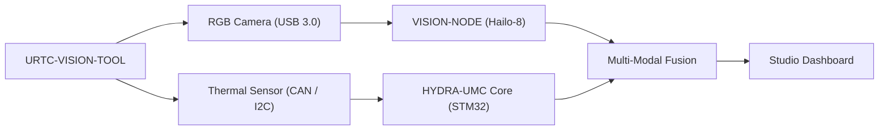

<p align="center">
  
</p>

# 👁️ URTC-VISION-TOOL

<p align="center">🇺🇸 <b>English</b> | <a href="README_spa.md">🇪🇸 Español</a> | <a href="README_fra.md">🇫🇷 Français</a> | <a href="README_ita.md">🇮🇹 Italiano</a> | <a href="README_deu.md">🇩🇪 Deutsch</a> | <a href="README_zho.md">🇨🇳 简体中文</a> | <a href="README_jpn.md">🇯🇵 日本語</a></p>

### 🔬 Integrated End-Effector Combining Thermal and RGB Perception

<p align="left">
  
  
  
  
</p>

---

## 1. 🛠️ TECHNICAL OVERVIEW

**URTC-VISION-TOOL** is a specialized robot tool head that merges visual and thermal perception into a single URTC-compatible effector. It is designed for advanced QA, thermal inspection of PCBs, and high-precision Pick-and-Place alignment.

Equipped with an RGB global shutter camera and an MLX9064x-family thermal sensor, it provides the Vision AI Node with dual-modal data, allowing it to detect not only the presence of a component but also its operating temperature or solder heat dissipation.

No PCB/schematic exists for this board yet (see `hardware/`), so nothing below can drive real thermal/RGB sensors - but the firmware toolchain and the host-side vision processing pipeline (synthetic frame generation, false-color rendering, RGB->thermal ROI alignment and temperature-stats extraction, all pytest-covered) are real and working today.

### Key Features:
* 🔬 **Dual-Modal Perception** — synchronized Thermal and RGB image capture. *(the processing pipeline both frames feed is real - see below; synchronized real capture needs the PCB and sensors.)*
* 🌡️ **High-Precision Thermal** — integrated MLX90640/41/42 sensor support. *(false-color rendering and per-region stats extraction are real - see below; reading a real MLX9064x over I2C needs the PCB.)*
* 🎯 **Eye-in-Hand Alignment** — sub-millimetric PnP and AOI (Automated Optical Inspection). *(the RGB->thermal ROI coordinate mapping and temperature-stats extraction are real and tested - see `vision_companion/alignment.py` below; sub-millimetric precision needs a real calibrated camera.)*
* 📡 **Unified CAN API** — seamlessly integrated into the URTC 25-tool catalog. *(the sensor-side wire protocol itself - framing, CRC, range validation - is real, see below; a real CAN transceiver to actually carry it is still needed.)*
* 🔒 **Sensor Protocol Safety** — real versioned framing with a CRC8 checksum, real measurement-range validation, real rate limiting, and dedicated error/latency/bus-reset diagnostics counters. *(implemented)*
* ✅ **Cortex-M4F firmware toolchain** — a real bare-metal image that cross-compiles and links with `arm-none-eabi-gcc`, same toolchain as sibling repos URTC and URTC-SMART-RACK. *(implemented — see BUILD below)*
* ✅ **`vision_companion` processing pipeline** — a real, working Python package: synthetic thermal+RGB frame generation, false-color thermal rendering, RGB->thermal ROI alignment + temperature-stats extraction, stats reporting, all covered by 21 real pytest cases, runs end-to-end with no hardware attached. *(implemented — see VISION COMPANION below)*

---

## 2. 🔄 VISION TOOL FLOW



---

## 3. 🧱 ARCHITECTURE & DESIGN DECISIONS

* **Why this project has 2 independent version tracks.** `src/firmware_common.h` (the STM32-side firmware) and `src/vision_companion/pyproject.toml` (a separate host-side Python package) are versioned independently - they run on different hardware (MCU vs. host CM5/PC) and ship on different schedules.
* **Why it isn't a child of URTC itself.** Same reasoning as URTC-SMART-RACK's own README - a Complementary Tool that shares URTC's CAN bus/firmware conventions, not part of its integration hierarchy.
* **Why a host-side companion package at all.** Thermal/RGB dual-modal capture needs real image processing (numpy/Pillow) that has no place running on the STM32 itself - the companion package is where that actually happens, talking to the board over CAN.
* **Why `alignment.py` assumes a shared field of view rather than a real homography.** Both sensors sit on the same rigid tool head, so a per-axis linear rescale between RGB-space and thermal-space pixel coordinates is a reasonable v0 approximation - a real per-pixel calibration (checkerboard, lens distortion) needs actual cameras to calibrate against, which don't exist yet.
* **How this fits the rest of the ecosystem.** Shares URTC's own CAN bus/tool ecosystem, and is a natural pairing with HYDRA-UMC-DETECTION-HEF for the same visual-recognition role URTC-SMART-RACK also serves.
* **Why the sensor frame protocol carries its own timestamp field.** A real sensor-side millisecond timestamp lets a caller know *when* a reading was actually taken, independent of whenever the MCU happens to get around to parsing the frame - real historian/diagnostic value that a bare "just arrived" assumption would lose.
* **Why diagnostics counters (`sensor_diagnostics.c`) never make an accept/reject decision themselves.** Only `sensor_frame.c` (framing), `sensor_reading.c` (range) and `rate_limiter.c` (throttling) decide whether a frame is trusted - diagnostics only records what they decided. Keeping that boundary strict means a diagnostics bug can never accidentally let bad data through, the promotion audit's own "separar diagnostico de salida de control".

---

## 📂 DIRECTORY STRUCTURE

```text
URTC-VISION-TOOL/
├── src/
│   ├── firmware_common.h           # FIRMWARE_VERSION_MAJOR/MINOR/PATCH
│   ├── sensor_frame.h / .c         # Real: versioned frame format + CRC8 parse/encode
│   ├── sensor_reading.h / .c       # Real: thermal reading decode + range validation
│   ├── rate_limiter.h / .c         # Real: minimum-interval frame throttling
│   ├── sensor_diagnostics.h / .c   # Real: error/latency/bus-reset counters, separate from control
│   ├── main.c                      # Minimal entry point (proof-of-life heartbeat loop)
│   ├── startup_stm32_minimal.c     # Vector table + Reset_Handler (no ST HAL yet, see file header)
│   ├── STM32_MINIMAL.ld            # Placeholder linker script (128K FLASH / 32K RAM floor)
│   └── vision_companion/           # Host-side (CM5/dev machine) Python vision pipeline
│       ├── pyproject.toml          # Packaging + `vision-companion` console script
│       ├── requirements.txt        # numpy + pillow
│       ├── main.py                 # Real, working CLI (version / selftest / analyze-roi)
│       ├── alignment.py            # Real: RGB<->thermal ROI mapping + temperature-stats extraction
│       ├── tests/                  # 21 real pytest cases (main.py + alignment.py)
│       └── README.md               # Companion-specific usage docs
├── tests/                          # Real host-native firmware test harness (sensor_frame, sensor_reading, rate_limiter, sensor_diagnostics, sensor scenarios)
├── docs/                           # Documentation and calibration reference
├── hardware/                       # Hardware design files (PCB, Case) - empty, no schematic yet
├── firmware/                       # Versioned build output (.bin/.elf/.hex), committed like sibling repo URTC
├── build/                          # Intermediate build objects (gitignored)
├── images/                         # Media and diagrams
├── tools/
│   ├── build_test.py               # Non-versioning build/compile check
│   └── ci_validate.py              # Manifest/CHANGELOG/docs validation used by CI
├── bump_version.py                 # Odometer-style version bump (generic, shared with URTC / URTC-SMART-RACK)
├── bump_manifest_version.py        # Syncs hydra-umc.project.json's version to the native one (--sync)
├── build_firmware.sh / .bat        # Real build: host tests + bump version + compile + link + publish to firmware/
├── build-test.sh / .bat            # Non-versioning build/compile check
└── README.md
```

---

## 4. ⚙️ BUILD (firmware)

Requires the ARM GNU Toolchain (`arm-none-eabi-gcc`, `arm-none-eabi-objcopy`, `arm-none-eabi-size`) and Python 3.

```bash
# Linux/macOS
chmod +x build_firmware.sh   # one-time
./build_firmware.sh

# Windows
build_firmware.bat
```

The build bumps `src/firmware_common.h`'s version (odometer rule), compiles `main.c` and `startup_stm32_minimal.c` for Cortex-M4F, links them against the placeholder `STM32_MINIMAL.ld` memory map, and publishes versioned `.elf`/`.bin`/`.hex` files to `firmware/`. There is nothing to flash to real hardware yet — no PCB exists to confirm the target STM32 part, pinout, MLX9064x wiring, or the RGB camera interface.

## 5. 🐍 VISION COMPANION (host-side Python)

This part runs today, fully, with no hardware attached:

```bash
cd src/vision_companion
python3 -m venv .venv
# Linux/macOS:
.venv/bin/pip install -r requirements.txt
.venv/bin/python main.py selftest

# Windows:
.venv\Scripts\pip install -r requirements.txt
.venv\Scripts\python main.py selftest
```

`selftest` generates a synthetic MLX9064x-shaped thermal frame (32x24, with a soldering-tip-like hotspot) and a synthetic RGB color-bar test pattern, renders/saves both as real files, and prints their stats — proof the numpy/Pillow processing pipeline genuinely works, independent of the real sensor capture step that lands once hardware exists.

`analyze-roi X0 Y0 X1 Y1` maps an RGB-space bounding box into thermal-space and reports real temperature stats for that region — the alignment logic behind the README's Eye-in-Hand Alignment feature, real today:

```bash
.venv/bin/python main.py analyze-roi 280 210 360 270
```

Real example output:

```text
RGB ROI (280,210)-(360,270) in a 640x480 frame
  -> thermal stats: min=75.67C max=78.97C mean=77.69C (16 thermal px)
```

21 real pytest cases cover both `main.py` and `alignment.py`:

```bash
pip install -e ".[dev]"
pytest
```

See `src/vision_companion/README.md` for the full companion documentation.

---

## 🔗 Related Projects

This project is part of a larger robotics ecosystem by the same author (JuanenRac / Electro Hobby 3D), spanning firmware, control software, AI nodes, and fleet tooling. Worth knowing about, since a request might actually be about one of these rather than this repository.

### Directly Related

- **[URTC](https://github.com/JuanenRac/URTC)** — same tool ecosystem / CAN bus.
- **[HYDRA-UMC-DETECTION-HEF](https://github.com/JuanenRac/HYDRA-UMC-DETECTION-HEF)** — visual recognition sibling.
- **[URTC-TESTER](https://github.com/JuanenRac/URTC-TESTER)** — its own live CAN-bus diagnostics complement this tool's visual QA checks on the same tool head.

### Rest of the Ecosystem

**HYDRA-UMC platform** — the multi-robot micro-factory cell
- **[HYDRA-UMC](https://github.com/JuanenRac/HYDRA-UMC)** — the CM5 + STM32H745 motherboard orchestrating up to 8 robot arms.
- **[HYDRA-UMC-SERVER](https://github.com/JuanenRac/HYDRA-UMC-SERVER)** — the Express/WebSocket backend every control client talks to.
- **[HYDRA-UMC-STUDIO](https://github.com/JuanenRac/HYDRA-UMC-STUDIO)** — web-based control dashboard, multi-robot 3D visualization.
- **[HYDRA-UMC-ANDROID-CONTROL](https://github.com/JuanenRac/HYDRA-UMC-ANDROID-CONTROL)** — Android control app over Wi-Fi/Bluetooth.
- **[HYDRA-UMC-IOS-CONTROL](https://github.com/JuanenRac/HYDRA-UMC-IOS-CONTROL)** — iOS/iPadOS control app built in Flutter.
- **[HYDRA-UMC-SUITE](https://github.com/JuanenRac/HYDRA-UMC-SUITE)** — desktop swarm command center (Python/PySide6).
- **[HYDRA-UMC-EDITOR-URDF](https://github.com/JuanenRac/HYDRA-UMC-EDITOR-URDF)** — desktop URDF model editor for the robot catalog.
- **[HYDRA-UMC-DSI](https://github.com/JuanenRac/HYDRA-UMC-DSI)** — native touch UI for the onboard DSI touchscreen.

**URTC platform** — the tool head controller every HYDRA-UMC robot arm carries
- **[URTC](https://github.com/JuanenRac/URTC)** — CAN bus tool head controller, 25 tool profiles.
- **[URTC-FLASHER](https://github.com/JuanenRac/URTC-FLASHER)** — desktop CAN-OTA + SWD/JTAG flashing tool.
- **[URTC-TESTER](https://github.com/JuanenRac/URTC-TESTER)** — desktop live CAN-bus diagnostic tool.
- **[URTC-WEB-STUDIO](https://github.com/JuanenRac/URTC-WEB-STUDIO)** — browser-based alternative via Web Serial API.

**🎥 Vision AI Node (Hailo-8)**
- [HYDRA-UMC-VISION-NODE](https://github.com/JuanenRac/HYDRA-UMC-VISION-NODE)
- [HYDRA-UMC-VISION-STREAMER](https://github.com/JuanenRac/HYDRA-UMC-VISION-STREAMER)
- [HYDRA-UMC-DETECTION-HEF](https://github.com/JuanenRac/HYDRA-UMC-DETECTION-HEF)
- [HYDRA-UMC-SAFETY-ZONES](https://github.com/JuanenRac/HYDRA-UMC-SAFETY-ZONES)
- [HYDRA-UMC-VISUAL-SERVOING-API](https://github.com/JuanenRac/HYDRA-UMC-VISUAL-SERVOING-API)

**🧠 Cognitive AI Node (Hailo-10)**
- [HYDRA-UMC-COGNITIVE-NODE](https://github.com/JuanenRac/HYDRA-UMC-COGNITIVE-NODE)
- [HYDRA-UMC-VLA-ENGINE](https://github.com/JuanenRac/HYDRA-UMC-VLA-ENGINE)
- [HYDRA-UMC-VOICE-UI](https://github.com/JuanenRac/HYDRA-UMC-VOICE-UI)
- [HYDRA-UMC-SEMANTIC-PLANNER](https://github.com/JuanenRac/HYDRA-UMC-SEMANTIC-PLANNER)
- [HYDRA-UMC-DOCS-QA](https://github.com/JuanenRac/HYDRA-UMC-DOCS-QA)

**🐝 Orchestration & Swarm**
- [HYDRA-UMC-ORCHESTRATOR](https://github.com/JuanenRac/HYDRA-UMC-ORCHESTRATOR)
- [HYDRA-UMC-SWARM-SYNC](https://github.com/JuanenRac/HYDRA-UMC-SWARM-SYNC)
- [HYDRA-UMC-PATH-PLANNER-3D](https://github.com/JuanenRac/HYDRA-UMC-PATH-PLANNER-3D)
- [HYDRA-UMC-JOB-DISPATCHER](https://github.com/JuanenRac/HYDRA-UMC-JOB-DISPATCHER)
- [HYDRA-UMC-NODE-HEALING](https://github.com/JuanenRac/HYDRA-UMC-NODE-HEALING)

**🎮 Digital Twin & Simulation**
- [HYDRA-UMC-TWIN](https://github.com/JuanenRac/HYDRA-UMC-TWIN)
- [HYDRA-UMC-PHYSICS-REPLICA](https://github.com/JuanenRac/HYDRA-UMC-PHYSICS-REPLICA)
- [HYDRA-UMC-HIL-BRIDGE](https://github.com/JuanenRac/HYDRA-UMC-HIL-BRIDGE)
- [HYDRA-UMC-SYNTHETIC-DATA-GEN](https://github.com/JuanenRac/HYDRA-UMC-SYNTHETIC-DATA-GEN)

**📊 Data & Analytics**
- [HYDRA-UMC-DATALAKE](https://github.com/JuanenRac/HYDRA-UMC-DATALAKE)
- [HYDRA-UMC-TELEMETRY-COLLECTOR](https://github.com/JuanenRac/HYDRA-UMC-TELEMETRY-COLLECTOR)
- [HYDRA-UMC-ANOMALY-DETECTOR](https://github.com/JuanenRac/HYDRA-UMC-ANOMALY-DETECTOR)
- [HYDRA-UMC-PRODUCTION-REPORTS](https://github.com/JuanenRac/HYDRA-UMC-PRODUCTION-REPORTS)

**🏭 Industrial Gateway**
- [HYDRA-UMC-GATEWAY-INDUSTRIAL](https://github.com/JuanenRac/HYDRA-UMC-GATEWAY-INDUSTRIAL)
- [HYDRA-UMC-OPCUA-SERVER](https://github.com/JuanenRac/HYDRA-UMC-OPCUA-SERVER)
- [HYDRA-UMC-MQTT-BROKER](https://github.com/JuanenRac/HYDRA-UMC-MQTT-BROKER)
- [HYDRA-UMC-MTCONNECT-ADAPTER](https://github.com/JuanenRac/HYDRA-UMC-MTCONNECT-ADAPTER)

**🛠️ Complementary Tools**
- [URTC-SMART-RACK](https://github.com/JuanenRac/URTC-SMART-RACK)
- [HYDRA-UMC-WATCH](https://github.com/JuanenRac/HYDRA-UMC-WATCH)
- [HYDRA-UMC-TOOL-CLI](https://github.com/JuanenRac/HYDRA-UMC-TOOL-CLI)
- [HYDRA-UMC-DASHBOARD-AI](https://github.com/JuanenRac/HYDRA-UMC-DASHBOARD-AI)


## 👤 AUTHOR
**JuanenRac** (Electro Hobby 3D)
📧 electrohobby3d@gmail.com
📺 [youtube.com/@electrohobby3d](https://youtube.com/@electrohobby3d)

## 📜 LICENSE
GPL-3.0 - See LICENSE for details.
