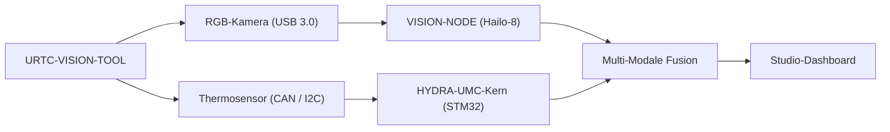

<p align="center">
  
</p>

# 👁️ URTC-VISION-TOOL

<p align="center"><a href="README.md">🇺🇸 English</a> | <a href="README_spa.md">🇪🇸 Español</a> | <a href="README_fra.md">🇫🇷 Français</a> | <a href="README_ita.md">🇮🇹 Italiano</a> | 🇩🇪 <b>Deutsch</b> | <a href="README_zho.md">🇨🇳 简体中文</a> | <a href="README_jpn.md">🇯🇵 日本語</a></p>

### 🔬 Integrierter Werkzeugkopf mit Thermal- und RGB-Wahrnehmung

<p align="left">
  
  
  
  
</p>

---

## 1. 🛠️ TECHNISCHER ÜBERBLICK

**URTC-VISION-TOOL** ist ein spezialisierter Roboter-Werkzeugkopf, der visuelle und thermische Wahrnehmung in einem einzigen URTC-kompatiblen Effektor vereint. Konzipiert für fortgeschrittene QS, thermische PCB-Inspektion und hochpräzise Pick-and-Place-Ausrichtung.

Ausgestattet mit einer RGB-Global-Shutter-Kamera und einem Thermosensor der MLX9064x-Familie liefert er dem Vision AI Node dual-modale Daten und ermöglicht es, nicht nur die Anwesenheit eines Bauteils, sondern auch dessen Betriebstemperatur oder die Wärmeabfuhr einer Lötstelle zu erkennen.

Für diese Platine existiert noch keine PCB/kein Schaltplan (siehe `hardware/`), also kann nichts davon echte Thermal-/RGB-Sensoren ansteuern - aber die Firmware-Toolchain und die hostseitige Vision-Pipeline (synthetische Frame-Erzeugung, Falschfarben-Rendering, RGB->Thermal-ROI-Ausrichtung und Temperaturstatistik-Extraktion, alles mit pytest abgedeckt) sind real und funktionieren heute.

### Hauptmerkmale:
* 🔬 **Dual-Modale Wahrnehmung** — synchronisierte Thermal- und RGB-Bildaufnahme. *(die Verarbeitungspipeline, die beide Frames speist, ist real - siehe unten; die echte synchronisierte Erfassung benötigt die PCB und die Sensoren.)*
* 🌡️ **Hochpräzise Thermik** — integrierte Unterstützung für MLX90640/41/42-Sensoren. *(das Falschfarben-Rendering und die Statistik-Extraktion pro Region sind real - siehe unten; einen echten MLX9064x über I2C auszulesen benötigt die PCB.)*
* 🎯 **Eye-in-Hand-Ausrichtung** — submillimetergenaues PnP und AOI (automatische optische Inspektion). *(die RGB->Thermal-ROI-Koordinatenzuordnung und die Temperaturstatistik-Extraktion sind real und getestet - siehe `vision_companion/alignment.py` unten; submillimetergenaue Präzision benötigt eine echte kalibrierte Kamera.)*
* 📡 **Einheitliche CAN-API** — nahtlos integriert in den 25-Werkzeug-Katalog von URTC. *(das sensorseitige Leitungsprotokoll selbst - Framing, CRC, Bereichsvalidierung - ist real, siehe unten; ein echter CAN-Transceiver, der es tatsächlich transportiert, wird noch benötigt.)*
* 🔒 **Sensorprotokoll-Sicherheit** — echtes versioniertes Framing mit CRC8-Prüfsumme, echte Messbereichsvalidierung, echte Ratenbegrenzung und dedizierte Diagnosezähler für Fehler/Latenz/Bus-Resets. *(implementiert)*
* ✅ **Cortex-M4F-Firmware-Toolchain** — ein echtes Bare-Metal-Image, das mit `arm-none-eabi-gcc` wirklich kompiliert und gelinkt wird, dieselbe Toolchain wie die Schwester-Repositories URTC und URTC-SMART-RACK. *(implementiert — siehe BUILD unten)*
* ✅ **`vision_companion`-Verarbeitungspipeline** — ein echtes, funktionierendes Python-Paket: synthetische Thermal+RGB-Frame-Erzeugung, thermisches Falschfarben-Rendering, RGB->Thermal-ROI-Ausrichtung + Temperaturstatistik-Extraktion, Statistikbericht, alles abgedeckt durch 21 echte pytest-Fälle, läuft Ende-zu-Ende ohne angeschlossene Hardware. *(implementiert — siehe VISION-COMPANION unten)*

---

## 2. 🔄 ABLAUF DES VISION-WERKZEUGS



---

## 3. 🧱 ARCHITEKTUR & DESIGNENTSCHEIDUNGEN

* **Warum dieses Projekt 2 unabhängige Versionsspuren hat.** `src/firmware_common.h` (die STM32-seitige Firmware) und `src/vision_companion/pyproject.toml` (ein separates hostseitiges Python-Paket) werden unabhängig versioniert - sie laufen auf unterschiedlicher Hardware (MCU gegen Host-CM5/PC) und werden nach unterschiedlichen Zeitplänen ausgeliefert.
* **Warum es kein Kind von URTC selbst ist.** Gleicher Grund wie im eigenen README von URTC-SMART-RACK - ein ergänzendes Werkzeug, das den CAN-Bus/die Firmware-Konventionen von URTC teilt, ohne Teil seiner Integrationshierarchie zu sein.
* **Warum überhaupt ein hostseitiges Companion-Paket.** Die duale thermische/RGB-Erfassung benötigt echte Bildverarbeitung (numpy/Pillow), die auf dem STM32 selbst keinen Platz hat - das Companion-Paket ist der Ort, an dem das tatsächlich geschieht, im Gespräch mit der Platine über CAN.
* **Warum `alignment.py` ein gemeinsames Sichtfeld annimmt statt einer echten Homografie.** Beide Sensoren sitzen auf demselben starren Werkzeugkopf, daher ist eine achsenweise lineare Neuskalierung zwischen Pixelkoordinaten im RGB-Raum und im Thermal-Raum eine vernünftige v0-Näherung - eine echte pixelgenaue Kalibrierung (Schachbrett, Objektivverzerrung) benötigt echte Kameras, gegen die kalibriert werden kann, die es noch nicht gibt.
* **Wie sich das ins restliche Ökosystem einfügt.** Teilt den eigenen CAN-Bus/das Werkzeug-Ökosystem von URTC und bildet ein natürliches Paar mit HYDRA-UMC-DETECTION-HEF für dieselbe visuelle Erkennungsrolle, die auch URTC-SMART-RACK erfüllt.
* **Warum das Sensor-Frame-Protokoll ein eigenes Zeitstempelfeld trägt.** Ein echter sensorseitiger Zeitstempel in Millisekunden lässt einen Aufrufer wissen, *wann* eine Messung tatsächlich vorgenommen wurde, unabhängig davon, wann die MCU dazu kommt, den Frame zu parsen - ein echter Wert für Historisierung/Diagnose, den eine bloße „gerade eben angekommen"-Annahme verlieren würde.
* **Warum Diagnosezähler (`sensor_diagnostics.c`) niemals selbst eine Annahme-/Ablehnungsentscheidung treffen.** Nur `sensor_frame.c` (Framing), `sensor_reading.c` (Bereich) und `rate_limiter.c` (Ratenbegrenzung) entscheiden, ob einem Frame vertraut wird - Diagnose zeichnet nur auf, was sie entschieden haben. Diese Grenze strikt einzuhalten bedeutet, dass ein Diagnose-Bug niemals versehentlich schlechte Daten durchlassen kann, das eigene "separar diagnostico de salida de control" des Promotion-Audits.

---

## 📂 VERZEICHNISSTRUKTUR

```text
URTC-VISION-TOOL/
├── src/
│   ├── firmware_common.h           # FIRMWARE_VERSION_MAJOR/MINOR/PATCH = 0.0.0
│   ├── sensor_frame.h / .c         # Echt: versioniertes Frame-Format + CRC8-Parsing/Encoding
│   ├── sensor_reading.h / .c       # Echt: Dekodierung thermischer Messwerte + Bereichsvalidierung
│   ├── rate_limiter.h / .c         # Echt: Frame-Drosselung mit Mindestintervall
│   ├── sensor_diagnostics.h / .c   # Echt: Zähler für Fehler/Latenz/Bus-Resets, getrennt von der Steuerung
│   ├── main.c                      # Minimaler Einstiegspunkt (Lebenszeichen-Schleife)
│   ├── startup_stm32_minimal.c     # Vektortabelle + Reset_Handler (noch keine ST-HAL, siehe Datei-Header)
│   ├── STM32_MINIMAL.ld            # Platzhalter-Linkerskript (Untergrenze 128K FLASH / 32K RAM)
│   └── vision_companion/           # Hostseitige (CM5/Entwicklungsrechner) Python-Vision-Pipeline
│       ├── pyproject.toml          # Packaging + Konsolenskript `vision-companion`
│       ├── requirements.txt        # numpy + pillow
│       ├── main.py                 # Echte, funktionierende CLI (version / selftest / analyze-roi)
│       ├── alignment.py            # Echt: RGB<->Thermal-ROI-Zuordnung + Temperaturstatistik-Extraktion
│       ├── tests/                  # 21 echte pytest-Fälle (main.py + alignment.py)
│       └── README.md               # Companion-spezifische Nutzungsdokumentation
├── tests/                          # Echter hostnativer Firmware-Testharness (sensor_frame, sensor_reading, rate_limiter, sensor_diagnostics, Sensor-Szenarien)
├── docs/                           # Dokumentation und Kalibrierreferenz
├── hardware/                       # Hardware-Design-Dateien (PCB, Gehäuse) - leer, noch kein Schaltplan
├── firmware/                       # Versionierte Build-Ausgabe (.bin/.elf/.hex), eingecheckt wie im Schwester-Repo URTC
├── build/                          # Zwischen-Build-Objekte (von git ignoriert)
├── images/                         # Medien und Diagramme
├── tools/
│   ├── build_test.py               # Build-/Kompilierprüfung ohne Versionserhöhung
│   └── ci_validate.py              # Manifest-/CHANGELOG-/Doku-Validierung, von der CI genutzt
├── bump_version.py                 # Versionserhöhung nach Kilometerzähler-Prinzip (generisch, geteilt mit URTC / URTC-SMART-RACK)
├── bump_manifest_version.py        # Synchronisiert die Version von hydra-umc.project.json mit der nativen (--sync)
├── build_firmware.sh / .bat        # Echter Build: Host-Tests + Version erhöhen + kompilieren + linken + nach firmware/ veröffentlichen
├── build-test.sh / .bat            # Build-/Kompilierprüfung ohne Versionserhöhung
└── README.md
```

---

## 4. ⚙️ BUILD (Firmware)

Erfordert die ARM-GNU-Toolchain (`arm-none-eabi-gcc`, `arm-none-eabi-objcopy`, `arm-none-eabi-size`) und Python 3.

```bash
# Linux/macOS
chmod +x build_firmware.sh   # einmalig
./build_firmware.sh

# Windows
build_firmware.bat
```

Der Build erhöht die Version von `src/firmware_common.h` (Kilometerzähler-Regel), kompiliert `main.c` und `startup_stm32_minimal.c` für Cortex-M4F, linkt sie gegen die Platzhalter-Speicherkarte `STM32_MINIMAL.ld` und veröffentlicht versionierte `.elf`/`.bin`/`.hex`-Dateien in `firmware/`. Es gibt noch nichts, was auf echte Hardware geflasht werden könnte - es existiert keine PCB, die das Ziel-STM32-Modell, das Pinout, die MLX9064x-Verkabelung oder die RGB-Kameraschnittstelle bestätigt.

## 5. 🐍 VISION-COMPANION (Python, hostseitig)

Dieser Teil funktioniert heute vollständig, ohne jegliche angeschlossene Hardware:

```bash
cd src/vision_companion
python3 -m venv .venv
# Linux/macOS:
.venv/bin/pip install -r requirements.txt
.venv/bin/python main.py selftest

# Windows:
.venv\Scripts\pip install -r requirements.txt
.venv\Scripts\python main.py selftest
```

`selftest` erzeugt einen synthetischen, MLX9064x-förmigen Thermal-Frame (32x24, mit einem lötspitzenartigen Hotspot) und ein synthetisches RGB-Farbbalken-Testmuster, rendert/speichert beide als echte Dateien und gibt deren Statistiken aus - Beweis dafür, dass die numpy/Pillow-Verarbeitungspipeline wirklich funktioniert, unabhängig vom echten Sensor-Erfassungsschritt, der kommt, sobald Hardware existiert.

`analyze-roi X0 Y0 X1 Y1` bildet eine Bounding-Box im RGB-Raum auf den Thermal-Raum ab und meldet echte Temperaturstatistiken für diesen Bereich - die Ausrichtungslogik hinter dem README-Feature Eye-in-Hand Alignment, heute real:

```bash
.venv/bin/python main.py analyze-roi 280 210 360 270
```

Echte Beispielausgabe:

```text
RGB ROI (280,210)-(360,270) in a 640x480 frame
  -> thermal stats: min=75.67C max=78.97C mean=77.69C (16 thermal px)
```

21 echte pytest-Fälle decken sowohl `main.py` als auch `alignment.py` ab:

```bash
pip install -e ".[dev]"
pytest
```

Siehe `src/vision_companion/README.md` für die vollständige Companion-Dokumentation.

---

## 🔗 Verwandte Projekte

Dieses Projekt ist Teil des HYDRA-UMC-Robotik-Ökosystems desselben Autors (JuanenRac / Electro Hobby 3D). Gut zu wissen, da eine Anfrage eigentlich eines dieser Projekte betreffen könnte statt dieses Repositorys.

**Direkt verwandt**
- **[URTC](https://github.com/JuanenRac/URTC)** — Firmware für die physische Universal-Robot-Tool-Controller-Platine, 25+ Werkzeugprofile über CAN-Bus — dasselbe Werkzeug-Ökosystem, über denselben CAN-Bus.
- **[HYDRA-UMC-DETECTION-HEF](https://github.com/JuanenRac/HYDRA-UMC-DETECTION-HEF)** — echte Registry für kompilierte Modelle mit Hailo-Architektur-/Prüfsummen-Safe-Load-Verifizierung — ein rollentechnischer Geschwister im Bereich visueller Erkennung.
- **[URTC-TESTER](https://github.com/JuanenRac/URTC-TESTER)** — Desktop-Live-CAN-Bus-Diagnosetool für URTC-Platinen, ein Panel pro Werkzeugprofil — die eigene Live-CAN-Bus-Diagnose ergänzt die visuellen Qualitätssicherungsprüfungen dieses Tools am selben Werkzeugkopf.

**Ebenfalls Teil des Ökosystems**

*Kern-Hardware & Plattform*
- **[HYDRA-UMC](https://github.com/JuanenRac/HYDRA-UMC)** — das physische Motherboard des Roboterarms: CM5-Host + Dual-Core-STM32H745, koordiniert bis zu 8 Werkzeugarme über CAN-OTA/SPI-OTA.
- **[HYDRA-UMC-OS](https://github.com/JuanenRac/HYDRA-UMC-OS)** — reproduzierbare Raspberry-Pi-OS-Produktschicht für den CM5: schreibgeschützter Agent, validierte Konfiguration/Profile, WiFi-Ersteinrichtung.
- **[HYDRA-UMC-SDK](https://github.com/JuanenRac/HYDRA-UMC-SDK)** — der gemeinsame JSON-Schema-Vertrag und die Sicherheitsschranke, gegen die jede Bridge ihre Befehle validiert.

*Kern-Backend & Clients*
- **[HYDRA-UMC-SERVER](https://github.com/JuanenRac/HYDRA-UMC-SERVER)** — das reale Headless-Backend (REST/WebSocket), mit dem jeder Steuerungsclient tatsächlich spricht.
- **[HYDRA-UMC-STUDIO](https://github.com/JuanenRac/HYDRA-UMC-STUDIO)** — Web-Steuerungs-Dashboard mit Echtzeit-3D-Visualisierung mehrerer Roboter.
- **[HYDRA-UMC-SUITE](https://github.com/JuanenRac/HYDRA-UMC-SUITE)** — Desktop-Schwarmleitstand (PySide6) für mehrere Server gleichzeitig, verpackt als eigenständige ausführbare Datei.
- **[HYDRA-UMC-ANDROID-CONTROL](https://github.com/JuanenRac/HYDRA-UMC-ANDROID-CONTROL)** — native Android-Steuerungs-App mit biometrischem Login und einer gekoppelten Wear-OS-Begleit-App.
- **[HYDRA-UMC-IOS-CONTROL](https://github.com/JuanenRac/HYDRA-UMC-IOS-CONTROL)** — iOS/iPadOS-Steuerungs-App (Flutter) mit Echtzeit-WebSocket-Synchronisierung.
- **[HYDRA-UMC-DSI](https://github.com/JuanenRac/HYDRA-UMC-DSI)** — native Touch-UI für das eingebaute 7"-DSI-Touchscreen, direkt auf dem CM5 eingebettet.
- **[HYDRA-UMC-EDITOR-URDF](https://github.com/JuanenRac/HYDRA-UMC-EDITOR-URDF)** — grafischer Desktop-URDF-Ersteller/-Editor, der fertige Modelle in STUDIOs eigenen Katalog überträgt.
- **[HYDRA-UMC-BRIDGE-AMR](https://github.com/JuanenRac/HYDRA-UMC-BRIDGE-AMR)** — Koordinationsschranke für AGV-/AMR-Flotten über einen echten VDA-5050-MQTT-Publisher.
- **[HYDRA-UMC-BRIDGE-CNC](https://github.com/JuanenRac/HYDRA-UMC-BRIDGE-CNC)** — High-Level-Koordinator für CNC-Zellen mit echtem GRBL-Status-/Steuerbyte-Zugriff.
- **[HYDRA-UMC-BRIDGE-DROIDS](https://github.com/JuanenRac/HYDRA-UMC-BRIDGE-DROIDS)** — Koordinationsschranke für laufende/humanoide Droiden, mit einem echten Boston-Dynamics-Spot-Befehlssender.
- **[HYDRA-UMC-BRIDGE-LASER](https://github.com/JuanenRac/HYDRA-UMC-BRIDGE-LASER)** — Sicherheitskoordinator für Laserzellen, liest 3 echte Schlüssel-/Gehäuse-/Verriegelungs-GPIO-Sicherungen.
- **[HYDRA-UMC-BRIDGE-OPENPNP](https://github.com/JuanenRac/HYDRA-UMC-BRIDGE-OPENPNP)** — sicherer High-Level-Koordinator für den Leiterplattenfluss von OpenPnP Pick-and-Place.
- **[HYDRA-UMC-BRIDGE-PRINTER3D](https://github.com/JuanenRac/HYDRA-UMC-BRIDGE-PRINTER3D)** — sichere Koordinationsschranke für Moonraker/Klipper-3D-Drucker, mit echten gesicherten Job-Befehlen.
- **[HYDRA-UMC-BRIDGE-ROS2](https://github.com/JuanenRac/HYDRA-UMC-BRIDGE-ROS2)** — Sicherheitskoordinator mit einem echten, träge importierten rclpy-ROS-2-Transport.
- **[HYDRA-UMC-BRIDGE-UAV](https://github.com/JuanenRac/HYDRA-UMC-BRIDGE-UAV)** — Koordinationsschranke für kameraausgestattete UAVs, mit einem echten MAVLink-Befehlssender.

*URTC-Werkzeugplattform*
- **[URTC-FLASHER](https://github.com/JuanenRac/URTC-FLASHER)** — Desktop-GUI-Flash-Tool für URTC-Platinen, CAN-OTA plus Full-Chip-SWD/JTAG.
- **[URTC-WEB-STUDIO](https://github.com/JuanenRac/URTC-WEB-STUDIO)** — browserbasierte Alternative zu URTC-TESTER über die Web-Serial-API, ohne lokale Installation.

*Vision-KI-Knoten (Hailo-8)*
- **[HYDRA-UMC-VISION-NODE](https://github.com/JuanenRac/HYDRA-UMC-VISION-NODE)** — Integrationsknoten für die Hailo-8-Vision-Pipeline, mit einer echten stufenweisen Hardware-Bereitschaftsprüfung.
- **[HYDRA-UMC-VISION-STREAMER](https://github.com/JuanenRac/HYDRA-UMC-VISION-STREAMER)** — echter GStreamer-Pipeline- + MediaMTX-Konfigurationsgenerator mit einer echten HailoRT-Integrationsschranke.
- **[HYDRA-UMC-VISUAL-SERVOING-API](https://github.com/JuanenRac/HYDRA-UMC-VISUAL-SERVOING-API)** — echtes Position-Based-Visual-Servoing-Korrekturgesetz, sicherheitsgesteuert nach vorgelagertem Zonenstatus.
- **[HYDRA-UMC-SAFETY-ZONES](https://github.com/JuanenRac/HYDRA-UMC-SAFETY-ZONES)** — echte Zonenverletzungsprüfung und E-STOP-Anforderung, mit erzwungener Kalibrierungsaktualität.

*Kognitiver KI-Knoten (Hailo-10)*
- **[HYDRA-UMC-COGNITIVE-NODE](https://github.com/JuanenRac/HYDRA-UMC-COGNITIVE-NODE)** — Integrationsknoten für die Hailo-10-Cognitive-Pipeline (LLM-/VLA-/Sprach-Orchestrierung).
- **[HYDRA-UMC-VLA-ENGINE](https://github.com/JuanenRac/HYDRA-UMC-VLA-ENGINE)** — echte Aktions-Token-Kodierung/-Dekodierung und Trajektoriengenerierung für ein Vision-Language-Action-Modell.
- **[HYDRA-UMC-VOICE-UI](https://github.com/JuanenRac/HYDRA-UMC-VOICE-UI)** — echtes Sprach-Frontend (VAD + Intent-Parser) mit einem begrenzten, bestätigungsgesicherten Watch-Relay.
- **[HYDRA-UMC-SEMANTIC-PLANNER](https://github.com/JuanenRac/HYDRA-UMC-SEMANTIC-PLANNER)** — echte regelbasierte Aufgabenzerlegung und semantische Fehlerbehebung über MCU-Fehlercodes.
- **[HYDRA-UMC-DOCS-QA](https://github.com/JuanenRac/HYDRA-UMC-DOCS-QA)** — echte, nur auf der Standardbibliothek basierende TF-IDF-Dokumentensuche über die eigenen Markdown-Dokumente dieses Ökosystems.

*Orchestrierung & Schwarm*
- **[HYDRA-UMC-ORCHESTRATOR](https://github.com/JuanenRac/HYDRA-UMC-ORCHESTRATOR)** — Integrationsknoten mit einem echten gRPC/Protobuf-Health-Report-Vertrag und einer Missions-Zustandsmaschine.
- **[HYDRA-UMC-JOB-DISPATCHER](https://github.com/JuanenRac/HYDRA-UMC-JOB-DISPATCHER)** — echte prioritätsbasierte Job-Queue mit Deduplizierung, über eine echte HTTP-API.
- **[HYDRA-UMC-NODE-HEALING](https://github.com/JuanenRac/HYDRA-UMC-NODE-HEALING)** — echter gRPC-basierter Flotten-Health-Watchdog mit Retry/Backoff und Identitäts-Mismatch-Erkennung.
- **[HYDRA-UMC-PATH-PLANNER-3D](https://github.com/JuanenRac/HYDRA-UMC-PATH-PLANNER-3D)** — echter RRT-basierter 3D-Pfadplaner mit echter Hindernis-/Arbeitsraum-Kollisionsvalidierung.
- **[HYDRA-UMC-SWARM-SYNC](https://github.com/JuanenRac/HYDRA-UMC-SWARM-SYNC)** — echte CRDT-LWW-Element-Map-Zustandssynchronisation, eigenschaftsgetestet auf Multi-Zellen-Konvergenz.

*Digitaler Zwilling & Simulation*
- **[HYDRA-UMC-TWIN](https://github.com/JuanenRac/HYDRA-UMC-TWIN)** — Integrationsknoten für die Digital-Twin-Engine, mit einem echten Versionskompatibilitäts-Sync-Vertrag.
- **[HYDRA-UMC-HIL-BRIDGE](https://github.com/JuanenRac/HYDRA-UMC-HIL-BRIDGE)** — echte Hardware-in-the-Loop-Sicherheitsverriegelung, die Befehle zwischen Simulation und echter Hardware routet.
- **[HYDRA-UMC-PHYSICS-REPLICA](https://github.com/JuanenRac/HYDRA-UMC-PHYSICS-REPLICA)** — echte Vorwärtskinematik und Gelenkgrenzenvalidierung über eine echte URDF-Teilmenge.
- **[HYDRA-UMC-SYNTHETIC-DATA-GEN](https://github.com/JuanenRac/HYDRA-UMC-SYNTHETIC-DATA-GEN)** — echter prozeduraler 2D-Szenengenerator mit YOLO/COCO-Annotationsexport.

*Daten & Analytik*
- **[HYDRA-UMC-DATALAKE](https://github.com/JuanenRac/HYDRA-UMC-DATALAKE)** — echter sqlite3-gestützter Zeitreihenspeicher mit einer echten Ingest-/Abfrage-HTTP-API.
- **[HYDRA-UMC-ANOMALY-DETECTOR](https://github.com/JuanenRac/HYDRA-UMC-ANOMALY-DETECTOR)** — echter FFT- + statistischer Basislinien-Anomaliedetektor mit Drift-Überwachung.
- **[HYDRA-UMC-PRODUCTION-REPORTS](https://github.com/JuanenRac/HYDRA-UMC-PRODUCTION-REPORTS)** — echte OEE-/Verfügbarkeitsberechnung über den DATALAKE-Verlauf, mit reproduzierbarem CSV-Export.
- **[HYDRA-UMC-TELEMETRY-COLLECTOR](https://github.com/JuanenRac/HYDRA-UMC-TELEMETRY-COLLECTOR)** — echte CAN/WebSocket-Ingestion-Pipeline in DATALAKE, mit Sequenz-Deduplizierung.

*Industrie-Gateway*
- **[HYDRA-UMC-GATEWAY-INDUSTRIAL](https://github.com/JuanenRac/HYDRA-UMC-GATEWAY-INDUSTRIAL)** — Integrationsknoten, der zu Industrieprotokollen weiterleitet, mit einer echten Befehls-Allowlist-/Backpressure-Schicht.
- **[HYDRA-UMC-OPCUA-SERVER](https://github.com/JuanenRac/HYDRA-UMC-OPCUA-SERVER)** — echter OPC-UA-Adressraum, verifiziert mit einer echten Binärprotokoll-Client-Session.
- **[HYDRA-UMC-MQTT-BROKER](https://github.com/JuanenRac/HYDRA-UMC-MQTT-BROKER)** — echter MQTT-Broker mit optionaler Pro-Client-Authentifizierung und Topic-ACLs.
- **[HYDRA-UMC-MTCONNECT-ADAPTER](https://github.com/JuanenRac/HYDRA-UMC-MTCONNECT-ADAPTER)** — echte MTConnect-`/probe`- und `/current`-XML-Endpunkte mit Degraded-Mode-Ausgabe.

*Ergänzende Tools & Ökosystembetrieb*
- **[HYDRA-UMC-DASHBOARD-AI](https://github.com/JuanenRac/HYDRA-UMC-DASHBOARD-AI)** — Smart-Summaries- und Anomaly-Highlighting-Panels über DATALAKE/ANOMALY-DETECTOR, mit einem ehrlichen statistischen Fallback.
- **[HYDRA-UMC-TOOL-CLI](https://github.com/JuanenRac/HYDRA-UMC-TOOL-CLI)** — Flotten-CLI mit einem echten, stabilen Exit-Code-Vertrag, ein echter Live-Client der eigenen API von HYDRA-UMC-SERVER.
- **[HYDRA-UMC-WATCH](https://github.com/JuanenRac/HYDRA-UMC-WATCH)** — WearOS-Begleit-App mit echten haptischen Alarmen und einem Sprach-Relay zum gekoppelten Telefon.
- **[URTC-SMART-RACK](https://github.com/JuanenRac/URTC-SMART-RACK)** — Firmware für ein Platinenmontagegestell mit echter Werkzeug-ID-Dekodierung und Smart-Idle-Vorheizlogik.
- **[HYDRA-UMC-UPDATER](https://github.com/JuanenRac/HYDRA-UMC-UPDATER)** — administratives Desktop-Tool, das jedes Repository in diesem Ökosystem entdeckt, klont und aktualisiert.


---

## 📚 Dokumentation & Community

- **[CONTRIBUTING.md](CONTRIBUTING.md)** — Technologie-Stack und Coding-Richtlinien für einen Pull Request.
- **[CODE_OF_CONDUCT.md](CODE_OF_CONDUCT.md)** — die in dieser Community erwarteten Verhaltensstandards.
- **[SECURITY.md](SECURITY.md)** — wie man eine Schwachstelle meldet, und die echten Sicherheitsschwerpunkte dieses Projekts.
- **[SUPPORT.md](SUPPORT.md)** — wo man Fragen stellt und Fehler meldet.
- **[LICENSE.md](LICENSE.md)** — die eigene Lizenz dieses Projekts.

## 👤 AUTOR
**JuanenRac** (Electro Hobby 3D)
📧 electrohobby3d@gmail.com
📺 [youtube.com/@electrohobby3d](https://youtube.com/@electrohobby3d)

## 📜 LIZENZ
GPL-3.0 - Siehe LICENSE für Details.
