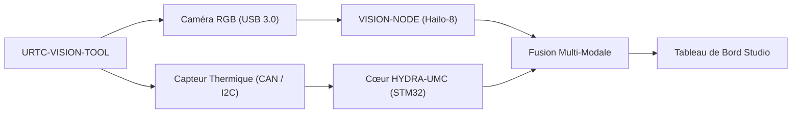

<p align="center">
  
</p>

# 👁️ URTC-VISION-TOOL

<p align="center"><a href="README.md">🇺🇸 English</a> | <a href="README_spa.md">🇪🇸 Español</a> | 🇫🇷 <b>Français</b> | <a href="README_ita.md">🇮🇹 Italiano</a> | <a href="README_deu.md">🇩🇪 Deutsch</a> | <a href="README_zho.md">🇨🇳 简体中文</a> | <a href="README_jpn.md">🇯🇵 日本語</a></p>

### 🔬 Tête d'Outil Intégrée Combinant Perception Thermique et RGB

<p align="left">
  
  
  
  
</p>

---

## 1. 🛠️ APERÇU TECHNIQUE

**URTC-VISION-TOOL** est une tête d'outil robotique spécialisée qui fusionne la perception visuelle et thermique en un seul effecteur compatible URTC. Conçue pour le contrôle qualité avancé, l'inspection thermique de PCB et l'alignement Pick-and-Place haute précision.

Équipée d'une caméra RGB à obturateur global et d'un capteur thermique de la famille MLX9064x, elle fournit au Vision AI Node des données à double modalité, lui permettant de détecter non seulement la présence d'un composant mais aussi sa température de fonctionnement ou la dissipation thermique d'une soudure.

Aucun PCB/schéma n'existe encore pour cette carte (voir `hardware/`), donc rien ci-dessous ne peut piloter de vrais capteurs thermiques/RGB - mais la chaîne d'outils firmware et le pipeline de vision côté hôte (génération synthétique de trames, rendu en fausses couleurs, alignement de ROI RGB->thermique et extraction de statistiques de température, le tout couvert par pytest) sont réels et fonctionnent aujourd'hui.

### Fonctionnalités Clés :
* 🔬 **Perception Double-Modale** — capture synchronisée d'images Thermique et RGB. *(le pipeline de traitement alimenté par les deux trames est réel - voir ci-dessous ; la capture synchronisée réelle nécessite le PCB et les capteurs.)*
* 🌡️ **Thermique Haute Précision** — prise en charge intégrée des capteurs MLX90640/41/42. *(le rendu en fausses couleurs et l'extraction de statistiques par région sont réels - voir ci-dessous ; lire un vrai MLX9064x par I2C nécessite le PCB.)*
* 🎯 **Alignement Eye-in-Hand** — PnP et AOI (Inspection Optique Automatisée) sub-millimétrique. *(le mappage de coordonnées ROI RGB->thermique et l'extraction de statistiques de température sont réels et testés - voir `vision_companion/alignment.py` ci-dessous ; la précision sub-millimétrique nécessite une vraie caméra calibrée.)*
* 📡 **API CAN Unifiée** — intégré de façon transparente au catalogue de 25 outils d'URTC. *(prévu - nécessite un vrai transceiver CAN.)*
* ✅ **Chaîne d'outils firmware Cortex-M4F** — une image bare-metal réelle qui compile et se lie réellement avec `arm-none-eabi-gcc`, la même chaîne d'outils que les dépôts frères URTC et URTC-SMART-RACK. *(implémenté — voir COMPILATION ci-dessous)*
* ✅ **Pipeline de traitement `vision_companion`** — un vrai paquet Python fonctionnel : génération synthétique de trames thermiques+RGB, rendu thermique en fausses couleurs, alignement de ROI RGB->thermique + extraction de statistiques de température, rapport de statistiques, le tout couvert par 21 cas pytest réels, fonctionne de bout en bout sans matériel connecté. *(implémenté — voir COMPAGNON DE VISION ci-dessous)*

---

## 2. 🔄 FLUX DE LA TÊTE DE VISION



---

## 3. 🧱 ARCHITECTURE & DÉCISIONS DE CONCEPTION

* **Pourquoi ce projet a 2 pistes de version indépendantes.** `src/firmware_common.h` (le firmware côté STM32) et `src/vision_companion/pyproject.toml` (un paquet Python séparé côté hôte) sont versionnés indépendamment - ils tournent sur du matériel différent (MCU contre hôte CM5/PC) et sont publiés selon des calendriers différents.
* **Pourquoi ce n'est pas un enfant d'URTC lui-même.** Même raison que le propre README d'URTC-SMART-RACK - un Outil Complémentaire qui partage le bus CAN/les conventions de firmware d'URTC, sans faire partie de sa hiérarchie d'intégration.
* **Pourquoi un paquet compagnon côté hôte.** La capture bi-modale thermique/RGB nécessite un vrai traitement d'image (numpy/Pillow) qui n'a pas sa place sur le STM32 lui-même - le paquet compagnon est là où cela se passe réellement, en parlant à la carte via CAN.
* **Pourquoi `alignment.py` suppose un champ de vision partagé plutôt qu'une vraie homographie.** Les deux capteurs sont sur la même tête d'outil rigide, donc une remise à l'échelle linéaire par axe entre les coordonnées de pixel en espace RGB et en espace thermique est une approximation v0 raisonnable - une vraie calibration par pixel (damier, distorsion d'objectif) nécessite de vraies caméras pour se calibrer, qui n'existent pas encore.
* **Comment cela s'intègre dans le reste de l'écosystème.** Partage le propre bus CAN/écosystème d'outils d'URTC, et forme une paire naturelle avec HYDRA-UMC-DETECTION-HEF pour le même rôle de reconnaissance visuelle qu'URTC-SMART-RACK remplit aussi.

---

## 📂 STRUCTURE DES DOSSIERS

```text
URTC-VISION-TOOL/
├── src/
│   ├── firmware_common.h           # FIRMWARE_VERSION_MAJOR/MINOR/PATCH = 0.0.0
│   ├── main.c                      # Point d'entrée minimal (boucle de battement de vie)
│   ├── startup_stm32_minimal.c     # Table des vecteurs + Reset_Handler (pas de HAL ST pour l'instant, voir l'en-tête du fichier)
│   ├── STM32_MINIMAL.ld            # Script de liaison provisoire (plancher 128K FLASH / 32K RAM)
│   └── vision_companion/           # Pipeline de vision Python côté hôte (CM5/machine de dev)
│       ├── pyproject.toml          # Packaging + console script `vision-companion`
│       ├── requirements.txt        # numpy + pillow
│       ├── main.py                 # CLI réelle et fonctionnelle (version / selftest / analyze-roi)
│       ├── alignment.py            # Réel : mappage de ROI RGB<->thermique + extraction de statistiques de température
│       ├── tests/                  # 21 cas pytest réels (main.py + alignment.py)
│       └── README.md               # Documentation spécifique au compagnon
├── docs/                           # Documentation et référence d'étalonnage
├── hardware/                       # Fichiers de conception matérielle (PCB, boîtier) - vide, pas de schéma pour l'instant
├── firmware/                       # Sortie de build versionnée (.bin/.elf/.hex), commitée comme le dépôt frère URTC
├── build/                          # Objets de build intermédiaires (ignoré par git)
├── images/                         # Médias et diagrammes
├── scripts/                        # Scripts utilitaires
├── bump_version.py                 # Incrémentation de version façon compteur kilométrique (générique, partagé avec URTC / URTC-SMART-RACK)
├── build_firmware.sh / .bat        # Build réel : incrémente la version + compile + lie + publie dans firmware/
└── README.md
```

---

## 4. ⚙️ COMPILATION (firmware)

Nécessite la chaîne d'outils ARM GNU (`arm-none-eabi-gcc`, `arm-none-eabi-objcopy`, `arm-none-eabi-size`) et Python 3.

```bash
# Linux/macOS
chmod +x build_firmware.sh   # une seule fois
./build_firmware.sh

# Windows
build_firmware.bat
```

Le build incrémente la version de `src/firmware_common.h` (règle du compteur kilométrique), compile `main.c` et `startup_stm32_minimal.c` pour Cortex-M4F, les lie avec la carte mémoire provisoire `STM32_MINIMAL.ld`, et publie des fichiers `.elf`/`.bin`/`.hex` versionnés dans `firmware/`. Il n'y a encore rien à flasher sur du matériel réel - aucun PCB n'existe pour confirmer la référence STM32 cible, le brochage, le câblage du MLX9064x, ou l'interface de la caméra RGB.

## 5. 🐍 COMPAGNON DE VISION (Python côté hôte)

Cette partie fonctionne aujourd'hui, entièrement, sans aucun matériel connecté :

```bash
cd src/vision_companion
python3 -m venv .venv
# Linux/macOS :
.venv/bin/pip install -r requirements.txt
.venv/bin/python main.py selftest

# Windows :
.venv\Scripts\pip install -r requirements.txt
.venv\Scripts\python main.py selftest
```

`selftest` génère une trame thermique synthétique de forme MLX9064x (32x24, avec un point chaud façon pointe à souder) et un motif de test RGB à barres de couleur, rend/enregistre les deux en fichiers réels, et affiche leurs statistiques — preuve que le pipeline de traitement numpy/Pillow fonctionne réellement, indépendamment de l'étape de capture réelle du capteur qui viendra une fois le matériel existant.

`analyze-roi X0 Y0 X1 Y1` mappe une boîte englobante en espace RGB vers l'espace thermique et rapporte des statistiques de température réelles pour cette région — la logique d'alignement derrière la fonctionnalité Eye-in-Hand Alignment du README, réelle aujourd'hui :

```bash
.venv/bin/python main.py analyze-roi 280 210 360 270
```

Exemple de sortie réelle :

```text
RGB ROI (280,210)-(360,270) in a 640x480 frame
  -> thermal stats: min=75.67C max=78.97C mean=77.69C (16 thermal px)
```

21 cas pytest réels couvrent `main.py` et `alignment.py` :

```bash
pip install -e ".[dev]"
pytest
```

Voir `src/vision_companion/README.md` pour la documentation complète du compagnon.

---

## 🔗 Projets Liés

Ce projet fait partie d'un écosystème robotique plus large du même auteur (JuanenRac / Electro Hobby 3D), couvrant firmware, logiciel de contrôle, nœuds IA et outillage de flotte. Bon à savoir, car une demande pourrait en réalité concerner l'un de ces projets plutôt que ce dépôt.

### Relation Directe

- **[URTC](https://github.com/JuanenRac/URTC)** — même écosystème d'outils / bus CAN.
- **[HYDRA-UMC-DETECTION-HEF](https://github.com/JuanenRac/HYDRA-UMC-DETECTION-HEF)** — frère de reconnaissance visuelle.

### Reste de l'Écosystème

**Plateforme HYDRA-UMC** — la cellule de micro-usine multi-robot
- **[HYDRA-UMC](https://github.com/JuanenRac/HYDRA-UMC)** — la carte mère CM5 + STM32H745 orchestrant jusqu'à 8 bras robotiques.
- **[HYDRA-UMC-SERVER](https://github.com/JuanenRac/HYDRA-UMC-SERVER)** — le backend Express/WebSocket auquel parle chaque client de contrôle.
- **[HYDRA-UMC-STUDIO](https://github.com/JuanenRac/HYDRA-UMC-STUDIO)** — tableau de bord de contrôle web, visualisation 3D multi-robot.
- **[HYDRA-UMC-ANDROID-CONTROL](https://github.com/JuanenRac/HYDRA-UMC-ANDROID-CONTROL)** — application de contrôle Android via Wi-Fi/Bluetooth.
- **[HYDRA-UMC-IOS-CONTROL](https://github.com/JuanenRac/HYDRA-UMC-IOS-CONTROL)** — application de contrôle iOS/iPadOS construite en Flutter.
- **[HYDRA-UMC-SUITE](https://github.com/JuanenRac/HYDRA-UMC-SUITE)** — centre de commande d'essaim de bureau (Python/PySide6).
- **[HYDRA-UMC-EDITOR-URDF](https://github.com/JuanenRac/HYDRA-UMC-EDITOR-URDF)** — éditeur de modèles URDF de bureau pour le catalogue de robots.
- **[HYDRA-UMC-DSI](https://github.com/JuanenRac/HYDRA-UMC-DSI)** — interface tactile native pour l'écran DSI embarqué.

**Plateforme URTC** — le contrôleur de tête d'outil que porte chaque bras HYDRA-UMC
- **[URTC](https://github.com/JuanenRac/URTC)** — contrôleur de tête d'outil sur bus CAN, 25 profils d'outil.
- **[URTC-FLASHER](https://github.com/JuanenRac/URTC-FLASHER)** — outil de bureau de flashage CAN-OTA + SWD/JTAG.
- **[URTC-TESTER](https://github.com/JuanenRac/URTC-TESTER)** — outil de bureau de diagnostic CAN en direct.
- **[URTC-WEB-STUDIO](https://github.com/JuanenRac/URTC-WEB-STUDIO)** — alternative basée navigateur via l'API Web Serial.

**🎥 Vision AI Node (Hailo-8)**
- [HYDRA-UMC-VISION-NODE](https://github.com/JuanenRac/HYDRA-UMC-VISION-NODE)
- [HYDRA-UMC-VISION-STREAMER](https://github.com/JuanenRac/HYDRA-UMC-VISION-STREAMER)
- [HYDRA-UMC-DETECTION-HEF](https://github.com/JuanenRac/HYDRA-UMC-DETECTION-HEF)
- [HYDRA-UMC-SAFETY-ZONES](https://github.com/JuanenRac/HYDRA-UMC-SAFETY-ZONES)
- [HYDRA-UMC-VISUAL-SERVOING-API](https://github.com/JuanenRac/HYDRA-UMC-VISUAL-SERVOING-API)

**🧠 Cognitive AI Node (Hailo-10)**
- [HYDRA-UMC-COGNITIVE-NODE](https://github.com/JuanenRac/HYDRA-UMC-COGNITIVE-NODE)
- [HYDRA-UMC-VLA-ENGINE](https://github.com/JuanenRac/HYDRA-UMC-VLA-ENGINE)
- [HYDRA-UMC-VOICE-UI](https://github.com/JuanenRac/HYDRA-UMC-VOICE-UI)
- [HYDRA-UMC-SEMANTIC-PLANNER](https://github.com/JuanenRac/HYDRA-UMC-SEMANTIC-PLANNER)
- [HYDRA-UMC-DOCS-QA](https://github.com/JuanenRac/HYDRA-UMC-DOCS-QA)

**🐝 Orchestration & Swarm**
- [HYDRA-UMC-ORCHESTRATOR](https://github.com/JuanenRac/HYDRA-UMC-ORCHESTRATOR)
- [HYDRA-UMC-SWARM-SYNC](https://github.com/JuanenRac/HYDRA-UMC-SWARM-SYNC)
- [HYDRA-UMC-PATH-PLANNER-3D](https://github.com/JuanenRac/HYDRA-UMC-PATH-PLANNER-3D)
- [HYDRA-UMC-JOB-DISPATCHER](https://github.com/JuanenRac/HYDRA-UMC-JOB-DISPATCHER)
- [HYDRA-UMC-NODE-HEALING](https://github.com/JuanenRac/HYDRA-UMC-NODE-HEALING)

**🎮 Digital Twin & Simulation**
- [HYDRA-UMC-TWIN](https://github.com/JuanenRac/HYDRA-UMC-TWIN)
- [HYDRA-UMC-PHYSICS-REPLICA](https://github.com/JuanenRac/HYDRA-UMC-PHYSICS-REPLICA)
- [HYDRA-UMC-HIL-BRIDGE](https://github.com/JuanenRac/HYDRA-UMC-HIL-BRIDGE)
- [HYDRA-UMC-SYNTHETIC-DATA-GEN](https://github.com/JuanenRac/HYDRA-UMC-SYNTHETIC-DATA-GEN)

**📊 Data & Analytics**
- [HYDRA-UMC-DATALAKE](https://github.com/JuanenRac/HYDRA-UMC-DATALAKE)
- [HYDRA-UMC-TELEMETRY-COLLECTOR](https://github.com/JuanenRac/HYDRA-UMC-TELEMETRY-COLLECTOR)
- [HYDRA-UMC-ANOMALY-DETECTOR](https://github.com/JuanenRac/HYDRA-UMC-ANOMALY-DETECTOR)
- [HYDRA-UMC-PRODUCTION-REPORTS](https://github.com/JuanenRac/HYDRA-UMC-PRODUCTION-REPORTS)

**🏭 Industrial Gateway**
- [HYDRA-UMC-GATEWAY-INDUSTRIAL](https://github.com/JuanenRac/HYDRA-UMC-GATEWAY-INDUSTRIAL)
- [HYDRA-UMC-OPCUA-SERVER](https://github.com/JuanenRac/HYDRA-UMC-OPCUA-SERVER)
- [HYDRA-UMC-MQTT-BROKER](https://github.com/JuanenRac/HYDRA-UMC-MQTT-BROKER)
- [HYDRA-UMC-MTCONNECT-ADAPTER](https://github.com/JuanenRac/HYDRA-UMC-MTCONNECT-ADAPTER)

**🛠️ Complementary Tools**
- [URTC-SMART-RACK](https://github.com/JuanenRac/URTC-SMART-RACK)
- [HYDRA-UMC-WATCH](https://github.com/JuanenRac/HYDRA-UMC-WATCH)
- [HYDRA-UMC-TOOL-CLI](https://github.com/JuanenRac/HYDRA-UMC-TOOL-CLI)
- [HYDRA-UMC-DASHBOARD-AI](https://github.com/JuanenRac/HYDRA-UMC-DASHBOARD-AI)


## 👤 AUTEUR
**JuanenRac** (Electro Hobby 3D)
📧 electrohobby3d@gmail.com

## 📜 LICENCE
GPL-3.0 - Voir LICENSE pour plus de détails.

## 🛠️ BUILD & RUN

Utilisez la vérification de compilation sans versionnement avant une compilation de publication :

| Action | Windows | Linux / macOS |
|---|---|---|
| Vérification de compilation (sans modifier la version ni le CHANGELOG) | `build-test.bat` | `./build-test.sh` |
| Exécution / développement (si disponible) | `run*.bat` ou `dev*.bat` | `./run*.sh` ou `./dev*.sh` |

`build-test.bat` et `build-test.sh` compilent ou valident la pile du projet sans incrémenter `hydra-umc.project.json` ni modifier `CHANGELOG.md`. Ils peuvent uniquement créer les sorties normales du compilateur. Les scripts existants `build*.bat`, `build*.sh`, `run*` et `dev*` conservent leur comportement spécifique de versionnement ou d'exécution ; utilisez-les lorsque ce comportement est requis.