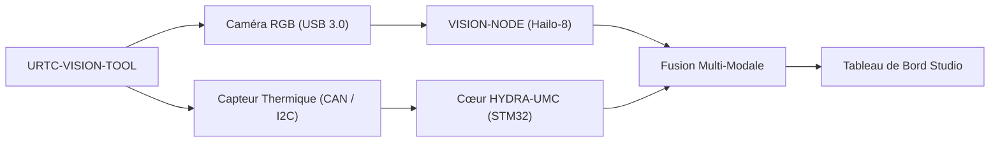

<p align="center">
  
</p>

# 👁️ URTC-VISION-TOOL

<p align="center"><a href="README.md">🇺🇸 English</a> | <a href="README_spa.md">🇪🇸 Español</a> | 🇫🇷 <b>Français</b> | <a href="README_ita.md">🇮🇹 Italiano</a> | <a href="README_deu.md">🇩🇪 Deutsch</a> | <a href="README_zho.md">🇨🇳 简体中文</a> | <a href="README_jpn.md">🇯🇵 日本語</a></p>

### 🔬 Tête d'Outil Intégrée Combinant Perception Thermique et RGB

<p align="left">
  
  
  
  
</p>

---

## 1. 🛠️ APERÇU TECHNIQUE

**URTC-VISION-TOOL** est une tête d'outil robotique spécialisée qui fusionne la perception visuelle et thermique en un seul effecteur compatible URTC. Conçue pour le contrôle qualité avancé, l'inspection thermique de PCB et l'alignement Pick-and-Place haute précision.

Équipée d'une caméra RGB à obturateur global et d'un capteur thermique de la famille MLX9064x, elle fournit au Vision AI Node des données à double modalité, lui permettant de détecter non seulement la présence d'un composant mais aussi sa température de fonctionnement ou la dissipation thermique d'une soudure.

Aucun PCB/schéma n'existe encore pour cette carte (voir `hardware/`), donc rien ci-dessous ne peut piloter de vrais capteurs thermiques/RGB - mais la chaîne d'outils firmware et le pipeline de vision côté hôte (génération synthétique de trames, rendu en fausses couleurs, alignement de ROI RGB->thermique et extraction de statistiques de température, le tout couvert par pytest) sont réels et fonctionnent aujourd'hui.

### Fonctionnalités Clés :
* 🔬 **Perception Double-Modale** — capture synchronisée d'images Thermique et RGB. *(le pipeline de traitement alimenté par les deux trames est réel - voir ci-dessous ; la capture synchronisée réelle nécessite le PCB et les capteurs.)*
* 🌡️ **Thermique Haute Précision** — prise en charge intégrée des capteurs MLX90640/41/42. *(le rendu en fausses couleurs et l'extraction de statistiques par région sont réels - voir ci-dessous ; lire un vrai MLX9064x par I2C nécessite le PCB.)*
* 🎯 **Alignement Eye-in-Hand** — PnP et AOI (Inspection Optique Automatisée) sub-millimétrique. *(le mappage de coordonnées ROI RGB->thermique et l'extraction de statistiques de température sont réels et testés - voir `vision_companion/alignment.py` ci-dessous ; la précision sub-millimétrique nécessite une vraie caméra calibrée.)*
* 📡 **API CAN Unifiée** — intégré de façon transparente au catalogue de 25 outils d'URTC. *(le protocole filaire côté capteur lui-même - trame, CRC, validation de plage - est réel, voir ci-dessous ; un vrai transceiver CAN pour le transporter reste nécessaire.)*
* 🔒 **Sécurité du Protocole Capteur** — trame versionnée réelle avec somme de contrôle CRC8, validation de plage de mesure réelle, limitation de débit réelle, et compteurs de diagnostic dédiés d'erreurs/latence/réinitialisations de bus. *(implémenté)*
* ✅ **Chaîne d'outils firmware Cortex-M4F** — une image bare-metal réelle qui compile et se lie réellement avec `arm-none-eabi-gcc`, la même chaîne d'outils que les dépôts frères URTC et URTC-SMART-RACK. *(implémenté — voir COMPILATION ci-dessous)*
* ✅ **Pipeline de traitement `vision_companion`** — un vrai paquet Python fonctionnel : génération synthétique de trames thermiques+RGB, rendu thermique en fausses couleurs, alignement de ROI RGB->thermique + extraction de statistiques de température, rapport de statistiques, le tout couvert par 21 cas pytest réels, fonctionne de bout en bout sans matériel connecté. *(implémenté — voir COMPAGNON DE VISION ci-dessous)*

---

## 2. 🔄 FLUX DE LA TÊTE DE VISION



---

## 3. 🧱 ARCHITECTURE & DÉCISIONS DE CONCEPTION

* **Pourquoi ce projet a 2 pistes de version indépendantes.** `src/firmware_common.h` (le firmware côté STM32) et `src/vision_companion/pyproject.toml` (un paquet Python séparé côté hôte) sont versionnés indépendamment - ils tournent sur du matériel différent (MCU contre hôte CM5/PC) et sont publiés selon des calendriers différents.
* **Pourquoi ce n'est pas un enfant d'URTC lui-même.** Même raison que le propre README d'URTC-SMART-RACK - un Outil Complémentaire qui partage le bus CAN/les conventions de firmware d'URTC, sans faire partie de sa hiérarchie d'intégration.
* **Pourquoi un paquet compagnon côté hôte.** La capture bi-modale thermique/RGB nécessite un vrai traitement d'image (numpy/Pillow) qui n'a pas sa place sur le STM32 lui-même - le paquet compagnon est là où cela se passe réellement, en parlant à la carte via CAN.
* **Pourquoi `alignment.py` suppose un champ de vision partagé plutôt qu'une vraie homographie.** Les deux capteurs sont sur la même tête d'outil rigide, donc une remise à l'échelle linéaire par axe entre les coordonnées de pixel en espace RGB et en espace thermique est une approximation v0 raisonnable - une vraie calibration par pixel (damier, distorsion d'objectif) nécessite de vraies caméras pour se calibrer, qui n'existent pas encore.
* **Comment cela s'intègre dans le reste de l'écosystème.** Partage le propre bus CAN/écosystème d'outils d'URTC, et forme une paire naturelle avec HYDRA-UMC-DETECTION-HEF pour le même rôle de reconnaissance visuelle qu'URTC-SMART-RACK remplit aussi.
* **Pourquoi le protocole de trame du capteur porte son propre champ d'horodatage.** Un véritable horodatage en millisecondes côté capteur permet à l'appelant de savoir *quand* une lecture a réellement été effectuée, indépendamment du moment où le MCU parvient à analyser la trame - une réelle valeur d'historisation/diagnostic qu'une simple hypothèse « vient d'arriver » ferait perdre.
* **Pourquoi les compteurs de diagnostic (`sensor_diagnostics.c`) ne prennent jamais eux-mêmes de décision d'acceptation/rejet.** Seuls `sensor_frame.c` (trame), `sensor_reading.c` (plage) et `rate_limiter.c` (limitation de débit) décident si une trame est fiable - le diagnostic se contente d'enregistrer ce qu'ils ont décidé. Maintenir cette frontière stricte signifie qu'un bug de diagnostic ne peut jamais laisser passer accidentellement de mauvaises données, le fameux « separar diagnostico de salida de control » de l'audit de promotion.

---

## 📂 STRUCTURE DES DOSSIERS

```text
URTC-VISION-TOOL/
├── src/
│   ├── firmware_common.h           # FIRMWARE_VERSION_MAJOR/MINOR/PATCH = 0.0.0
│   ├── sensor_frame.h / .c         # Réel : format de trame versionné + parsing/encodage CRC8
│   ├── sensor_reading.h / .c       # Réel : décodage de lecture thermique + validation de plage
│   ├── rate_limiter.h / .c         # Réel : limitation de trame par intervalle minimal
│   ├── sensor_diagnostics.h / .c   # Réel : compteurs d'erreurs/latence/réinitialisations de bus, séparés du contrôle
│   ├── main.c                      # Point d'entrée minimal (boucle de battement de vie)
│   ├── startup_stm32_minimal.c     # Table des vecteurs + Reset_Handler (pas de HAL ST pour l'instant, voir l'en-tête du fichier)
│   ├── STM32_MINIMAL.ld            # Script de liaison provisoire (plancher 128K FLASH / 32K RAM)
│   └── vision_companion/           # Pipeline de vision Python côté hôte (CM5/machine de dev)
│       ├── pyproject.toml          # Packaging + console script `vision-companion`
│       ├── requirements.txt        # numpy + pillow
│       ├── main.py                 # CLI réelle et fonctionnelle (version / selftest / analyze-roi)
│       ├── alignment.py            # Réel : mappage de ROI RGB<->thermique + extraction de statistiques de température
│       ├── tests/                  # 21 cas pytest réels (main.py + alignment.py)
│       └── README.md               # Documentation spécifique au compagnon
├── tests/                          # Harnais de test firmware natif hôte réel (sensor_frame, sensor_reading, rate_limiter, sensor_diagnostics, scénarios capteur)
├── docs/                           # Documentation et référence d'étalonnage
├── hardware/                       # Fichiers de conception matérielle (PCB, boîtier) - vide, pas de schéma pour l'instant
├── firmware/                       # Sortie de build versionnée (.bin/.elf/.hex), commitée comme le dépôt frère URTC
├── build/                          # Objets de build intermédiaires (ignoré par git)
├── images/                         # Médias et diagrammes
├── tools/
│   ├── build_test.py               # Contrôle build/compilation sans gestion de version
│   └── ci_validate.py              # Validation manifest/CHANGELOG/docs utilisée par la CI
├── bump_version.py                 # Incrémentation de version façon compteur kilométrique (générique, partagé avec URTC / URTC-SMART-RACK)
├── bump_manifest_version.py        # Synchronise la version de hydra-umc.project.json avec la version native (--sync)
├── build_firmware.sh / .bat        # Build réel : tests hôte + incrémente la version + compile + lie + publie dans firmware/
├── build-test.sh / .bat            # Contrôle build/compilation sans gestion de version
└── README.md
```

---

## 4. ⚙️ COMPILATION (firmware)

Nécessite la chaîne d'outils ARM GNU (`arm-none-eabi-gcc`, `arm-none-eabi-objcopy`, `arm-none-eabi-size`) et Python 3.

```bash
# Linux/macOS
chmod +x build_firmware.sh   # une seule fois
./build_firmware.sh

# Windows
build_firmware.bat
```

Le build incrémente la version de `src/firmware_common.h` (règle du compteur kilométrique), compile `main.c` et `startup_stm32_minimal.c` pour Cortex-M4F, les lie avec la carte mémoire provisoire `STM32_MINIMAL.ld`, et publie des fichiers `.elf`/`.bin`/`.hex` versionnés dans `firmware/`. Il n'y a encore rien à flasher sur du matériel réel - aucun PCB n'existe pour confirmer la référence STM32 cible, le brochage, le câblage du MLX9064x, ou l'interface de la caméra RGB.

## 5. 🐍 COMPAGNON DE VISION (Python côté hôte)

Cette partie fonctionne aujourd'hui, entièrement, sans aucun matériel connecté :

```bash
cd src/vision_companion
python3 -m venv .venv
# Linux/macOS :
.venv/bin/pip install -r requirements.txt
.venv/bin/python main.py selftest

# Windows :
.venv\Scripts\pip install -r requirements.txt
.venv\Scripts\python main.py selftest
```

`selftest` génère une trame thermique synthétique de forme MLX9064x (32x24, avec un point chaud façon pointe à souder) et un motif de test RGB à barres de couleur, rend/enregistre les deux en fichiers réels, et affiche leurs statistiques — preuve que le pipeline de traitement numpy/Pillow fonctionne réellement, indépendamment de l'étape de capture réelle du capteur qui viendra une fois le matériel existant.

`analyze-roi X0 Y0 X1 Y1` mappe une boîte englobante en espace RGB vers l'espace thermique et rapporte des statistiques de température réelles pour cette région — la logique d'alignement derrière la fonctionnalité Eye-in-Hand Alignment du README, réelle aujourd'hui :

```bash
.venv/bin/python main.py analyze-roi 280 210 360 270
```

Exemple de sortie réelle :

```text
RGB ROI (280,210)-(360,270) in a 640x480 frame
  -> thermal stats: min=75.67C max=78.97C mean=77.69C (16 thermal px)
```

21 cas pytest réels couvrent `main.py` et `alignment.py` :

```bash
pip install -e ".[dev]"
pytest
```

Voir `src/vision_companion/README.md` pour la documentation complète du compagnon.

---

## 🔗 Projets Liés

Ce projet fait partie de l'écosystème robotique HYDRA-UMC du même auteur (JuanenRac / Electro Hobby 3D). Bon à savoir, car une demande pourrait en réalité concerner l'un de ceux-ci plutôt que ce dépôt.

**Directement Liés**
- **[URTC](https://github.com/JuanenRac/URTC)** — firmware pour la carte physique Universal Robot Tool Controller, plus de 25 profils d'outil sur bus CAN — le même écosystème d'outils, sur le même bus CAN.
- **[HYDRA-UMC-DETECTION-HEF](https://github.com/JuanenRac/HYDRA-UMC-DETECTION-HEF)** — registre réel de modèles compilés avec vérification de chargement sécurisé par architecture Hailo/checksum — un frère de rôle en reconnaissance visuelle.
- **[URTC-TESTER](https://github.com/JuanenRac/URTC-TESTER)** — outil de bureau de diagnostic CAN-bus en direct pour cartes URTC, un panneau par profil d'outil — son propre diagnostic CAN-bus en direct complète les contrôles visuels d'assurance qualité de cet outil sur la même tête d'outil.

**Fait Également Partie de l'Écosystème**

*Matériel & Plateforme de Base*
- **[HYDRA-UMC](https://github.com/JuanenRac/HYDRA-UMC)** — la carte mère physique du bras robotique : hôte CM5 + coprocesseur STM32H745 double cœur, coordonnant jusqu'à 8 bras-outils via CAN-OTA/SPI-OTA.
- **[HYDRA-UMC-OS](https://github.com/JuanenRac/HYDRA-UMC-OS)** — couche produit reproductible sur Raspberry Pi OS pour le CM5 : agent en lecture seule, config/profils validés, provisionnement WiFi de premier contact.
- **[HYDRA-UMC-SDK](https://github.com/JuanenRac/HYDRA-UMC-SDK)** — le contrat JSON-Schema partagé et la barrière de sécurité contre laquelle chaque bridge valide ses commandes.

*Backend Central & Clients*
- **[HYDRA-UMC-SERVER](https://github.com/JuanenRac/HYDRA-UMC-SERVER)** — le vrai backend headless (REST/WebSocket) auquel parle réellement chaque client de contrôle.
- **[HYDRA-UMC-STUDIO](https://github.com/JuanenRac/HYDRA-UMC-STUDIO)** — tableau de bord de contrôle web avec visualisation 3D multi-robot en temps réel.
- **[HYDRA-UMC-SUITE](https://github.com/JuanenRac/HYDRA-UMC-SUITE)** — centre de commande d'essaim de bureau (PySide6) pour plusieurs serveurs à la fois, empaqueté en exécutable autonome.
- **[HYDRA-UMC-ANDROID-CONTROL](https://github.com/JuanenRac/HYDRA-UMC-ANDROID-CONTROL)** — application de contrôle Android native avec connexion biométrique et un compagnon Wear OS jumelé.
- **[HYDRA-UMC-IOS-CONTROL](https://github.com/JuanenRac/HYDRA-UMC-IOS-CONTROL)** — application de contrôle iOS/iPadOS (Flutter) avec synchronisation WebSocket en temps réel.
- **[HYDRA-UMC-DSI](https://github.com/JuanenRac/HYDRA-UMC-DSI)** — interface tactile native pour l'écran tactile DSI 7" embarqué, intégrée directement sur le CM5.
- **[HYDRA-UMC-EDITOR-URDF](https://github.com/JuanenRac/HYDRA-UMC-EDITOR-URDF)** — créateur/éditeur graphique de bureau pour URDF qui envoie les modèles terminés vers le propre catalogue de STUDIO.
- **[HYDRA-UMC-BRIDGE-AMR](https://github.com/JuanenRac/HYDRA-UMC-BRIDGE-AMR)** — frontière de coordination pour les flottes AGV/AMR via un éditeur MQTT VDA 5050 réel.
- **[HYDRA-UMC-BRIDGE-CNC](https://github.com/JuanenRac/HYDRA-UMC-BRIDGE-CNC)** — coordinateur haut niveau pour cellules CNC avec accès réel au statut/octets de contrôle GRBL.
- **[HYDRA-UMC-BRIDGE-DROIDS](https://github.com/JuanenRac/HYDRA-UMC-BRIDGE-DROIDS)** — frontière de coordination pour droïdes à pattes/humanoïdes, avec un véritable émetteur de commandes Boston Dynamics Spot.
- **[HYDRA-UMC-BRIDGE-LASER](https://github.com/JuanenRac/HYDRA-UMC-BRIDGE-LASER)** — coordinateur de sécurité pour cellules laser lisant 3 vraies sécurités GPIO de clé/enceinte/verrouillage.
- **[HYDRA-UMC-BRIDGE-OPENPNP](https://github.com/JuanenRac/HYDRA-UMC-BRIDGE-OPENPNP)** — coordinateur haut niveau sûr pour le flux de cartes du pick-and-place OpenPnP.
- **[HYDRA-UMC-BRIDGE-PRINTER3D](https://github.com/JuanenRac/HYDRA-UMC-BRIDGE-PRINTER3D)** — frontière de coordination sûre pour imprimantes 3D Moonraker/Klipper, avec de vraies commandes de tâche contrôlées.
- **[HYDRA-UMC-BRIDGE-ROS2](https://github.com/JuanenRac/HYDRA-UMC-BRIDGE-ROS2)** — coordinateur de sécurité avec un vrai transport ROS 2 rclpy à importation paresseuse.
- **[HYDRA-UMC-BRIDGE-UAV](https://github.com/JuanenRac/HYDRA-UMC-BRIDGE-UAV)** — frontière de coordination pour UAV équipés de caméra, avec un véritable émetteur de commandes MAVLink.

*Plateforme d'Outils URTC*
- **[URTC-FLASHER](https://github.com/JuanenRac/URTC-FLASHER)** — outil de bureau à interface graphique pour flasher les cartes URTC, CAN-OTA plus SWD/JTAG puce complète.
- **[URTC-WEB-STUDIO](https://github.com/JuanenRac/URTC-WEB-STUDIO)** — alternative basée navigateur à URTC-TESTER via la Web Serial API, sans installation locale.

*Nœud IA de Vision (Hailo-8)*
- **[HYDRA-UMC-VISION-NODE](https://github.com/JuanenRac/HYDRA-UMC-VISION-NODE)** — hub d'intégration pour le pipeline de vision Hailo-8, avec une vraie vérification de disponibilité matérielle par étape.
- **[HYDRA-UMC-VISION-STREAMER](https://github.com/JuanenRac/HYDRA-UMC-VISION-STREAMER)** — générateur réel de pipeline GStreamer + config MediaMTX, avec une vraie frontière d'intégration HailoRT.
- **[HYDRA-UMC-VISUAL-SERVOING-API](https://github.com/JuanenRac/HYDRA-UMC-VISUAL-SERVOING-API)** — vraie loi de correction Position-Based Visual Servoing, verrouillée sur l'état de zone en amont.
- **[HYDRA-UMC-SAFETY-ZONES](https://github.com/JuanenRac/HYDRA-UMC-SAFETY-ZONES)** — vraie vérification de violation de zone et demande d'E-STOP, avec application de la fraîcheur de calibration.

*Nœud IA Cognitif (Hailo-10)*
- **[HYDRA-UMC-COGNITIVE-NODE](https://github.com/JuanenRac/HYDRA-UMC-COGNITIVE-NODE)** — hub d'intégration pour le pipeline cognitif Hailo-10 (orchestration LLM/VLA/voix).
- **[HYDRA-UMC-VLA-ENGINE](https://github.com/JuanenRac/HYDRA-UMC-VLA-ENGINE)** — vrai encodage/décodage de jetons d'action et génération de trajectoire pour un modèle Vision-Language-Action.
- **[HYDRA-UMC-VOICE-UI](https://github.com/JuanenRac/HYDRA-UMC-VOICE-UI)** — vrai front-end vocal (VAD + analyseur d'intention) avec un relais Watch borné et soumis à confirmation.
- **[HYDRA-UMC-SEMANTIC-PLANNER](https://github.com/JuanenRac/HYDRA-UMC-SEMANTIC-PLANNER)** — vraie décomposition de tâches basée sur des règles et récupération sémantique d'erreurs sur les codes d'erreur MCU.
- **[HYDRA-UMC-DOCS-QA](https://github.com/JuanenRac/HYDRA-UMC-DOCS-QA)** — vraie recherche documentaire TF-IDF (bibliothèque standard uniquement) sur les propres documents Markdown de cet écosystème.

*Orchestration & Essaim*
- **[HYDRA-UMC-ORCHESTRATOR](https://github.com/JuanenRac/HYDRA-UMC-ORCHESTRATOR)** — hub d'intégration avec un vrai contrat de rapport de santé gRPC/Protobuf et une machine à états de mission.
- **[HYDRA-UMC-JOB-DISPATCHER](https://github.com/JuanenRac/HYDRA-UMC-JOB-DISPATCHER)** — vraie file de tâches basée sur la priorité avec déduplication, via une vraie API HTTP.
- **[HYDRA-UMC-NODE-HEALING](https://github.com/JuanenRac/HYDRA-UMC-NODE-HEALING)** — vrai chien de garde de santé de flotte basé sur gRPC, avec retry/backoff et détection d'incohérence d'identité.
- **[HYDRA-UMC-PATH-PLANNER-3D](https://github.com/JuanenRac/HYDRA-UMC-PATH-PLANNER-3D)** — vrai planificateur de trajectoire 3D basé sur RRT, avec vraie validation des collisions obstacle/espace de travail.
- **[HYDRA-UMC-SWARM-SYNC](https://github.com/JuanenRac/HYDRA-UMC-SWARM-SYNC)** — vraie synchronisation d'état CRDT LWW-Element-Map, testée par propriétés pour la convergence multi-cellule.

*Jumeau Numérique & Simulation*
- **[HYDRA-UMC-TWIN](https://github.com/JuanenRac/HYDRA-UMC-TWIN)** — hub d'intégration pour le moteur de jumeau numérique, avec un vrai contrat de synchronisation par compatibilité de version.
- **[HYDRA-UMC-HIL-BRIDGE](https://github.com/JuanenRac/HYDRA-UMC-HIL-BRIDGE)** — vrai verrouillage de sécurité hardware-in-the-loop routant les commandes entre simulation et matériel réel.
- **[HYDRA-UMC-PHYSICS-REPLICA](https://github.com/JuanenRac/HYDRA-UMC-PHYSICS-REPLICA)** — vraie cinématique directe et validation des limites articulaires sur un vrai sous-ensemble URDF.
- **[HYDRA-UMC-SYNTHETIC-DATA-GEN](https://github.com/JuanenRac/HYDRA-UMC-SYNTHETIC-DATA-GEN)** — vrai générateur procédural de scènes 2D avec export d'annotations YOLO/COCO.

*Données & Analytique*
- **[HYDRA-UMC-DATALAKE](https://github.com/JuanenRac/HYDRA-UMC-DATALAKE)** — vrai magasin de séries temporelles basé sur sqlite3, avec une vraie API HTTP d'ingestion/requête.
- **[HYDRA-UMC-ANOMALY-DETECTOR](https://github.com/JuanenRac/HYDRA-UMC-ANOMALY-DETECTOR)** — vrai détecteur d'anomalies FFT + ligne de base statistique, avec surveillance de dérive.
- **[HYDRA-UMC-PRODUCTION-REPORTS](https://github.com/JuanenRac/HYDRA-UMC-PRODUCTION-REPORTS)** — vrai calcul OEE/disponibilité sur l'historique de DATALAKE, avec export CSV reproductible.
- **[HYDRA-UMC-TELEMETRY-COLLECTOR](https://github.com/JuanenRac/HYDRA-UMC-TELEMETRY-COLLECTOR)** — vrai pipeline d'ingestion CAN/WebSocket vers DATALAKE, avec déduplication par séquence.

*Passerelle Industrielle*
- **[HYDRA-UMC-GATEWAY-INDUSTRIAL](https://github.com/JuanenRac/HYDRA-UMC-GATEWAY-INDUSTRIAL)** — hub d'intégration relayant vers les protocoles industriels, avec une vraie couche de liste blanche de commandes/contre-pression.
- **[HYDRA-UMC-OPCUA-SERVER](https://github.com/JuanenRac/HYDRA-UMC-OPCUA-SERVER)** — vrai espace d'adressage OPC-UA, vérifié avec une vraie session client du protocole binaire.
- **[HYDRA-UMC-MQTT-BROKER](https://github.com/JuanenRac/HYDRA-UMC-MQTT-BROKER)** — vrai broker MQTT avec authentification par client optionnelle et ACL de sujets.
- **[HYDRA-UMC-MTCONNECT-ADAPTER](https://github.com/JuanenRac/HYDRA-UMC-MTCONNECT-ADAPTER)** — vrais points de terminaison XML MTConnect `/probe` et `/current`, avec sortie en mode dégradé.

*Outils Complémentaires & Opérations de l'Écosystème*
- **[HYDRA-UMC-DASHBOARD-AI](https://github.com/JuanenRac/HYDRA-UMC-DASHBOARD-AI)** — panneaux Smart Summaries et Anomaly Highlighting sur DATALAKE/ANOMALY-DETECTOR, avec un repli statistique honnête.
- **[HYDRA-UMC-TOOL-CLI](https://github.com/JuanenRac/HYDRA-UMC-TOOL-CLI)** — CLI de flotte avec un vrai contrat de codes de sortie stable, un vrai client en direct de la propre API de HYDRA-UMC-SERVER.
- **[HYDRA-UMC-WATCH](https://github.com/JuanenRac/HYDRA-UMC-WATCH)** — application compagnon WearOS avec de vraies alertes haptiques et un relais vocal vers le téléphone jumelé.
- **[URTC-SMART-RACK](https://github.com/JuanenRac/URTC-SMART-RACK)** — firmware pour un rack de montage de cartes avec décodage réel d'ID d'outil et logique de préchauffage Smart Idle.
- **[HYDRA-UMC-UPDATER](https://github.com/JuanenRac/HYDRA-UMC-UPDATER)** — outil administratif de bureau qui découvre, clone et met à jour chaque dépôt de cet écosystème.


## 👤 AUTEUR
**JuanenRac** (Electro Hobby 3D)
📧 electrohobby3d@gmail.com
📺 [youtube.com/@electrohobby3d](https://youtube.com/@electrohobby3d)

## 📜 LICENCE
GPL-3.0 - Voir LICENSE pour plus de détails.
