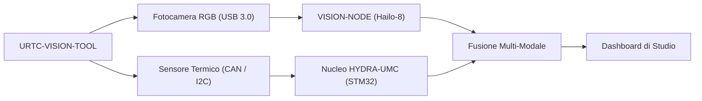

<p align="center">
  
</p>

# 👁️ URTC-VISION-TOOL

<p align="center"><a href="README.md">🇺🇸 English</a> | <a href="README_spa.md">🇪🇸 Español</a> | <a href="README_fra.md">🇫🇷 Français</a> | 🇮🇹 <b>Italiano</b> | <a href="README_deu.md">🇩🇪 Deutsch</a> | <a href="README_zho.md">🇨🇳 简体中文</a> | <a href="README_jpn.md">🇯🇵 日本語</a></p>

### 🔬 Testina Integrata che Combina Percezione Termica e RGB

<p align="left">
  
  
  
  
</p>

---

## 1. 🛠️ PANORAMICA TECNICA

**URTC-VISION-TOOL** è una testina robotica specializzata che fonde percezione visiva e termica in un unico effettore compatibile URTC. Progettata per QA avanzato, ispezione termica di PCB e allineamento Pick-and-Place ad alta precisione.

Dotata di una fotocamera RGB a otturatore globale e di un sensore termico della famiglia MLX9064x, fornisce al Vision AI Node dati a doppia modalità, permettendogli di rilevare non solo la presenza di un componente ma anche la sua temperatura di funzionamento o la dissipazione termica di una saldatura.

Non esiste ancora un PCB/schematico per questa scheda (vedi `hardware/`), quindi nulla di sottostante può pilotare sensori termici/RGB reali - ma la toolchain del firmware e la pipeline di visione lato host (generazione sintetica di frame, rendering a falsi colori, allineamento ROI RGB->termico ed estrazione di statistiche di temperatura, tutto coperto da pytest) sono reali e funzionano oggi.

### Caratteristiche Principali:
* 🔬 **Percezione Dual-Modale** — cattura sincronizzata di immagini Termiche e RGB. *(la pipeline di elaborazione alimentata da entrambi i frame è reale - vedi sotto; la cattura sincronizzata reale richiede il PCB e i sensori.)*
* 🌡️ **Termico ad Alta Precisione** — supporto integrato per sensori MLX90640/41/42. *(il rendering a falsi colori e l'estrazione di statistiche per regione sono reali - vedi sotto; leggere un vero MLX9064x via I2C richiede il PCB.)*
* 🎯 **Allineamento Eye-in-Hand** — PnP e AOI (Ispezione Ottica Automatizzata) sub-millimetrica. *(la mappatura di coordinate ROI RGB->termico e l'estrazione di statistiche di temperatura sono reali e testate - vedi `vision_companion/alignment.py` sotto; la precisione sub-millimetrica richiede una vera fotocamera calibrata.)*
* 📡 **API CAN Unificata** — integrata perfettamente nel catalogo di 25 utensili di URTC. *(il protocollo cablato lato sensore stesso - framing, CRC, validazione dell'intervallo - è reale, vedi sotto; serve ancora un vero transceiver CAN per trasportarlo davvero.)*
* 🔒 **Sicurezza del Protocollo Sensore** — framing versionato reale con checksum CRC8, validazione reale dell'intervallo di misura, limitazione della velocità reale, e contatori di diagnostica dedicati per errori/latenza/reset del bus. *(implementato)*
* ✅ **Toolchain firmware Cortex-M4F** — un'immagine bare-metal reale che compila e collega davvero con `arm-none-eabi-gcc`, la stessa toolchain dei repository gemelli URTC e URTC-SMART-RACK. *(implementato — vedi COMPILAZIONE sotto)*
* ✅ **Pipeline di elaborazione `vision_companion`** — un pacchetto Python reale e funzionante: generazione sintetica di frame termici+RGB, rendering termico a falsi colori, allineamento ROI RGB->termico + estrazione di statistiche di temperatura, report statistico, tutto coperto da 21 casi pytest reali, funziona end-to-end senza hardware collegato. *(implementato — vedi COMPAGNO DI VISIONE sotto)*

---

## 2. 🔄 FLUSSO DELLA TESTINA DI VISIONE



---

## 3. 🧱 ARCHITETTURA E DECISIONI DI PROGETTAZIONE

* **Perché questo progetto ha 2 tracce di versione indipendenti.** `src/firmware_common.h` (il firmware lato STM32) e `src/vision_companion/pyproject.toml` (un pacchetto Python separato lato host) sono versionati indipendentemente - girano su hardware diverso (MCU contro host CM5/PC) e vengono pubblicati con calendari diversi.
* **Perché non è un figlio di URTC stesso.** Stesso motivo del README proprio di URTC-SMART-RACK - uno Strumento Complementare che condivide il bus CAN/le convenzioni firmware di URTC, senza far parte della sua gerarchia di integrazione.
* **Perché un pacchetto companion lato host.** La cattura dual-modale termica/RGB richiede una vera elaborazione immagini (numpy/Pillow) che non ha posto sull'STM32 stesso - il pacchetto companion è dove ciò avviene realmente, parlando con la scheda via CAN.
* **Perché `alignment.py` assume un campo visivo condiviso invece di una vera omografia.** Entrambi i sensori sono sulla stessa testina fisica rigida, quindi un riscalamento lineare per asse tra le coordinate pixel in spazio RGB e spazio termico è un'approssimazione v0 ragionevole - una vera calibrazione per pixel (scacchiera, distorsione della lente) richiede vere fotocamere su cui calibrarsi, che non esistono ancora.
* **Come si inserisce nel resto dell'ecosistema.** Condivide il bus CAN/ecosistema utensili proprio di URTC, e forma un abbinamento naturale con HYDRA-UMC-DETECTION-HEF per lo stesso ruolo di riconoscimento visivo che svolge anche URTC-SMART-RACK.
* **Perché il protocollo di trama del sensore porta il proprio campo di timestamp.** Un vero timestamp in millisecondi lato sensore permette a chi chiama di sapere *quando* una lettura è stata effettivamente presa, indipendentemente da quando l'MCU riesce ad analizzare il frame - un reale valore storico/diagnostico che una semplice assunzione di "appena arrivato" farebbe perdere.
* **Perché i contatori di diagnostica (`sensor_diagnostics.c`) non prendono mai da soli una decisione di accettazione/rifiuto.** Solo `sensor_frame.c` (framing), `sensor_reading.c` (intervallo) e `rate_limiter.c` (limitazione della velocità) decidono se un frame è affidabile - la diagnostica si limita a registrare ciò che hanno deciso. Mantenere questo confine rigido significa che un bug nella diagnostica non può mai lasciar passare accidentalmente dati errati, la stessa "separar diagnostico de salida de control" dell'audit di promozione.

---

## 📂 STRUTTURA DELLE DIRECTORY

```text
URTC-VISION-TOOL/
├── src/
│   ├── firmware_common.h           # FIRMWARE_VERSION_MAJOR/MINOR/PATCH = 0.0.0
│   ├── sensor_frame.h / .c         # Reale: formato di frame versionato + parsing/codifica CRC8
│   ├── sensor_reading.h / .c       # Reale: decodifica lettura termica + validazione intervallo
│   ├── rate_limiter.h / .c         # Reale: limitazione frame a intervallo minimo
│   ├── sensor_diagnostics.h / .c   # Reale: contatori errori/latenza/reset bus, separati dal controllo
│   ├── main.c                      # Punto di ingresso minimo (ciclo di battito di vita)
│   ├── startup_stm32_minimal.c     # Tabella dei vettori + Reset_Handler (ancora senza HAL ST, vedi intestazione del file)
│   ├── STM32_MINIMAL.ld            # Linker script placeholder (base 128K FLASH / 32K RAM)
│   └── vision_companion/           # Pipeline di visione Python lato host (CM5/macchina di sviluppo)
│       ├── pyproject.toml          # Packaging + console script `vision-companion`
│       ├── requirements.txt        # numpy + pillow
│       ├── main.py                 # CLI reale e funzionante (version / selftest / analyze-roi)
│       ├── alignment.py            # Reale: mappatura ROI RGB<->termico + estrazione statistiche di temperatura
│       ├── tests/                  # 21 casi pytest reali (main.py + alignment.py)
│       └── README.md               # Documentazione specifica del companion
├── tests/                          # Harness di test firmware nativo host reale (sensor_frame, sensor_reading, rate_limiter, sensor_diagnostics, scenari sensore)
├── docs/                           # Documentazione e riferimento di calibrazione
├── hardware/                       # File di progettazione hardware (PCB, case) - vuoto, nessuno schematico ancora
├── firmware/                       # Output di build versionato (.bin/.elf/.hex), commesso come il repository gemello URTC
├── build/                          # Oggetti di build intermedi (ignorato da git)
├── images/                         # Media e diagrammi
├── scripts/                        # Script di utilità
├── bump_version.py                 # Incremento versione stile contachilometri (generico, condiviso con URTC / URTC-SMART-RACK)
├── build_firmware.sh / .bat        # Build reale: test host + incrementa versione + compila + collega + pubblica in firmware/
└── README.md
```

---

## 4. ⚙️ COMPILAZIONE (firmware)

Richiede la toolchain ARM GNU (`arm-none-eabi-gcc`, `arm-none-eabi-objcopy`, `arm-none-eabi-size`) e Python 3.

```bash
# Linux/macOS
chmod +x build_firmware.sh   # una tantum
./build_firmware.sh

# Windows
build_firmware.bat
```

Il build incrementa la versione di `src/firmware_common.h` (regola contachilometri), compila `main.c` e `startup_stm32_minimal.c` per Cortex-M4F, li collega con la mappa di memoria placeholder `STM32_MINIMAL.ld`, e pubblica file `.elf`/`.bin`/`.hex` versionati in `firmware/`. Non c'è ancora nulla da flashare su hardware reale - non esiste un PCB che confermi la parte STM32 target, il pinout, il cablaggio dell'MLX9064x, o l'interfaccia della fotocamera RGB.

## 5. 🐍 COMPAGNO DI VISIONE (Python lato host)

Questa parte funziona oggi, completamente, senza alcun hardware collegato:

```bash
cd src/vision_companion
python3 -m venv .venv
# Linux/macOS:
.venv/bin/pip install -r requirements.txt
.venv/bin/python main.py selftest

# Windows:
.venv\Scripts\pip install -r requirements.txt
.venv\Scripts\python main.py selftest
```

`selftest` genera un frame termico sintetico a forma di MLX9064x (32x24, con un punto caldo tipo punta saldante) e un pattern di test RGB a barre colorate, esegue il rendering/salva entrambi come file reali, e stampa le loro statistiche — prova che la pipeline di elaborazione numpy/Pillow funziona davvero, indipendentemente dal passaggio di cattura reale del sensore che arriverà quando esisterà l'hardware.

`analyze-roi X0 Y0 X1 Y1` mappa un riquadro delimitatore in spazio RGB verso lo spazio termico e riporta statistiche reali di temperatura per quella regione — la logica di allineamento dietro la funzionalità Eye-in-Hand Alignment del README, reale oggi:

```bash
.venv/bin/python main.py analyze-roi 280 210 360 270
```

Output di esempio reale:

```text
RGB ROI (280,210)-(360,270) in a 640x480 frame
  -> thermal stats: min=75.67C max=78.97C mean=77.69C (16 thermal px)
```

21 casi pytest reali coprono sia `main.py` che `alignment.py`:

```bash
pip install -e ".[dev]"
pytest
```

Vedi `src/vision_companion/README.md` per la documentazione completa del companion.

---

## 🔗 Progetti Correlati

Questo progetto fa parte di un ecosistema robotico più ampio dello stesso autore (JuanenRac / Electro Hobby 3D), che copre firmware, software di controllo, nodi IA e strumenti di flotta. Utile saperlo, perché una richiesta potrebbe in realtà riguardare uno di questi progetti anziché questo repository.

### Relazione Diretta

- **[URTC](https://github.com/JuanenRac/URTC)** — stesso ecosistema di strumenti / bus CAN.
- **[HYDRA-UMC-DETECTION-HEF](https://github.com/JuanenRac/HYDRA-UMC-DETECTION-HEF)** — fratello di riconoscimento visivo.

### Resto dell'Ecosistema

**Piattaforma HYDRA-UMC** — la cella di micro-fabbrica multi-robot
- **[HYDRA-UMC](https://github.com/JuanenRac/HYDRA-UMC)** — la scheda madre CM5 + STM32H745 che orchestra fino a 8 bracci robotici.
- **[HYDRA-UMC-SERVER](https://github.com/JuanenRac/HYDRA-UMC-SERVER)** — il backend Express/WebSocket con cui parla ogni client di controllo.
- **[HYDRA-UMC-STUDIO](https://github.com/JuanenRac/HYDRA-UMC-STUDIO)** — dashboard di controllo web, visualizzazione 3D multi-robot.
- **[HYDRA-UMC-ANDROID-CONTROL](https://github.com/JuanenRac/HYDRA-UMC-ANDROID-CONTROL)** — app di controllo Android via Wi-Fi/Bluetooth.
- **[HYDRA-UMC-IOS-CONTROL](https://github.com/JuanenRac/HYDRA-UMC-IOS-CONTROL)** — app di controllo iOS/iPadOS costruita in Flutter.
- **[HYDRA-UMC-SUITE](https://github.com/JuanenRac/HYDRA-UMC-SUITE)** — centro di comando sciame desktop (Python/PySide6).
- **[HYDRA-UMC-EDITOR-URDF](https://github.com/JuanenRac/HYDRA-UMC-EDITOR-URDF)** — editor desktop di modelli URDF per il catalogo robot.
- **[HYDRA-UMC-DSI](https://github.com/JuanenRac/HYDRA-UMC-DSI)** — interfaccia touch nativa per lo schermo DSI a bordo.

**Piattaforma URTC** — il controller della testa utensile che ogni braccio HYDRA-UMC porta con sé
- **[URTC](https://github.com/JuanenRac/URTC)** — controller testa utensile su bus CAN, 25 profili utensile.
- **[URTC-FLASHER](https://github.com/JuanenRac/URTC-FLASHER)** — strumento desktop di flashing CAN-OTA + SWD/JTAG.
- **[URTC-TESTER](https://github.com/JuanenRac/URTC-TESTER)** — strumento desktop di diagnostica CAN live.
- **[URTC-WEB-STUDIO](https://github.com/JuanenRac/URTC-WEB-STUDIO)** — alternativa basata su browser via Web Serial API.

**🎥 Nodo di Visione IA (Hailo-8)**
- [HYDRA-UMC-VISION-NODE](https://github.com/JuanenRac/HYDRA-UMC-VISION-NODE)
- [HYDRA-UMC-VISION-STREAMER](https://github.com/JuanenRac/HYDRA-UMC-VISION-STREAMER)
- [HYDRA-UMC-DETECTION-HEF](https://github.com/JuanenRac/HYDRA-UMC-DETECTION-HEF)
- [HYDRA-UMC-SAFETY-ZONES](https://github.com/JuanenRac/HYDRA-UMC-SAFETY-ZONES)
- [HYDRA-UMC-VISUAL-SERVOING-API](https://github.com/JuanenRac/HYDRA-UMC-VISUAL-SERVOING-API)

**🧠 Nodo IA Cognitiva (Hailo-10)**
- [HYDRA-UMC-COGNITIVE-NODE](https://github.com/JuanenRac/HYDRA-UMC-COGNITIVE-NODE)
- [HYDRA-UMC-VLA-ENGINE](https://github.com/JuanenRac/HYDRA-UMC-VLA-ENGINE)
- [HYDRA-UMC-VOICE-UI](https://github.com/JuanenRac/HYDRA-UMC-VOICE-UI)
- [HYDRA-UMC-SEMANTIC-PLANNER](https://github.com/JuanenRac/HYDRA-UMC-SEMANTIC-PLANNER)
- [HYDRA-UMC-DOCS-QA](https://github.com/JuanenRac/HYDRA-UMC-DOCS-QA)

**🐝 Orchestrazione e Sciame**
- [HYDRA-UMC-ORCHESTRATOR](https://github.com/JuanenRac/HYDRA-UMC-ORCHESTRATOR)
- [HYDRA-UMC-SWARM-SYNC](https://github.com/JuanenRac/HYDRA-UMC-SWARM-SYNC)
- [HYDRA-UMC-PATH-PLANNER-3D](https://github.com/JuanenRac/HYDRA-UMC-PATH-PLANNER-3D)
- [HYDRA-UMC-JOB-DISPATCHER](https://github.com/JuanenRac/HYDRA-UMC-JOB-DISPATCHER)
- [HYDRA-UMC-NODE-HEALING](https://github.com/JuanenRac/HYDRA-UMC-NODE-HEALING)

**🎮 Gemello Digitale e Simulazione**
- [HYDRA-UMC-TWIN](https://github.com/JuanenRac/HYDRA-UMC-TWIN)
- [HYDRA-UMC-PHYSICS-REPLICA](https://github.com/JuanenRac/HYDRA-UMC-PHYSICS-REPLICA)
- [HYDRA-UMC-HIL-BRIDGE](https://github.com/JuanenRac/HYDRA-UMC-HIL-BRIDGE)
- [HYDRA-UMC-SYNTHETIC-DATA-GEN](https://github.com/JuanenRac/HYDRA-UMC-SYNTHETIC-DATA-GEN)

**📊 Dati e Analisi**
- [HYDRA-UMC-DATALAKE](https://github.com/JuanenRac/HYDRA-UMC-DATALAKE)
- [HYDRA-UMC-TELEMETRY-COLLECTOR](https://github.com/JuanenRac/HYDRA-UMC-TELEMETRY-COLLECTOR)
- [HYDRA-UMC-ANOMALY-DETECTOR](https://github.com/JuanenRac/HYDRA-UMC-ANOMALY-DETECTOR)
- [HYDRA-UMC-PRODUCTION-REPORTS](https://github.com/JuanenRac/HYDRA-UMC-PRODUCTION-REPORTS)

**🏭 Gateway Industriale**
- [HYDRA-UMC-GATEWAY-INDUSTRIAL](https://github.com/JuanenRac/HYDRA-UMC-GATEWAY-INDUSTRIAL)
- [HYDRA-UMC-OPCUA-SERVER](https://github.com/JuanenRac/HYDRA-UMC-OPCUA-SERVER)
- [HYDRA-UMC-MQTT-BROKER](https://github.com/JuanenRac/HYDRA-UMC-MQTT-BROKER)
- [HYDRA-UMC-MTCONNECT-ADAPTER](https://github.com/JuanenRac/HYDRA-UMC-MTCONNECT-ADAPTER)

**🛠️ Strumenti Complementari**
- [URTC-SMART-RACK](https://github.com/JuanenRac/URTC-SMART-RACK)
- [HYDRA-UMC-WATCH](https://github.com/JuanenRac/HYDRA-UMC-WATCH)
- [HYDRA-UMC-TOOL-CLI](https://github.com/JuanenRac/HYDRA-UMC-TOOL-CLI)
- [HYDRA-UMC-DASHBOARD-AI](https://github.com/JuanenRac/HYDRA-UMC-DASHBOARD-AI)


## 👤 AUTORE
**JuanenRac** (Electro Hobby 3D)
📧 electrohobby3d@gmail.com

## 📜 LICENZA
GPL-3.0 - Vedi LICENSE per i dettagli.
