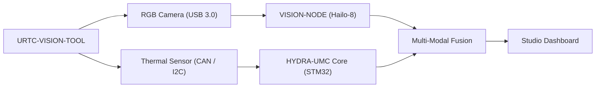

<p align="center">
  
</p>

# 👁️ URTC-VISION-TOOL

<p align="center"><a href="README.md">🇺🇸 English</a> | <a href="README_spa.md">🇪🇸 Español</a> | <a href="README_fra.md">🇫🇷 Français</a> | <a href="README_ita.md">🇮🇹 Italiano</a> | <a href="README_deu.md">🇩🇪 Deutsch</a> | <a href="README_zho.md">🇨🇳 简体中文</a> | 🇯🇵 <b>日本語</b></p>

### 🔬 熱画像と RGB 知覚を統合したエンドエフェクター

<p align="left">
  
  
  
  
</p>

---

## 1. 🛠️ 技術概要

**URTC-VISION-TOOL** は、視覚的知覚と熱知覚を単一の URTC 互換エフェクター
に統合した専用のロボット工具ヘッドです。高度な QA、PCB の熱画像検査、
高精度なピック＆プレースアライメント向けに設計されています。

RGB グローバルシャッターカメラと MLX9064x ファミリーの熱センサーを搭載し、
視覚 AI ノードにデュアルモーダルデータを提供します。これにより、部品の
存在だけでなく、その動作温度やはんだの放熱状況も検知できます。

この基板にはまだ PCB/回路図が存在しないため（`hardware/` 参照）、以下の
どの機能も実際の熱画像/RGB センサーを駆動することはできません——しかし
ファームウェアツールチェーンとホスト側の視覚処理パイプライン（合成フレーム
生成、疑似カラーレンダリング、RGB->熱画像 ROI アライメントと温度統計抽出、
すべて pytest でカバー）は今日すでに本物であり、動作します。

### 主な機能：
* 🔬 **デュアルモーダル知覚** — 同期された熱画像と RGB 画像のキャプチャ。*（両フレームが供給する処理パイプライン自体は本物です——下記参照。実際の同期キャプチャには PCB とセンサーが必要です。）*
* 🌡️ **高精度熱画像** — 統合された MLX90640/41/42 センサーサポート。*（疑似カラーレンダリングと領域ごとの統計抽出は本物です——下記参照。実際の MLX9064x を I2C 経由で読み取るには PCB が必要です。）*
* 🎯 **Eye-in-Hand アライメント** — サブミリメートル単位の PnP と AOI（自動光学検査）。*（RGB->熱画像 ROI 座標マッピングと温度統計抽出は本物でテスト済みです——下記の `vision_companion/alignment.py` 参照。サブミリメートル精度には実際に校正されたカメラが必要です。）*
* 📡 **統一 CAN API** — URTC の 25 種類の工具カタログにシームレスに統合。*（計画中——実際の CAN トランシーバーが必要です。）*
* ✅ **Cortex-M4F ファームウェアツールチェーン** — 兄弟リポジトリ URTC と URTC-SMART-RACK と同じツールチェーンを用いて、`arm-none-eabi-gcc` でクロスコンパイルおよびリンクされる実際のベアメタルイメージ。*（実装済み——下記の「ビルド」を参照）*
* ✅ **`vision_companion` 処理パイプライン** — 実際に動作する Python パッケージ：合成された熱画像+RGB フレーム生成、疑似カラー熱画像レンダリング、RGB->熱画像 ROI アライメント + 温度統計抽出、統計レポート、21 件の実際の pytest ケースでカバー、ハードウェア接続なしでエンドツーエンドに実行可能。*（実装済み——下記の「VISION COMPANION」を参照）*

---

## 2. 🔄 ビジョンツールフロー



---

## 3. 🧱 アーキテクチャと設計上の決定

* **本プロジェクトが 2 つの独立したバージョン管理系統を持つ理由。** `src/firmware_common.h`（STM32 側のファームウェア）と `src/vision_companion/pyproject.toml`（独立したホスト側 Python パッケージ）は独立してバージョン管理されています——異なるハードウェア（MCU 対ホストの CM5/PC）上で動作し、異なるスケジュールで出荷されるためです。
* **URTC 自体の子プロジェクトではない理由。** URTC-SMART-RACK 自身の README と同じ理由です——URTC の CAN バス/ファームウェアの慣例を共有する補完ツールであり、その統合階層の一部ではありません。
* **そもそもホスト側のコンパニオンパッケージが必要な理由。** 熱画像/RGB のデュアルモーダルキャプチャには、STM32 自体で実行する場所のない実際の画像処理（numpy/Pillow）が必要です——このコンパニオンパッケージは、CAN 経由で基板と通信しながら、実際にその処理が行われる場所です。
* **`alignment.py` が実際のホモグラフィではなく共有視野を前提とする理由。** 両方のセンサーは同じ剛体の工具ヘッド上にあるため、RGB 空間と熱画像空間のピクセル座標間で軸ごとの線形再スケーリングを行うのは妥当な v0 近似です——実際のピクセル単位のキャリブレーション（チェッカーボード、レンズ歪み）には、まだ存在しない実際のカメラでの校正が必要です。
* **エコシステムの他の部分との関係。** URTC 自身の CAN バス/工具エコシステムを共有しており、URTC-SMART-RACK も担っているのと同じ視覚認識の役割を果たす HYDRA-UMC-DETECTION-HEF と自然に組み合わされます。

---

## 📂 リポジトリ構成

```text
URTC-VISION-TOOL/
├── src/
│   ├── firmware_common.h           # FIRMWARE_VERSION_MAJOR/MINOR/PATCH = 0.0.0
│   ├── main.c                      # 最小限のエントリポイント（生存証明のハートビートループ）
│   ├── startup_stm32_minimal.c     # ベクターテーブル + Reset_Handler（ST HAL はまだなし、ファイルヘッダー参照）
│   ├── STM32_MINIMAL.ld            # プレースホルダーリンカスクリプト（128K FLASH / 32K RAM の下限）
│   └── vision_companion/           # ホスト側（CM5/開発機）の Python 視覚パイプライン
│       ├── pyproject.toml          # パッケージング + `vision-companion` コンソールスクリプト
│       ├── requirements.txt        # numpy + pillow
│       ├── main.py                 # 実際に動作する CLI（バージョン/自己診断/analyze-roi）
│       ├── alignment.py            # 本物：RGB<->熱画像 ROI マッピング + 温度統計抽出
│       ├── tests/                  # 21 件の実際の pytest ケース（main.py + alignment.py）
│       └── README.md               # コンパニオン専用の使用方法ドキュメント
├── docs/                           # ドキュメントとキャリブレーションリファレンス
├── hardware/                       # ハードウェア設計ファイル（PCB、筐体）—— 現時点では空、回路図なし
├── firmware/                       # バージョン管理されたビルド出力（.bin/.elf/.hex）、兄弟リポジトリ URTC と同様にコミットされる
├── build/                          # 中間ビルドオブジェクト（gitignore 対象）
├── images/                         # メディアと図表
├── scripts/                        # ユーティリティスクリプト
├── bump_version.py                 # オドメーター式バージョンインクリメント（汎用スクリプト、URTC / URTC-SMART-RACK と共有）
├── build_firmware.sh / .bat        # 実際のビルド：バージョンインクリメント + コンパイル + リンク + firmware/ へ公開
└── README.md
```

---

## 4. ⚙️ ビルド（ファームウェア）

ARM GNU ツールチェーン（`arm-none-eabi-gcc`、`arm-none-eabi-objcopy`、
`arm-none-eabi-size`）と Python 3 が必要です。

```bash
# Linux/macOS
chmod +x build_firmware.sh   # 初回のみ
./build_firmware.sh

# Windows
build_firmware.bat
```

このビルドは `src/firmware_common.h` のバージョンを増加させ（オドメーター
規則）、`main.c` と `startup_stm32_minimal.c` を Cortex-M4F 向けにコン
パイルし、プレースホルダーである `STM32_MINIMAL.ld` のメモリマップと
リンクし、バージョン管理された `.elf`/`.bin`/`.hex` ファイルを
`firmware/` に公開します。実際のハードウェアにフラッシュできるものは
今のところ何もありません——対象の STM32 部品、ピン配置、MLX9064x の配線、
RGB カメラインターフェースを確認できる PCB が存在しないためです。

## 5. 🐍 ビジョンコンパニオン（ホスト側 Python）

この部分は今日、ハードウェアを一切接続することなく完全に動作します：

```bash
cd src/vision_companion
python3 -m venv .venv
# Linux/macOS：
.venv/bin/pip install -r requirements.txt
.venv/bin/python main.py selftest

# Windows：
.venv\Scripts\pip install -r requirements.txt
.venv\Scripts\python main.py selftest
```

`selftest` は、MLX9064x 形式に合わせた合成熱画像フレーム（32x24、はんだ
ごて先のようなホットスポット付き）と、合成 RGB カラーバーテストパターン
を生成し、両方を実際のファイルとしてレンダリング/保存し、その統計情報を
表示します——これは、実際のハードウェアが存在するようになった時点で実装
されるセンサーキャプチャのステップとは独立して、numpy/Pillow の処理
パイプラインが本当に機能することの証明です。

`analyze-roi X0 Y0 X1 Y1` は、RGB 空間のバウンディングボックスを熱画像
空間にマッピングし、その領域の実際の温度統計を報告します——README の
「Eye-in-Hand Alignment」機能の背後にあるアライメントロジックで、今日
実際に動作します：

```bash
.venv/bin/python main.py analyze-roi 280 210 360 270
```

実際の出力例：

```text
RGB ROI (280,210)-(360,270) in a 640x480 frame
  -> thermal stats: min=75.67C max=78.97C mean=77.69C (16 thermal px)
```

21 件の実際の pytest ケースが `main.py` と `alignment.py` の両方をカバー
します：

```bash
pip install -e ".[dev]"
pytest
```

完全なコンパニオンドキュメントについては `src/vision_companion/README.md`
を参照してください。

---

## 🔗 関連プロジェクト

本プロジェクトは、同一著者（JuanenRac / Electro Hobby 3D）による、
ファームウェア、制御ソフトウェア、AI ノード、フリート管理ツールにまたがる、
より大きなロボティクスエコシステムの一部です。ご要望が実際にはこれらの
プロジェクトのいずれかに関するものであり、本リポジトリのものではない
可能性もあるため、知っておく価値があります。

### 直接関連

- **[URTC](https://github.com/JuanenRac/URTC)** —— 同一の工具エコシステム/CAN バス。
- **[HYDRA-UMC-DETECTION-HEF](https://github.com/JuanenRac/HYDRA-UMC-DETECTION-HEF)** —— 視覚認識の同族プロジェクト。

### エコシステムのその他のプロジェクト

**HYDRA-UMC プラットフォーム** — マルチロボット・マイクロファクトリーセル
- **[HYDRA-UMC](https://github.com/JuanenRac/HYDRA-UMC)** — 最大 8 台のロボットアームを統括する CM5 + STM32H745 マザーボード。
- **[HYDRA-UMC-SERVER](https://github.com/JuanenRac/HYDRA-UMC-SERVER)** — すべての制御クライアントが接続する Express/WebSocket バックエンド。
- **[HYDRA-UMC-STUDIO](https://github.com/JuanenRac/HYDRA-UMC-STUDIO)** — Web ベースの制御ダッシュボード、マルチロボット 3D 可視化。
- **[HYDRA-UMC-ANDROID-CONTROL](https://github.com/JuanenRac/HYDRA-UMC-ANDROID-CONTROL)** — Wi-Fi/Bluetooth 経由の Android 制御アプリ。
- **[HYDRA-UMC-IOS-CONTROL](https://github.com/JuanenRac/HYDRA-UMC-IOS-CONTROL)** — Flutter で構築された iOS/iPadOS 制御アプリ。
- **[HYDRA-UMC-SUITE](https://github.com/JuanenRac/HYDRA-UMC-SUITE)** — デスクトップ版群制御コマンドセンター（Python/PySide6）。
- **[HYDRA-UMC-EDITOR-URDF](https://github.com/JuanenRac/HYDRA-UMC-EDITOR-URDF)** — ロボットカタログ向けのデスクトップ版 URDF モデルエディター。
- **[HYDRA-UMC-DSI](https://github.com/JuanenRac/HYDRA-UMC-DSI)** — 機載 DSI タッチスクリーン用のネイティブタッチ UI。

**URTC プラットフォーム** — すべての HYDRA-UMC ロボットアームが搭載するツールヘッドコントローラー
- **[URTC](https://github.com/JuanenRac/URTC)** — CAN バスツールヘッドコントローラー、25 種類のツールプロファイル。
- **[URTC-FLASHER](https://github.com/JuanenRac/URTC-FLASHER)** — デスクトップ版 CAN-OTA + SWD/JTAG フラッシュツール。
- **[URTC-TESTER](https://github.com/JuanenRac/URTC-TESTER)** — デスクトップ版ライブ CAN バス診断ツール。
- **[URTC-WEB-STUDIO](https://github.com/JuanenRac/URTC-WEB-STUDIO)** — Web Serial API によるブラウザベースの代替版。

**🎥 ビジョン AI ノード（Hailo-8）**
- [HYDRA-UMC-VISION-NODE](https://github.com/JuanenRac/HYDRA-UMC-VISION-NODE)
- [HYDRA-UMC-VISION-STREAMER](https://github.com/JuanenRac/HYDRA-UMC-VISION-STREAMER)
- [HYDRA-UMC-DETECTION-HEF](https://github.com/JuanenRac/HYDRA-UMC-DETECTION-HEF)
- [HYDRA-UMC-SAFETY-ZONES](https://github.com/JuanenRac/HYDRA-UMC-SAFETY-ZONES)
- [HYDRA-UMC-VISUAL-SERVOING-API](https://github.com/JuanenRac/HYDRA-UMC-VISUAL-SERVOING-API)

**🧠 認知 AI ノード（Hailo-10）**
- [HYDRA-UMC-COGNITIVE-NODE](https://github.com/JuanenRac/HYDRA-UMC-COGNITIVE-NODE)
- [HYDRA-UMC-VLA-ENGINE](https://github.com/JuanenRac/HYDRA-UMC-VLA-ENGINE)
- [HYDRA-UMC-VOICE-UI](https://github.com/JuanenRac/HYDRA-UMC-VOICE-UI)
- [HYDRA-UMC-SEMANTIC-PLANNER](https://github.com/JuanenRac/HYDRA-UMC-SEMANTIC-PLANNER)
- [HYDRA-UMC-DOCS-QA](https://github.com/JuanenRac/HYDRA-UMC-DOCS-QA)

**🐝 オーケストレーションと群制御**
- [HYDRA-UMC-ORCHESTRATOR](https://github.com/JuanenRac/HYDRA-UMC-ORCHESTRATOR)
- [HYDRA-UMC-SWARM-SYNC](https://github.com/JuanenRac/HYDRA-UMC-SWARM-SYNC)
- [HYDRA-UMC-PATH-PLANNER-3D](https://github.com/JuanenRac/HYDRA-UMC-PATH-PLANNER-3D)
- [HYDRA-UMC-JOB-DISPATCHER](https://github.com/JuanenRac/HYDRA-UMC-JOB-DISPATCHER)
- [HYDRA-UMC-NODE-HEALING](https://github.com/JuanenRac/HYDRA-UMC-NODE-HEALING)

**🎮 デジタルツインとシミュレーション**
- [HYDRA-UMC-TWIN](https://github.com/JuanenRac/HYDRA-UMC-TWIN)
- [HYDRA-UMC-PHYSICS-REPLICA](https://github.com/JuanenRac/HYDRA-UMC-PHYSICS-REPLICA)
- [HYDRA-UMC-HIL-BRIDGE](https://github.com/JuanenRac/HYDRA-UMC-HIL-BRIDGE)
- [HYDRA-UMC-SYNTHETIC-DATA-GEN](https://github.com/JuanenRac/HYDRA-UMC-SYNTHETIC-DATA-GEN)

**📊 データと分析**
- [HYDRA-UMC-DATALAKE](https://github.com/JuanenRac/HYDRA-UMC-DATALAKE)
- [HYDRA-UMC-TELEMETRY-COLLECTOR](https://github.com/JuanenRac/HYDRA-UMC-TELEMETRY-COLLECTOR)
- [HYDRA-UMC-ANOMALY-DETECTOR](https://github.com/JuanenRac/HYDRA-UMC-ANOMALY-DETECTOR)
- [HYDRA-UMC-PRODUCTION-REPORTS](https://github.com/JuanenRac/HYDRA-UMC-PRODUCTION-REPORTS)

**🏭 産業用ゲートウェイ**
- [HYDRA-UMC-GATEWAY-INDUSTRIAL](https://github.com/JuanenRac/HYDRA-UMC-GATEWAY-INDUSTRIAL)
- [HYDRA-UMC-OPCUA-SERVER](https://github.com/JuanenRac/HYDRA-UMC-OPCUA-SERVER)
- [HYDRA-UMC-MQTT-BROKER](https://github.com/JuanenRac/HYDRA-UMC-MQTT-BROKER)
- [HYDRA-UMC-MTCONNECT-ADAPTER](https://github.com/JuanenRac/HYDRA-UMC-MTCONNECT-ADAPTER)

**🛠️ 補完ツール**
- [URTC-SMART-RACK](https://github.com/JuanenRac/URTC-SMART-RACK)
- [HYDRA-UMC-WATCH](https://github.com/JuanenRac/HYDRA-UMC-WATCH)
- [HYDRA-UMC-TOOL-CLI](https://github.com/JuanenRac/HYDRA-UMC-TOOL-CLI)
- [HYDRA-UMC-DASHBOARD-AI](https://github.com/JuanenRac/HYDRA-UMC-DASHBOARD-AI)


## 👤 作者
**JuanenRac**（Electro Hobby 3D）
📧 electrohobby3d@gmail.com

## 📜 ライセンス
GPL-3.0 —— 詳細は LICENSE を参照してください。

## 🛠️ BUILD & RUN

リリースビルドの前に、バージョンを変更しないビルドチェックを使用してください。

| 操作 | Windows | Linux / macOS |
|---|---|---|
| ビルドチェック（バージョンと CHANGELOG を変更しない） | `build-test.bat` | `./build-test.sh` |
| 実行 / 開発（提供されている場合） | `run*.bat` または `dev*.bat` | `./run*.sh` または `./dev*.sh` |

`build-test.bat` と `build-test.sh` は、`hydra-umc.project.json` をインクリメントせず、`CHANGELOG.md` も変更せずにプロジェクトのスタックをコンパイルまたは検証します。通常のコンパイラ出力だけが作成される場合があります。既存の `build*.bat`、`build*.sh`、`run*`、`dev*` は、各プロジェクト固有のバージョン化または実行時の動作を維持します。その動作が必要な場合はそれらを使用してください。