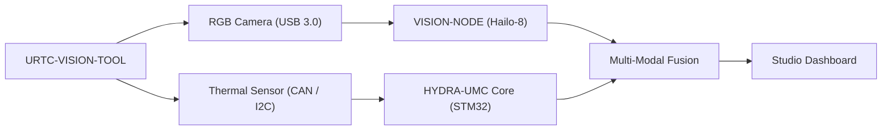

<p align="center">
  
</p>

# 👁️ URTC-VISION-TOOL

<p align="center"><a href="README.md">🇺🇸 English</a> | <a href="README_spa.md">🇪🇸 Español</a> | <a href="README_fra.md">🇫🇷 Français</a> | <a href="README_ita.md">🇮🇹 Italiano</a> | <a href="README_deu.md">🇩🇪 Deutsch</a> | <a href="README_zho.md">🇨🇳 简体中文</a> | 🇯🇵 <b>日本語</b></p>

### 🔬 熱画像と RGB 知覚を統合したエンドエフェクター

<p align="left">
  
  
  
  
</p>

---

## 1. 🛠️ 技術概要

**URTC-VISION-TOOL** は、視覚的知覚と熱知覚を単一の URTC 互換エフェクター
に統合した専用のロボット工具ヘッドです。高度な QA、PCB の熱画像検査、
高精度なピック＆プレースアライメント向けに設計されています。

RGB グローバルシャッターカメラと MLX9064x ファミリーの熱センサーを搭載し、
視覚 AI ノードにデュアルモーダルデータを提供します。これにより、部品の
存在だけでなく、その動作温度やはんだの放熱状況も検知できます。

この基板にはまだ PCB/回路図が存在しないため（`hardware/` 参照）、以下の
どの機能も実際の熱画像/RGB センサーを駆動することはできません——しかし
ファームウェアツールチェーンとホスト側の視覚処理パイプライン（合成フレーム
生成、疑似カラーレンダリング、RGB->熱画像 ROI アライメントと温度統計抽出、
すべて pytest でカバー）は今日すでに本物であり、動作します。

### 主な機能：
* 🔬 **デュアルモーダル知覚** — 同期された熱画像と RGB 画像のキャプチャ。*（両フレームが供給する処理パイプライン自体は本物です——下記参照。実際の同期キャプチャには PCB とセンサーが必要です。）*
* 🌡️ **高精度熱画像** — 統合された MLX90640/41/42 センサーサポート。*（疑似カラーレンダリングと領域ごとの統計抽出は本物です——下記参照。実際の MLX9064x を I2C 経由で読み取るには PCB が必要です。）*
* 🎯 **Eye-in-Hand アライメント** — サブミリメートル単位の PnP と AOI（自動光学検査）。*（RGB->熱画像 ROI 座標マッピングと温度統計抽出は本物でテスト済みです——下記の `vision_companion/alignment.py` 参照。サブミリメートル精度には実際に校正されたカメラが必要です。）*
* 📡 **統一 CAN API** — URTC の 25 種類の工具カタログにシームレスに統合。*（センサー側のワイヤープロトコル自体——フレーミング、CRC、範囲検証——は本物です。下記参照。それを実際に伝送する実際の CAN トランシーバーはまだ必要です。）*
* 🔒 **センサープロトコルの安全性** — 実際のバージョン管理されたフレーミング、CRC8 チェックサム、実際の測定範囲検証、実際のレート制限、そして制御判断とは独立した専用のエラー/レイテンシ/バスリセット診断カウンター。*（実装済み）*
* ✅ **Cortex-M4F ファームウェアツールチェーン** — 兄弟リポジトリ URTC と URTC-SMART-RACK と同じツールチェーンを用いて、`arm-none-eabi-gcc` でクロスコンパイルおよびリンクされる実際のベアメタルイメージ。*（実装済み——下記の「ビルド」を参照）*
* ✅ **`vision_companion` 処理パイプライン** — 実際に動作する Python パッケージ：合成された熱画像+RGB フレーム生成、疑似カラー熱画像レンダリング、RGB->熱画像 ROI アライメント + 温度統計抽出、統計レポート、21 件の実際の pytest ケースでカバー、ハードウェア接続なしでエンドツーエンドに実行可能。*（実装済み——下記の「VISION COMPANION」を参照）*

---

## 2. 🔄 ビジョンツールフロー



---

## 3. 🧱 アーキテクチャと設計上の決定

* **本プロジェクトが 2 つの独立したバージョン管理系統を持つ理由。** `src/firmware_common.h`（STM32 側のファームウェア）と `src/vision_companion/pyproject.toml`（独立したホスト側 Python パッケージ）は独立してバージョン管理されています——異なるハードウェア（MCU 対ホストの CM5/PC）上で動作し、異なるスケジュールで出荷されるためです。
* **URTC 自体の子プロジェクトではない理由。** URTC-SMART-RACK 自身の README と同じ理由です——URTC の CAN バス/ファームウェアの慣例を共有する補完ツールであり、その統合階層の一部ではありません。
* **そもそもホスト側のコンパニオンパッケージが必要な理由。** 熱画像/RGB のデュアルモーダルキャプチャには、STM32 自体で実行する場所のない実際の画像処理（numpy/Pillow）が必要です——このコンパニオンパッケージは、CAN 経由で基板と通信しながら、実際にその処理が行われる場所です。
* **`alignment.py` が実際のホモグラフィではなく共有視野を前提とする理由。** 両方のセンサーは同じ剛体の工具ヘッド上にあるため、RGB 空間と熱画像空間のピクセル座標間で軸ごとの線形再スケーリングを行うのは妥当な v0 近似です——実際のピクセル単位のキャリブレーション（チェッカーボード、レンズ歪み）には、まだ存在しない実際のカメラでの校正が必要です。
* **エコシステムの他の部分との関係。** URTC 自身の CAN バス/工具エコシステムを共有しており、URTC-SMART-RACK も担っているのと同じ視覚認識の役割を果たす HYDRA-UMC-DETECTION-HEF と自然に組み合わされます。
* **センサーフレームプロトコルが独自のタイムスタンプフィールドを持つ理由。** 実際のセンサー側ミリ秒単位のタイムスタンプにより、呼び出し元は、MCU がいつそのフレームの解析にたどり着くかとは無関係に、読み取りが実際に*いつ*行われたかを知ることができます——単に「たった今届いた」という前提では失われてしまう、履歴管理/診断における実際の価値です。
* **診断カウンター（`sensor_diagnostics.c`）が自ら受理/拒否の判断を一切行わない理由。** フレームが信頼できるかどうかを決定するのは `sensor_frame.c`（フレーミング）、`sensor_reading.c`（範囲）、`rate_limiter.c`（レート制限）のみであり——診断はそれらが決定した結果を記録するだけです。この境界を厳格に保つことで、診断側のバグが誤って不正なデータを通過させてしまうことは決してなくなります。これは昇格監査自身が言う「separar diagnostico de salida de control」そのものです。

---

## 📂 リポジトリ構成

```text
URTC-VISION-TOOL/
├── src/
│   ├── firmware_common.h           # FIRMWARE_VERSION_MAJOR/MINOR/PATCH = 0.0.0
│   ├── sensor_frame.h / .c         # 本物：バージョン管理されたフレーム形式 + CRC8 パース/エンコード
│   ├── sensor_reading.h / .c       # 本物：熱画像読み取りのデコード + 範囲検証
│   ├── rate_limiter.h / .c         # 本物：最小間隔によるフレームのスロットリング
│   ├── sensor_diagnostics.h / .c   # 本物：エラー/レイテンシ/バスリセットのカウンター、制御からは分離
│   ├── main.c                      # 最小限のエントリポイント（生存証明のハートビートループ）
│   ├── startup_stm32_minimal.c     # ベクターテーブル + Reset_Handler（ST HAL はまだなし、ファイルヘッダー参照）
│   ├── STM32_MINIMAL.ld            # プレースホルダーリンカスクリプト（128K FLASH / 32K RAM の下限）
│   └── vision_companion/           # ホスト側（CM5/開発機）の Python 視覚パイプライン
│       ├── pyproject.toml          # パッケージング + `vision-companion` コンソールスクリプト
│       ├── requirements.txt        # numpy + pillow
│       ├── main.py                 # 実際に動作する CLI（バージョン/自己診断/analyze-roi）
│       ├── alignment.py            # 本物：RGB<->熱画像 ROI マッピング + 温度統計抽出
│       ├── tests/                  # 21 件の実際の pytest ケース（main.py + alignment.py）
│       └── README.md               # コンパニオン専用の使用方法ドキュメント
├── tests/                          # 実際のホストネイティブなファームウェアテストハーネス（sensor_frame、sensor_reading、rate_limiter、sensor_diagnostics、センサーシナリオ）
├── docs/                           # ドキュメントとキャリブレーションリファレンス
├── hardware/                       # ハードウェア設計ファイル（PCB、筐体）—— 現時点では空、回路図なし
├── firmware/                       # バージョン管理されたビルド出力（.bin/.elf/.hex）、兄弟リポジトリ URTC と同様にコミットされる
├── build/                          # 中間ビルドオブジェクト（gitignore 対象）
├── images/                         # メディアと図表
├── tools/
│   ├── build_test.py               # バージョンを更新しないビルド/コンパイル確認
│   └── ci_validate.py              # CI が使用する manifest/CHANGELOG/docs の検証
├── bump_version.py                 # オドメーター式バージョンインクリメント（汎用スクリプト、URTC / URTC-SMART-RACK と共有）
├── bump_manifest_version.py        # hydra-umc.project.json のバージョンをネイティブ側と同期（--sync）
├── build_firmware.sh / .bat        # 実際のビルド：ホストテスト + バージョンインクリメント + コンパイル + リンク + firmware/ へ公開
├── build-test.sh / .bat            # バージョンを更新しないビルド/コンパイル確認
└── README.md
```

---

## 4. ⚙️ ビルド（ファームウェア）

ARM GNU ツールチェーン（`arm-none-eabi-gcc`、`arm-none-eabi-objcopy`、
`arm-none-eabi-size`）と Python 3 が必要です。

```bash
# Linux/macOS
chmod +x build_firmware.sh   # 初回のみ
./build_firmware.sh

# Windows
build_firmware.bat
```

このビルドは `src/firmware_common.h` のバージョンを増加させ（オドメーター
規則）、`main.c` と `startup_stm32_minimal.c` を Cortex-M4F 向けにコン
パイルし、プレースホルダーである `STM32_MINIMAL.ld` のメモリマップと
リンクし、バージョン管理された `.elf`/`.bin`/`.hex` ファイルを
`firmware/` に公開します。実際のハードウェアにフラッシュできるものは
今のところ何もありません——対象の STM32 部品、ピン配置、MLX9064x の配線、
RGB カメラインターフェースを確認できる PCB が存在しないためです。

## 5. 🐍 ビジョンコンパニオン（ホスト側 Python）

この部分は今日、ハードウェアを一切接続することなく完全に動作します：

```bash
cd src/vision_companion
python3 -m venv .venv
# Linux/macOS：
.venv/bin/pip install -r requirements.txt
.venv/bin/python main.py selftest

# Windows：
.venv\Scripts\pip install -r requirements.txt
.venv\Scripts\python main.py selftest
```

`selftest` は、MLX9064x 形式に合わせた合成熱画像フレーム（32x24、はんだ
ごて先のようなホットスポット付き）と、合成 RGB カラーバーテストパターン
を生成し、両方を実際のファイルとしてレンダリング/保存し、その統計情報を
表示します——これは、実際のハードウェアが存在するようになった時点で実装
されるセンサーキャプチャのステップとは独立して、numpy/Pillow の処理
パイプラインが本当に機能することの証明です。

`analyze-roi X0 Y0 X1 Y1` は、RGB 空間のバウンディングボックスを熱画像
空間にマッピングし、その領域の実際の温度統計を報告します——README の
「Eye-in-Hand Alignment」機能の背後にあるアライメントロジックで、今日
実際に動作します：

```bash
.venv/bin/python main.py analyze-roi 280 210 360 270
```

実際の出力例：

```text
RGB ROI (280,210)-(360,270) in a 640x480 frame
  -> thermal stats: min=75.67C max=78.97C mean=77.69C (16 thermal px)
```

21 件の実際の pytest ケースが `main.py` と `alignment.py` の両方をカバー
します：

```bash
pip install -e ".[dev]"
pytest
```

完全なコンパニオンドキュメントについては `src/vision_companion/README.md`
を、実際に取得した出力付きの全コマンド・フラグ・終了コード一覧については
[`docs/CLI_REFERENCE.md`](docs/CLI_REFERENCE.md) を参照してください。

---

## 6. 📋 チェンジログ

バージョン履歴の全文は [`CHANGELOG.md`](CHANGELOG.md) を参照。ファームウェアと
`vision_companion` は独立してバージョン管理されており(上記のビルドおよび
ビジョンコンパニオンを参照)、実際の変更ごとに個別のエントリを持つ。

---

## 🔗 関連プロジェクト

本プロジェクトは、同じ作者(JuanenRac / Electro Hobby 3D)による HYDRA-UMC ロボティクスエコシステムの一部です。リクエストが実はこの中のどれかについてのものである可能性があるため、知っておく価値があります。

**直接関連**
- **[URTC](https://github.com/JuanenRac/URTC)** — 物理的な Universal Robot Tool Controller 基板向けファームウェア、CAN バス経由の 25 以上のツールプロファイル ——同じ CAN バス上の、同じツールエコシステム。
- **[HYDRA-UMC-DETECTION-HEF](https://github.com/JuanenRac/HYDRA-UMC-DETECTION-HEF)** — Hailo アーキテクチャ/チェックサムによる安全読み込み検証を備えた、実際のコンパイル済みモデルレジストリ ——視覚認識という役割における兄弟。
- **[URTC-TESTER](https://github.com/JuanenRac/URTC-TESTER)** — URTC 基板向けのデスクトップ CAN バスライブ診断ツール、ツールプロファイルごとに 1 パネル ——その独自のライブ CAN バス診断は、同じツールヘッドに対する本ツールの視覚的品質保証チェックを補完する。

**エコシステムの他のプロジェクト**

*コアハードウェア&プラットフォーム*
- **[HYDRA-UMC](https://github.com/JuanenRac/HYDRA-UMC)** — 実際のロボットアームのマザーボード——CM5 ホスト + デュアルコア STM32H745、CAN-OTA/SPI-OTA 経由で最大 8 本のツールアームを統括。
- **[HYDRA-UMC-OS](https://github.com/JuanenRac/HYDRA-UMC-OS)** — CM5 向けの再現可能な Raspberry Pi OS プロダクト層——読み取り専用エージェント、検証済み設定/プロファイル、WiFi 初回接続プロビジョニング。
- **[HYDRA-UMC-SDK](https://github.com/JuanenRac/HYDRA-UMC-SDK)** — すべてのブリッジが自身のコマンドを検証する共有 JSON-Schema 契約と安全ゲートの境界。

*コアバックエンド&クライアント*
- **[HYDRA-UMC-SERVER](https://github.com/JuanenRac/HYDRA-UMC-SERVER)** — すべての制御クライアントが実際に通信する、本物のヘッドレスバックエンド(REST/WebSocket)。
- **[HYDRA-UMC-STUDIO](https://github.com/JuanenRac/HYDRA-UMC-STUDIO)** — リアルタイムのマルチロボット 3D 可視化を備えたウェブ制御ダッシュボード。
- **[HYDRA-UMC-SUITE](https://github.com/JuanenRac/HYDRA-UMC-SUITE)** — 複数のサーバーを同時に扱えるデスクトップ(PySide6)スウォームコマンドセンター、スタンドアロン実行ファイルとしてパッケージ化。
- **[HYDRA-UMC-ANDROID-CONTROL](https://github.com/JuanenRac/HYDRA-UMC-ANDROID-CONTROL)** — 生体認証ログインとペアリングされた Wear OS コンパニオンを備えたネイティブ Android 制御アプリ。
- **[HYDRA-UMC-IOS-CONTROL](https://github.com/JuanenRac/HYDRA-UMC-IOS-CONTROL)** — リアルタイム WebSocket 同期を備えた iOS/iPadOS 制御アプリ(Flutter)。
- **[HYDRA-UMC-DSI](https://github.com/JuanenRac/HYDRA-UMC-DSI)** — 本体搭載の 7 インチ DSI タッチスクリーン向けネイティブタッチ UI、CM5 自体に組み込み。
- **[HYDRA-UMC-EDITOR-URDF](https://github.com/JuanenRac/HYDRA-UMC-EDITOR-URDF)** — 完成したモデルを STUDIO 自身のカタログへ送信するデスクトップ用グラフィカル URDF 作成/編集ツール。
- **[HYDRA-UMC-BRIDGE-AMR](https://github.com/JuanenRac/HYDRA-UMC-BRIDGE-AMR)** — 実際の VDA 5050 MQTT パブリッシャーによる AGV/AMR フリートの調整境界。
- **[HYDRA-UMC-BRIDGE-CNC](https://github.com/JuanenRac/HYDRA-UMC-BRIDGE-CNC)** — 実際の GRBL ステータス/制御バイトへのアクセスを持つ、CNC セルの高レベルコーディネーター。
- **[HYDRA-UMC-BRIDGE-DROIDS](https://github.com/JuanenRac/HYDRA-UMC-BRIDGE-DROIDS)** — 実際の Boston Dynamics Spot コマンド送信機能を持つ、脚型/ヒューマノイドドロイドの調整境界。
- **[HYDRA-UMC-BRIDGE-LASER](https://github.com/JuanenRac/HYDRA-UMC-BRIDGE-LASER)** — 実際のキー/筐体/インターロック GPIO セーフガード 3 系統を読み取る、レーザーセルの安全コーディネーター。
- **[HYDRA-UMC-BRIDGE-OPENPNP](https://github.com/JuanenRac/HYDRA-UMC-BRIDGE-OPENPNP)** — OpenPnP ピックアンドプレースの基板フローを安全に統括する高レベルコーディネーター。
- **[HYDRA-UMC-BRIDGE-PRINTER3D](https://github.com/JuanenRac/HYDRA-UMC-BRIDGE-PRINTER3D)** — 実際にゲート制御されたジョブコマンドを持つ、Moonraker/Klipper 3D プリンター向けの安全な調整境界。
- **[HYDRA-UMC-BRIDGE-ROS2](https://github.com/JuanenRac/HYDRA-UMC-BRIDGE-ROS2)** — 実際の遅延インポート rclpy ROS 2 トランスポートを持つ安全コーディネーター。
- **[HYDRA-UMC-BRIDGE-UAV](https://github.com/JuanenRac/HYDRA-UMC-BRIDGE-UAV)** — 実際の MAVLink コマンド送信機能を持つ、カメラ搭載 UAV の調整境界。

*URTC ツールプラットフォーム*
- **[URTC-FLASHER](https://github.com/JuanenRac/URTC-FLASHER)** — URTC 基板用のデスクトップ GUI 書き込みツール、CAN-OTA およびフルチップ SWD/JTAG。
- **[URTC-WEB-STUDIO](https://github.com/JuanenRac/URTC-WEB-STUDIO)** — Web Serial API を使ったブラウザベースの URTC-TESTER の代替、ローカルインストール不要。

*ビジョン AI ノード(Hailo-8)*
- **[HYDRA-UMC-VISION-NODE](https://github.com/JuanenRac/HYDRA-UMC-VISION-NODE)** — Hailo-8 ビジョンパイプラインの統合ハブ、段階ごとの実際のハードウェア準備状況チェック付き。
- **[HYDRA-UMC-VISION-STREAMER](https://github.com/JuanenRac/HYDRA-UMC-VISION-STREAMER)** — 実際の HailoRT 統合境界を持つ、実際の GStreamer パイプライン + MediaMTX 設定生成器。
- **[HYDRA-UMC-VISUAL-SERVOING-API](https://github.com/JuanenRac/HYDRA-UMC-VISUAL-SERVOING-API)** — 上流のゾーン状態に応じて安全ゲート制御される、実際の Position-Based Visual Servoing 補正則。
- **[HYDRA-UMC-SAFETY-ZONES](https://github.com/JuanenRac/HYDRA-UMC-SAFETY-ZONES)** — キャリブレーションの鮮度を強制する、実際のゾーン侵入チェックと E-STOP 要求。

*コグニティブ AI ノード(Hailo-10)*
- **[HYDRA-UMC-COGNITIVE-NODE](https://github.com/JuanenRac/HYDRA-UMC-COGNITIVE-NODE)** — Hailo-10 コグニティブパイプライン(LLM/VLA/音声オーケストレーション)の統合ハブ。
- **[HYDRA-UMC-VLA-ENGINE](https://github.com/JuanenRac/HYDRA-UMC-VLA-ENGINE)** — Vision-Language-Action モデル向けの、実際のアクショントークンのエンコード/デコードと軌道生成。
- **[HYDRA-UMC-VOICE-UI](https://github.com/JuanenRac/HYDRA-UMC-VOICE-UI)** — 確認ゲート付きの限定的な Watch リレーを備えた、実際の音声フロントエンド(VAD + 意図解析)。
- **[HYDRA-UMC-SEMANTIC-PLANNER](https://github.com/JuanenRac/HYDRA-UMC-SEMANTIC-PLANNER)** — MCU エラーコードに対する、実際のルールベースのタスク分解と意味的エラー復旧。
- **[HYDRA-UMC-DOCS-QA](https://github.com/JuanenRac/HYDRA-UMC-DOCS-QA)** — このエコシステム自身の Markdown ドキュメントに対する、標準ライブラリのみの実際の TF-IDF 文書検索。

*オーケストレーション&スウォーム*
- **[HYDRA-UMC-ORCHESTRATOR](https://github.com/JuanenRac/HYDRA-UMC-ORCHESTRATOR)** — 実際の gRPC/Protobuf ヘルスレポート契約とミッションステートマシンを持つ統合ハブ。
- **[HYDRA-UMC-JOB-DISPATCHER](https://github.com/JuanenRac/HYDRA-UMC-JOB-DISPATCHER)** — 実際の HTTP API 上に構築された、優先度ベースの実際のジョブキュー(重複排除付き)。
- **[HYDRA-UMC-NODE-HEALING](https://github.com/JuanenRac/HYDRA-UMC-NODE-HEALING)** — リトライ/バックオフとアイデンティティ不一致検出を備えた、実際の gRPC ベースのフリートヘルスウォッチドッグ。
- **[HYDRA-UMC-PATH-PLANNER-3D](https://github.com/JuanenRac/HYDRA-UMC-PATH-PLANNER-3D)** — 実際の障害物/ワークスペース衝突検証を備えた、実際の RRT ベースの 3D 経路プランナー。
- **[HYDRA-UMC-SWARM-SYNC](https://github.com/JuanenRac/HYDRA-UMC-SWARM-SYNC)** — 複数セルの収束についてプロパティテストされた、実際の CRDT LWW-Element-Map 状態同期。

*デジタルツイン&シミュレーション*
- **[HYDRA-UMC-TWIN](https://github.com/JuanenRac/HYDRA-UMC-TWIN)** — 実際のバージョン互換性同期契約を持つ、デジタルツインエンジンの統合ハブ。
- **[HYDRA-UMC-HIL-BRIDGE](https://github.com/JuanenRac/HYDRA-UMC-HIL-BRIDGE)** — シミュレーションと実際のハードウェアの間でコマンドをルーティングする、実際のハードウェア・イン・ザ・ループ安全インターロック。
- **[HYDRA-UMC-PHYSICS-REPLICA](https://github.com/JuanenRac/HYDRA-UMC-PHYSICS-REPLICA)** — 実際の URDF サブセットに対する、実際の順運動学と関節限界検証。
- **[HYDRA-UMC-SYNTHETIC-DATA-GEN](https://github.com/JuanenRac/HYDRA-UMC-SYNTHETIC-DATA-GEN)** — YOLO/COCO アノテーションのエクスポート機能を持つ、実際のプロシージャル 2D シーンジェネレーター。

*データ&分析*
- **[HYDRA-UMC-DATALAKE](https://github.com/JuanenRac/HYDRA-UMC-DATALAKE)** — 実際の取り込み/クエリ HTTP API を備えた、実際の sqlite3 ベースの時系列ストア。
- **[HYDRA-UMC-ANOMALY-DETECTOR](https://github.com/JuanenRac/HYDRA-UMC-ANOMALY-DETECTOR)** — ドリフト監視を備えた、実際の FFT + 統計ベースラインによる異常検知器。
- **[HYDRA-UMC-PRODUCTION-REPORTS](https://github.com/JuanenRac/HYDRA-UMC-PRODUCTION-REPORTS)** — DATALAKE の履歴に対する実際の OEE/稼働率計算、再現可能な CSV エクスポート付き。
- **[HYDRA-UMC-TELEMETRY-COLLECTOR](https://github.com/JuanenRac/HYDRA-UMC-TELEMETRY-COLLECTOR)** — シーケンス重複排除機能を備えた、DATALAKE への実際の CAN/WebSocket 取り込みパイプライン。

*産業用ゲートウェイ*
- **[HYDRA-UMC-GATEWAY-INDUSTRIAL](https://github.com/JuanenRac/HYDRA-UMC-GATEWAY-INDUSTRIAL)** — 実際のコマンド許可リスト/バックプレッシャー層を持つ、産業用プロトコルへ中継する統合ハブ。
- **[HYDRA-UMC-OPCUA-SERVER](https://github.com/JuanenRac/HYDRA-UMC-OPCUA-SERVER)** — 実際のバイナリプロトコルクライアントセッションで検証された、実際の OPC-UA アドレス空間。
- **[HYDRA-UMC-MQTT-BROKER](https://github.com/JuanenRac/HYDRA-UMC-MQTT-BROKER)** — クライアント単位のオプション認証とトピック ACL を備えた、実際の MQTT ブローカー。
- **[HYDRA-UMC-MTCONNECT-ADAPTER](https://github.com/JuanenRac/HYDRA-UMC-MTCONNECT-ADAPTER)** — 縮退モード出力を備えた、実際の MTConnect `/probe` および `/current` XML エンドポイント。

*補完ツール&エコシステム運用*
- **[HYDRA-UMC-DASHBOARD-AI](https://github.com/JuanenRac/HYDRA-UMC-DASHBOARD-AI)** — 誠実な統計フォールバックを備えた、DATALAKE/ANOMALY-DETECTOR 上のスマートサマリーと異常ハイライトパネル。
- **[HYDRA-UMC-TOOL-CLI](https://github.com/JuanenRac/HYDRA-UMC-TOOL-CLI)** — 実際の安定した終了コード契約を持つフリート CLI、HYDRA-UMC-SERVER 自身の API の本物のライブクライアント。
- **[HYDRA-UMC-WATCH](https://github.com/JuanenRac/HYDRA-UMC-WATCH)** — 実際の触覚アラートとペアリングされたスマートフォンへの音声リレーを備えた WearOS コンパニオンアプリ。
- **[URTC-SMART-RACK](https://github.com/JuanenRac/URTC-SMART-RACK)** — 実際の工具 ID デコードと Smart Idle 予熱ロジックを備えた、基板搭載ラック用ファームウェア。
- **[HYDRA-UMC-UPDATER](https://github.com/JuanenRac/HYDRA-UMC-UPDATER)** — このエコシステム内のすべてのリポジトリを検出・クローン・更新する、管理用デスクトップツール。


---

## 📚 ドキュメント & コミュニティ

- **[CONTRIBUTING.md](CONTRIBUTING.md)** —— プルリクエストのための技術スタックとコーディング指針。
- **[CODE_OF_CONDUCT.md](CODE_OF_CONDUCT.md)** —— このコミュニティで期待される行動規範。
- **[SECURITY.md](SECURITY.md)** —— 脆弱性の報告方法と、このプロジェクトの実際のセキュリティ重点領域。
- **[SUPPORT.md](SUPPORT.md)** —— 質問の投稿先とバグの報告先。
- **[LICENSE.md](LICENSE.md)** —— このプロジェクト自身のライセンス。

## 👤 作者
**JuanenRac** (Electro Hobby 3D)
📧 electrohobby3d@gmail.com
📺 [youtube.com/@electrohobby3d](https://youtube.com/@electrohobby3d)

## 📜 ライセンス
GPL-3.0 —— 詳細は LICENSE を参照してください。
