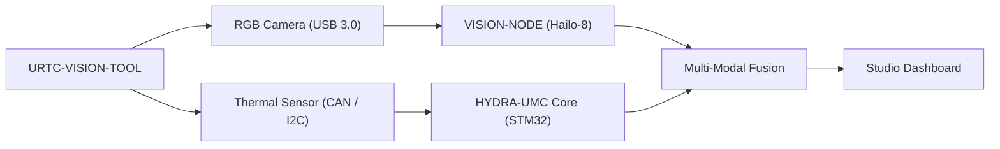

<p align="center">
  
</p>

# 👁️ URTC-VISION-TOOL

<p align="center"><a href="README.md">🇺🇸 English</a> | <a href="README_spa.md">🇪🇸 Español</a> | <a href="README_fra.md">🇫🇷 Français</a> | <a href="README_ita.md">🇮🇹 Italiano</a> | <a href="README_deu.md">🇩🇪 Deutsch</a> | <a href="README_zho.md">🇨🇳 简体中文</a> | 🇯🇵 <b>日本語</b> | <a href="README_por.md">🇵🇹 Português</a></p>

### 🔬 熱画像と RGB 知覚を統合したエンドエフェクター

<p align="center">
  
  
  
  
</p>

---

**正直な現状確認 - 実際に今動くもの:** ファームウェア側のセンサープロトコル（`sensor_frame.c`、`sensor_reading.c`、`rate_limiter.c`、`sensor_freshness.c`、`sensor_diagnostics.c`、`vision_sensor_link.c`）は本物の純粋な C で、190 件の `TEST_ASSERT` チェック（`tests/test_*.c`、ホストの C コンパイラでコンパイル・実行）がすべて通過しており、このリポジトリの CI が実際に実行しています：`.github/workflows/ci.yml` のファームウェアステップが `build_firmware.sh` を呼び出し、そのステップ 2 が STM32 ビルドの前に必ず `tests/` をコンパイル・実行します。ホスト側の `vision_companion` パッケージ（`alignment.py`、`cli.py`）も本物で、183 件の pytest ケースがすべて通過しており、CI はこのスイートも実行します（専用ステップが `src/vision_companion/requirements.txt` をインストールし、そこで `pytest tests/` を実行）。したがって、どちらの側の退行もビルドを失敗させます。README の冒頭にある通り、このボードの PCB／回路図はまだ存在しないため、ここにあるものは本物の MLX9064x センサーや RGB カメラを読んだことも、本物の CAN トランシーバーを駆動したこともありません——`main.c`/`startup_stm32_minimal.c` は、仮のリンカースクリプトで Cortex-M4F のクロスコンパイルとリンクが成功することを示すだけです。何がリリースされたかは `CHANGELOG.md` を参照してください。

---

> **安全性とセキュリティの現状:** このエコシステムは認証された安全システムではなく、実装済みの URTC 基板もまだ存在しません。ブートローダーはファームウェアイメージを CRC32 と共有鍵の HMAC-SHA256 で検査しており、非対称署名ではありません(予定)。公開されているアプリケーションイメージは公開の開発用鍵(`signing_key_kind: dev`)で署名されているため、誰でもブートローダーが受け入れるイメージを作れます。実際の基板には何も送信されていません。ここに書かれた内容を人の安全のために頼る前に、[セキュリティベースライン](https://github.com/JuanenRac/URTC-DOCS/blob/main/docs/SECURITY_BASELINE.md)と[脅威モデル](https://github.com/JuanenRac/URTC-DOCS/blob/main/docs/THREAT_MODEL.md)をお読みください。

## 📋 ひと目で

| | |
|---|---|
| バージョン | `0.1.5` |
| 成熟度 | 機能する |
| テスト | 183 (`pytest`) |
| 技術 | C / STM32 / Python vision companion |
| 対象 | マイコン基板（ファームウェア）。ビルドは PC で行います |
| 実機での確認 | まだです：このバージョンについて実機での動作記録はありません |

**移動先：** [概要](#-概要) · [アーキテクチャ](#-アーキテクチャ) · [機能](#-機能) · [セキュリティ](#-セキュリティと安全) · [インターフェース](#-インターフェース) · [クイックスタート](#-クイックスタート) · [テスト](#-テスト) · [構成](#-リポジトリの構成) · [関連](#-関連プロジェクト)

<!-- urtc-section:status_vision_tool -->
## 🚦 プロジェクトの状況

🟢 完了・検証済み · 🟡 動作するが既知の制限あり · 🟠 途中、または未検証 · 🔴 未実施または動作しない。実機で一度も動いていないものは緑になりません。

| 項目 | 状態 | リポジトリが示せること |
| --- | :---: | --- |
| ソフトウェア | 🟡 | PC とシミュレーターでは動作します。実際のボードでは一度も実行していません。 |
| テスト | 🟢 | テストスイートはプッシュごとに CI で通ります。 |
| 実機 | 🟠 | 実際のボードでの実行はまだありません。ベンチテストは未実施です。 |
| ドキュメント | 🟡 | 8 言語の README と参照ドキュメントがあります。翻訳はネイティブによるレビューを受けていません。 |

<!-- /urtc-section:status_vision_tool -->

## 🎯 概要

**URTC-VISION-TOOL** は、視覚的知覚と熱知覚を単一の URTC 互換エフェクター
に統合した専用のロボット工具ヘッドです。高度な QA、PCB の熱画像検査、
高精度なピック＆プレースアライメント向けに設計されています。

RGB グローバルシャッターカメラと MLX9064x ファミリーの熱センサーを搭載し、
視覚 AI ノードにデュアルモーダルデータを提供します。これにより、部品の
存在だけでなく、その動作温度やはんだの放熱状況も検知できます。

この基板にはまだ PCB/回路図が存在しないため（`hardware/` 参照）、以下の
どの機能も実際の熱画像/RGB センサーを駆動することはできません——しかし
ファームウェアツールチェーンとホスト側の視覚処理パイプライン（合成フレーム
生成、疑似カラーレンダリング、RGB->熱画像 ROI アライメントと温度統計抽出、
すべて pytest でカバー）は今日すでに本物であり、動作します。

### 主な機能：
* 🔬 **デュアルモーダル知覚** — 同期された熱画像と RGB 画像のキャプチャ。*（両フレームが供給する処理パイプライン自体は本物です——下記参照。実際の同期キャプチャには PCB とセンサーが必要です。）*
* 🌡️ **高精度熱画像** — 統合された MLX90640/41/42 センサーサポート。*（疑似カラーレンダリングと領域ごとの統計抽出は本物です——下記参照。実際の MLX9064x を I2C 経由で読み取るには PCB が必要です。）*
* 🎯 **Eye-in-Hand アライメント** — サブミリメートル単位の PnP と AOI（自動光学検査）。*（RGB->熱画像 ROI 座標マッピングと温度統計抽出は本物でテスト済みです——下記の `vision_companion/alignment.py` 参照。サブミリメートル精度には実際に校正されたカメラが必要です。）*
* 📡 **URTC との統合** — 決定済み：このヘッドは URTC の工具ヘッドであり、第二のプロトコルではなく、URTC の熱画像検査ツール（工具プロファイル 22、MLX90640/90641/90642）とその CAN メッセージ `0x250`-`0x255`（トリガー、ステータス、生および校正済みのピクセルブロック。URTC の `docs/CANBUS.TXT` に記載）を再利用します。このやり取りのホスト側は本物で、ハードウェアなしでテスト済みです（`urtc_thermal.py`、模擬ヘッド付き）。ヘッドのファームウェア、CAN トランシーバー、実装済み基板はまだ存在しないため、バス上で動いたことはありません。*（このリポジトリのセンサー側フレームプロトコル（下記）は、ホストでテスト済みの別個の部品であり、熱画像は運びません。）*
* 🔒 **センサープロトコルの範囲チェック** — バージョン管理されたフレーミング、CRC8 チェックサム、測定範囲検証、レート制限、フレームの鮮度チェック（シーケンスとタイムスタンプ）、そして制御判断とは独立した専用のエラー/レイテンシ/バスリセット診断カウンター。フレームのバージョン 2：複数バイトの値（タイムスタンプと温度の読み取り値）はすべてバスと同じビッグエンディアンで、バージョン 1 のフレームは拒否されます。*（純粋な C として実装され、PC 上でのみテスト済みです。ボードや実際のセンサーで動作したことはなく、安全機能でもありません）*
* ✅ **Cortex-M4F ファームウェアツールチェーン** — 兄弟リポジトリ URTC と URTC-SMART-RACK と同じツールチェーンを用いて、`arm-none-eabi-gcc` でクロスコンパイルおよびリンクされる実際のベアメタルイメージ。*（実装済み——下記の「ビルド」を参照）*
* ✅ **`vision_companion` 処理パイプライン** — 実際に動作する Python パッケージ：合成された熱画像+RGB フレーム生成、疑似カラー熱画像レンダリング、RGB->熱画像 ROI アライメント + 温度統計抽出、統計レポート、183 件の実際の pytest ケースでカバー、ハードウェア接続なしでエンドツーエンドに実行可能。*（実装済み——下記の「VISION COMPANION」を参照）*

## 🧩 URTC での役割

URTC-VISION-TOOL は RGB カメラと MLX9064x 熱センサーを一体にしたツールヘッドで、品質検査、基板の熱検査、実装ヘッドの位置合わせに使います。URTC のツールヘッドで、2 つ目のプロトコルを作る代わりに URTC の熱検査ツールとその CAN メッセージ `0x250` から `0x255` を再利用し、ビジョンノード（Hailo-8）と HYDRA-UMC コントローラーに 2 種類のデータを渡すので、部品を有無だけでなく温度でも判断できます。現時点で実在するのは、ファームウェアのセンサープロトコルとホスト側のビジョンコンパニオンで、どちらもコンピューター上で試験されています。ボードはまだ存在しません。補完的なツールで、URTC の子ではありません。

## 🏛️ アーキテクチャ

<p align="center">
  
</p>

このリポジトリの各部分の関係：誰が使い、何を持ち、何に依存するか。図は `docs/architecture.json` から描かれ、コードと照合されます。

<details>
<summary>図のテキスト版 (Mermaid)</summary>


```mermaid
flowchart LR
    TOOL["URTC-VISION-TOOL"] --> RGB["RGB Camera (USB 3.0)"]
    TOOL --> THRM["Thermal Sensor (CAN / I2C)"]
    RGB --> VISION["VISION-NODE (Hailo-8)"]
    THRM --> CORE["HYDRA-UMC Core (STM32)"]
    VISION --> SYNC["Multi-Modal Fusion"]
    CORE --> SYNC
    SYNC --> DASH["Studio Dashboard"]
```

</details>

### アーキテクチャと設計上の決定

* **本プロジェクトが 2 つの独立したバージョン管理系統を持つ理由。** `src/firmware_common.h`（STM32 側のファームウェア）と `src/vision_companion/vision_companion/__init__.py`（独立したホスト側 Python パッケージ）は独立してバージョン管理されています——異なるハードウェア（MCU 対ホストの CM5/PC）上で動作し、異なるスケジュールで出荷されるためです。
* **URTC 自体の子プロジェクトではない理由。** URTC-SMART-RACK 自身の README と同じ理由です——URTC のファームウェアの慣例を共有する補完ツールであり、その統合階層の一部ではありません。
* **そもそもホスト側のコンパニオンパッケージが必要な理由。** 熱画像/RGB のデュアルモーダルキャプチャには、STM32 自体で実行する場所のない実際の画像処理（numpy/Pillow）が必要です——このコンパニオンパッケージは、実際にその処理が行われる場所です。独自のバスアクセスはありませんが、URTC の熱画像検査メッセージを話します（`urtc_thermal.py`）：要求を組み立て、16 ピクセルのブロックを画像に組み直し、メッセージをバスを運ぶ側に渡します。
* **`alignment.py` が実際のホモグラフィではなく共有視野を前提とする理由。** 両方のセンサーは同じ剛体の工具ヘッド上にあるため、RGB 空間と熱画像空間のピクセル座標間で軸ごとの線形再スケーリングを行うのは妥当な v0 近似です——実際のピクセル単位のキャリブレーション（チェッカーボード、レンズ歪み）には、まだ存在しない実際のカメラでの校正が必要です。
* **エコシステムの他の部分との関係。** URTC 自身の工具エコシステムの一員であり（URTC の熱画像検査ツールとその CAN メッセージを再利用、上記参照）、URTC-SMART-RACK も担っているのと同じ視覚認識の役割を果たす HYDRA-UMC-DETECTION-HEF と自然に組み合わされます。
* **センサーフレームプロトコルが独自のタイムスタンプフィールドを持つ理由。** 実際のセンサー側ミリ秒単位のタイムスタンプにより、呼び出し元は、MCU がいつそのフレームの解析にたどり着くかとは無関係に、読み取りが実際に*いつ*行われたかを知ることができます——単に「たった今届いた」という前提では失われてしまう、履歴管理/診断における実際の価値です。
* **診断カウンター（`sensor_diagnostics.c`）が自ら受理/拒否の判断を一切行わない理由。** フレームが信頼できるかどうかを決定するのは `sensor_frame.c`（フレーミング）、`sensor_reading.c`（範囲）、`rate_limiter.c`（レート制限）のみであり——診断はそれらが決定した結果を記録するだけです。この境界を厳格に保つことで、診断側のバグが誤って不正なデータを通過させてしまうことは決してなくなります。これは診断ノート自身が言う「separar diagnostico de salida de control」そのものです。

## ✨ 機能

**領域ごとの熱検査、系列の書き出し、センサーのドリフト、ラック確認(ホストでのテストのみ):** `inspect` は、計画にある各部品を種類ごとの温度ルールで判定し、各領域の最小・最大・平均を HYDRA-UMC データレイク向けのサンプル、JSON 行、OPC-UA ノード値として書き出せます。`drift-check` は基準シーンのフレームを基準データと比べ(不良画素、オフセットのドリフト)、校正ファイルを書き出せます。`rack-check` は熱フレームからツールラックの先端を判定します。`rack-watch` はラックの加熱中に先端を追い、各スロットがいつ目標に達したか、工具を交換してよいかを示します。`rack-simulate` は模擬ラック(正常または異常あり)のフレームを書き出し、カメラなしで試せます。ラックのコマンドは 8 言語で表示します(`--lang`)。[CLI リファレンス](docs/CLI_REFERENCE.md)を参照してください。合成フレームでのみ実行しており、カメラも基板も使っていません。

**シリアル CAN アダプター経由の熱画像取得（新規、模擬アダプターと模擬ヘッドでのみ確認）:** `capture --port PORT` は、熱検査ツールを載せた URTC ヘッドから、SLCAN アダプター（シリアルポートまたは pyserial の URL）を通して `0x250` から `0x255` のやり取りで校正済みの画像を 1 枚読み取り、`.npy` と擬似カラー PNG として保存します。これは `inspect`、`drift-check`、`rack-check` にそのまま渡せます。ヘッドがエラーを報告する、準備完了にならない、またはブロックに応答しない場合は、分かりやすいメッセージでコマンドを終了します（終了コード 1）。開けないポートの場合は終了コード 2 で終了します。実際のアダプター、バス、ヘッドでは実行していません。

## 🔒 セキュリティと安全

| 脅威 | 防御 |
|---|---|
| センサーからの壊れた、または古いフレーム | バージョン付きフレームと CRC-8（`sensor_frame.c`）。バージョン 2 ではタイムスタンプと熱の読み取り値を含む複数バイトの値はバスと同じビッグエンディアンで、バージョン 1 のフレームは拒否されます |
| センサーが出せないはずの読み取り値 | `sensor_reading.c` が熱の読み取り値をデコードし、範囲外のものを拒否します |
| フレームの洪水 | `rate_limiter.c` が最小間隔でフレームを保留します |
| 再生されたフレームや固まったセンサー | `sensor_freshness.c` がシーケンスとセンサー自身のタイムスタンプを検査します |
| カウンターの不具合で不正なデータが通ること | `sensor_diagnostics.c` は他のモジュールの判断（エラー、遅延、バスのリセット）を記録するだけで、フレームを受理も拒否もしません |

これはすべてコンピューター上で試験された純粋な C で、ボード上でも実際のセンサーでも動いたことはなく、安全機能でもありません。

## 🔌 インターフェース

* **URTC の熱検査メッセージ**（`0x250` から `0x255`：トリガー、状態、生および校正済みのピクセルチャンク。URTC の `docs/CANBUS.TXT` に記載）：このやり取りのホスト側は `urtc_thermal.py` で、ハードウェアなしに模擬ヘッドで試験されています。`capture --port PORT` は SLCAN アダプター（シリアルポートまたは pyserial URL）経由でこれを実行し、画像を `.npy` と擬似カラー PNG で保存します。ヘッドがエラーを報告する、準備完了にならない、チャンクに応答しない場合は終了コード 1 で、ポートを開けない場合は終了コード 2 で終わります。
* **ファームウェアのセンサーフレーム：** バージョン 2、ビッグエンディアン、CRC-8（`sensor_frame.c`）。独立したホスト試験済みの部品で、熱画像は運びません。
* **コマンドライン `vision-companion`：** `version`、`selftest`、`analyze-roi`、`capture`、`inspect`、`drift-check`、`rack-check`、`rack-watch`、`rack-simulate`。各オプションと終了コードは [docs/CLI_REFERENCE.md](docs/CLI_REFERENCE.md) にあります。
* **エクスポート：** `inspect` の読み取り値は JSON Lines、OPC UA ノード値、HYDRA-UMC データレイク用のサンプルとして書き出せます。

## 🚀 クイックスタート

ARM GNU ツールチェーン（`arm-none-eabi-gcc`、`arm-none-eabi-objcopy`、
`arm-none-eabi-size`）と Python 3 が必要です。

```bash
# Linux/macOS
chmod +x build_firmware.sh   # 初回のみ
./build_firmware.sh

# Windows
build_firmware.bat
```

### ビジョンコンパニオン（ホスト側 Python）

この部分は今日、ハードウェアを一切接続することなく完全に動作します：

```bash
cd src/vision_companion
python3 -m venv .venv
# Linux/macOS：
.venv/bin/pip install -r requirements.txt
.venv/bin/python -m vision_companion selftest

# Windows：
.venv\Scripts\pip install -r requirements.txt
.venv\Scripts\python -m vision_companion selftest
```

`selftest` は、MLX9064x 形式に合わせた合成熱画像フレーム（32x24、はんだ
ごて先のようなホットスポット付き）と、合成 RGB カラーバーテストパターン
を生成し、両方を実際のファイルとしてレンダリング/保存し、その統計情報を
表示します——これは、実際のハードウェアが存在するようになった時点で実装
されるセンサーキャプチャのステップとは独立して、numpy/Pillow の処理
パイプラインが本当に機能することの証明です。

`analyze-roi X0 Y0 X1 Y1` は、RGB 空間のバウンディングボックスを熱画像
空間にマッピングし、その領域の実際の温度統計を報告します——README の
「Eye-in-Hand Alignment」機能の背後にあるアライメントロジックで、今日
実際に動作します：

```bash
.venv/bin/python -m vision_companion analyze-roi 280 210 360 270
```

実際の出力例：

```text
RGB ROI (280,210)-(360,270) in a 640x480 frame
  -> thermal stats: min=75.67C max=78.97C mean=77.69C p95=78.70C (16 thermal px)
```

183 件の実際の pytest ケースが `cli.py`、`alignment.py`、およびパッケージのその他のモジュールをカバー
します：

```bash
pip install -e ".[dev]"
pytest
```

完全なコンパニオンドキュメントについては `src/vision_companion/README.md`
を、実際に取得した出力付きの全コマンド・フラグ・終了コード一覧については
[`docs/CLI_REFERENCE.md`](docs/CLI_REFERENCE.md) を参照してください。

<!-- urtc-section:compatibility -->
### 要件と互換性

どのバージョンの URTC プログラムが連携して動作し、それぞれがどのプロトコルバージョンを話すかは、URTC-COMMON が生成する互換性表に載っています：[docs/COMPATIBILITY.md](https://github.com/JuanenRac/URTC/blob/main/docs/COMPATIBILITY.md)。
<!-- /urtc-section:compatibility -->

## 🧪 テスト

テストは 2 系統あります。ファームウェア側は `tests/` の C（190 件の `TEST_ASSERT` 検査）で、センサーフレーム、読み取り値、レート制限、診断、鮮度、リンク全体のシナリオ、不正な入力への堅牢性、URTC-COMMON の共有ベクトルを扱い、コンピューター自身の C コンパイラーでコンパイル・実行し、CI では AddressSanitizer、UBSan、カバレッジ下限も使います。ホスト側は `vision_companion` パッケージで、183 件の pytest ケース（`cd src/vision_companion && pytest`）がハードウェアなしでパイプライン全体を動かします：合成画像、疑似カラー、位置合わせ、校正、模擬ヘッドに対する熱画像の取得、検査、ドリフト、ラックの検査です。4 つの Python テストファイルがビルドスクリプト、リリースの成果物、バージョンファイルを検査します。`bash build_firmware.sh` はクロスコンパイルの前に C のテストを実行し、アサーションが 1 つでも失敗すると失敗します。割り込みが使う受信経路（`sensor_rx.c`：割り込みはバイトをリングに入れるだけで、メインループがフレームを見つけ、壊れたフレームの後に再同期し、待たされすぎた途中のフレームを破棄します）も純粋なロジックで、テストでは 1 バイトずつ流します。

## 🏗️ ビルドとリリース

ビルドはまず `tests/` を*コンピューター自身の* C コンパイラー（`arm-none-eabi-gcc` ではありません。純粋なロジックのテストで、MCU のレジスタには触れません）でコンパイル・実行し、アサーションが 1 つでも失敗するとビルド全体が失敗します。その後はじめて `main.c` と `startup_stm32_minimal.c` を Cortex-M4F 用にコンパイルし、仮の `STM32_MINIMAL.ld` メモリマップとリンクして、バージョン付きの `.elf`/`.bin`/`.hex` を `firmware/` に出力します。ビルドがバージョンを変えることはありません。

`src/` 以下のすべてのモジュールも Cortex-M4F 用にコンパイルされ、検査としてまとめてリンクされます（ターゲットには C ライブラリがありません）。現時点でイメージに入っているのは `main.c` と起動ファイルだけです。`URTC_CI=1` を設定すると、バージョン管理されたファイルには一切触れません。

実際のハードウェアにフラッシュできるものは
今のところ何もありません——対象の STM32 部品、ピン配置、MLX9064x の配線、
RGB カメラインターフェースを確認できる PCB が存在しないためです。

ファームウェアイメージ（`.bin`、`.hex`、`.elf`）は git で管理されません。リリースビルドは `firmware/URTC_VISION_TOOL_FIRMWARE_v<バージョン>.*` に書き出し（git の無視対象。CI モード、つまり `URTC_CI=1` では `build/firmware`）、各バージョンの GitHub リリースのアセットとしてのみ公開されます。`python tools/publish_release_assets.py` がファイルを検査し、不足している `.sha256` ファイルを書き出して、添付するファイルを含む正確な `gh release create` コマンドを表示します。

バージョンの全履歴は [`CHANGELOG.md`](CHANGELOG.md) を参照してください。各バージョンにそれぞれの項目があります。

## 📂 リポジトリの構成

<p align="center">
  
</p>

<details>
<summary>ツリーのテキスト版</summary>

```text
URTC-VISION-TOOL/
├── src/                                               ファームウェア（純粋な C のセンサープロトコル、URTC-COMMON の検査済みコピー、エントリーポイント、仮のリンカースクリプト）と Python コンパニオン
├── tests/                                             C のホストテスト（190 件の検査）とビルドスクリプトの Python 検査
├── docs/                                              CLI_REFERENCE.md：すべてのコマンドと終了コード
├── hardware/                                          回路図も PCB もまだありません
├── tools/                                             ビルド、カバレッジ、リリースのツール
├── images/                                            バナーとこの README の画像
├── .github/                                           CI ワークフローと Issue・プルリクエストのテンプレート
├── build-test.sh build-test.bat                       リポジトリを変更しないビルド・テストのスクリプト
├── test.sh test.bat                                   テストを実行
├── urtc.project.json                                  マニフェスト：バージョン、役割、成熟度、ビルドコマンド
├── CHANGELOG.md                                       各バージョンの変更内容
├── SECURITY.md SUPPORT.md LICENSE                     セキュリティポリシー、サポート、ライセンス
├── CONTRIBUTING.md CODE_OF_CONDUCT.md                 貢献方法と行動規範
├── .gitattributes .gitignore                          Git の設定
├── build_firmware.sh build_firmware.bat               ホストテスト、クロスコンパイル、公開
├── bump.py bump_version.py bump_manifest_version.py   バージョンを上げるスクリプト
└── LICENSE.md ruff.toml                               ドキュメントのライセンスと lint 設定
```

</details>

各ソースファイルの注釈付き一覧（1 ファイル 1 行）は [docs/SOURCE_MAP.md](docs/SOURCE_MAP.md) にあります。

## 🗺️ ロードマップと既知の制限

**現時点で分かっている制限**

* このボードにはまだ PCB も回路図もありません（`hardware/` 参照）。ここにあるものは、実際の MLX9064x を I2C で読んだことも、RGB カメラや CAN トランシーバーを動かしたこともありません。`main.c` と起動ファイルが示すのは、仮のリンカースクリプトで Cortex-M4F 向けのクロスコンパイルとリンクが通るということだけです。
* ヘッドのファームウェアはまだ存在しません。熱データのやり取りのホスト側は、模擬ヘッドと模擬 SLCAN アダプターに対してだけ試験されています。
* `alignment.py` は視野が共通であると仮定し、各軸を線形に拡縮します。本当のピクセル単位の校正（チェッカーボード、レンズ歪み）には実際のカメラが必要です。
* サブミリ単位の精度、同期した実際の取得、検査ルールの温度の限界は、実際の部品では試していません。

**次のステップ**

* ボードを設計し、STM32 の部品とカメラのインターフェースを決め、センサーとカメラのドライバーを書き、試験台で実際のヘッドに対して熱画像の取得を実行します。

## 🌍 言語

README とテキストは、英語、スペイン語、フランス語、イタリア語、ドイツ語、中国語、日本語、ヨーロッパポルトガル語で提供されています。

## 🔗 関連プロジェクト

URTC は独立したリポジトリで構成され、それぞれに固有のバージョン、テスト、README があります。グループ別のファミリーは次のとおりです：

* **URTC Tool Platform:** [URTC](https://github.com/JuanenRac/URTC), [URTC-COMMON](https://github.com/JuanenRac/URTC-COMMON), [URTC-FLASHER](https://github.com/JuanenRac/URTC-FLASHER), [URTC-GATEWAY](https://github.com/JuanenRac/URTC-GATEWAY), [URTC-SMART-RACK](https://github.com/JuanenRac/URTC-SMART-RACK), [URTC-TESTER](https://github.com/JuanenRac/URTC-TESTER), **URTC-VISION-TOOL** (このリポジトリ), [URTC-WEB-STUDIO](https://github.com/JuanenRac/URTC-WEB-STUDIO)
* **Ecosystem Operations:** [URTC-DOCS](https://github.com/JuanenRac/URTC-DOCS), [URTC-UPDATER](https://github.com/JuanenRac/URTC-UPDATER)

**姉妹プロジェクト（独立しており、基盤とツールを共有）：**

* **[HYDRA-UMC-DOCS](https://github.com/JuanenRac/HYDRA-UMC-DOCS)** - 姉妹プロジェクト：HYDRA-UMC のドキュメントハブ。基盤とツールを共有する独立したエコシステム
* **[ARMOR-DOCS](https://github.com/JuanenRac/ARMOR-DOCS)** - 姉妹プロジェクト：A.R.M.O.R. セキュリティエコシステムのドキュメントハブ。こちらも独立し、同じ基盤の上にある
* **[JuanenRac](https://github.com/JuanenRac/JuanenRac)** - すべてのエコシステムのプロフィールとステータスダッシュボード

## 📚 ドキュメント

- **[CONTRIBUTING.md](CONTRIBUTING.md)** —— プルリクエストのための技術スタックとコーディング指針。
- **[CODE_OF_CONDUCT.md](CODE_OF_CONDUCT.md)** —— このコミュニティで期待される行動規範。
- **[SECURITY.md](SECURITY.md)** —— 脆弱性の報告方法と、このプロジェクトの実際のセキュリティ重点領域。
- **[SUPPORT.md](SUPPORT.md)** —— 質問の投稿先とバグの報告先。
- **[LICENSE.md](LICENSE.md)** —— このプロジェクト自身のライセンス。

## 🤝 コントリビュートとコミュニティ

* プルリクエストの前に `URTC_CI=1 python tools/ci_validate.py` を実行してください。通過する必要があります。[CONTRIBUTING.md](CONTRIBUTING.md) と[行動規範](CODE_OF_CONDUCT.md)を参照してください。
* README は 8 言語で提供されています。文章の変更は 8 つのファイルすべてで行い、他のリポジトリと共有するセクションは URTC-COMMON の `tools/readme_sections.py` が書き込みます。
* CAN プロトコルの変更は URTC-COMMON（`spec/can_protocol.json`）から始まり、検査済みのコピーを通じてこのリポジトリに届きます。
* ビルドしただけのものを、ボード上で動いているかのように書かないでください。
* 脆弱性は非公開で報告してください：[SECURITY.md](SECURITY.md)。質問、アイデア、報告：electrohobby3d@gmail.com（[SUPPORT.md](SUPPORT.md)）。

## 👤 作者

**JuanenRac** (Electro Hobby 3D)
📧 electrohobby3d@gmail.com
📺 [youtube.com/@electrohobby3d](https://youtube.com/@electrohobby3d)

## 📜 ライセンス

GPL-3.0-or-later —— 詳細は LICENSE を参照してください。
