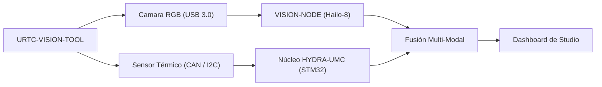

<p align="center">
  
</p>

# 👁️ URTC-VISION-TOOL

<p align="center"><a href="README.md">🇺🇸 English</a> | 🇪🇸 <b>Español</b> | <a href="README_fra.md">🇫🇷 Français</a> | <a href="README_ita.md">🇮🇹 Italiano</a> | <a href="README_deu.md">🇩🇪 Deutsch</a> | <a href="README_zho.md">🇨🇳 简体中文</a> | <a href="README_jpn.md">🇯🇵 日本語</a></p>

### 🔬 Cabezal Integrado que Combina Percepción Térmica y RGB

<p align="left">
  
  
  
  
</p>

---

## 1. 🛠️ VISIÓN TÉCNICA GENERAL

**URTC-VISION-TOOL** es un cabezal de robot especializado que fusiona percepción visual y térmica en un único efector compatible con URTC. Está diseñado para QA avanzado, inspección térmica de PCBs y alineación de Pick-and-Place de alta precisión.

Equipado con una cámara RGB de obturador global y un sensor térmico de la familia MLX9064x, proporciona al Vision AI Node datos duales, permitiéndole detectar no solo la presencia de un componente sino también su temperatura de funcionamiento o la disipación de calor de una soldadura.

Todavía no existe PCB/esquemático para esta placa (ver `hardware/`), así que nada de lo de abajo puede manejar sensores térmicos/RGB reales - pero el toolchain de firmware y el pipeline de visión del lado host (generación sintética de frames, renderizado en falso color, alineación de ROI RGB->térmico y extracción de estadísticas de temperatura, todo cubierto por pytest) son reales y funcionan hoy.

### Características Clave:
* 🔬 **Percepción Dual-Modal** — captura sincronizada de imagen Térmica y RGB. *(el pipeline de procesamiento que alimentan ambos frames es real - ver abajo; la captura sincronizada real necesita el PCB y los sensores.)*
* 🌡️ **Térmico de Alta Precisión** — soporte integrado para sensores MLX90640/41/42. *(el renderizado en falso color y la extracción de estadísticas por región son reales - ver abajo; leer un MLX9064x real por I2C necesita el PCB.)*
* 🎯 **Alineación Eye-in-Hand** — PnP y AOI (Inspección Óptica Automatizada) sub-milimétrica. *(el mapeo de coordenadas ROI RGB->térmico y la extracción de estadísticas de temperatura son reales y están testeados - ver `vision_companion/alignment.py` abajo; la precisión sub-milimétrica necesita una cámara calibrada real.)*
* 📡 **API CAN Unificada** — integrado sin fisuras en el catálogo de 25 herramientas de URTC. *(el protocolo de cable del propio sensor - framing, CRC, validación de rango - es real, ver abajo; todavía se necesita un transceptor CAN real para transportarlo.)*
* 🔒 **Seguridad del Protocolo de Sensor** — framing versionado real con checksum CRC8, validación de rango de medición real, limitación de tasa real, y contadores de diagnóstico dedicados de error/latencia/reset de bus. *(implementado)*
* ✅ **Toolchain de firmware Cortex-M4F** — una imagen bare-metal real que compila y enlaza de verdad con `arm-none-eabi-gcc`, el mismo toolchain que los repositorios hermanos URTC y URTC-SMART-RACK. *(implementado — ver COMPILACIÓN abajo)*
* ✅ **Pipeline de procesamiento `vision_companion`** — un paquete Python real y funcional: generación sintética de frames térmicos+RGB, renderizado térmico en falso color, alineación de ROI RGB->térmico + extracción de estadísticas de temperatura, informe de estadísticas, todo cubierto por 21 casos reales de pytest, funciona de principio a fin sin hardware conectado. *(implementado — ver COMPANION DE VISIÓN abajo)*

---

## 2. 🔄 FLUJO DE LA HERRAMIENTA DE VISIÓN



---

## 3. 🧱 ARQUITECTURA Y DECISIONES DE DISEÑO

* **Por qué este proyecto tiene 2 pistas de versión independientes.** `src/firmware_common.h` (el firmware del lado STM32) y `src/vision_companion/pyproject.toml` (un paquete Python independiente del lado host) se versionan por separado - corren en hardware distinto (MCU frente a host CM5/PC) y se publican en calendarios distintos.
* **Por qué no es un hijo del propio URTC.** Mismo motivo que el propio README de URTC-SMART-RACK - una Herramienta Complementaria que comparte el bus CAN/convenciones de firmware de URTC, sin formar parte de su jerarquía de integración.
* **Por qué un paquete complementario del lado host.** La captura dual térmica/RGB necesita procesamiento de imagen real (numpy/Pillow) que no tiene sitio corriendo en el propio STM32 - el paquete complementario es donde eso ocurre de verdad, hablando con la placa por CAN.
* **Por qué `alignment.py` asume un campo de visión compartido en vez de una homografía real.** Ambos sensores están en el mismo cabezal físico rígido, así que un reescalado lineal por eje entre coordenadas de píxel en espacio RGB y espacio térmico es una aproximación v0 razonable - una calibración real por píxel (tablero de ajedrez, distorsión de lente) necesita cámaras reales contra las que calibrar, que todavía no existen.
* **Cómo encaja en el resto del ecosistema.** Comparte el propio bus CAN/ecosistema de herramientas de URTC, y forma pareja natural con HYDRA-UMC-DETECTION-HEF para el mismo papel de reconocimiento visual que también cumple URTC-SMART-RACK.
* **Por qué el protocolo de trama del sensor lleva su propio campo de timestamp.** Un timestamp real en milisegundos generado por el propio sensor permite a quien llama saber *cuándo* se tomó realmente una lectura, independientemente de cuándo la MCU llegue a analizar la trama - un valor real para historial/diagnóstico que una simple suposición de "acaba de llegar" perdería.
* **Por qué los contadores de diagnóstico (`sensor_diagnostics.c`) nunca toman una decisión de aceptar/rechazar por sí mismos.** Solo `sensor_frame.c` (framing), `sensor_reading.c` (rango) y `rate_limiter.c` (limitación de tasa) deciden si se confía en una trama - diagnóstico solo registra lo que ellos decidieron. Mantener ese límite estricto significa que un bug en diagnóstico nunca pueda dejar pasar datos incorrectos por accidente, la propia "separar diagnóstico de salida de control" de la auditoría de promoción.

---

## 📂 ESTRUCTURA DE DIRECTORIOS

```text
URTC-VISION-TOOL/
├── src/
│   ├── firmware_common.h           # FIRMWARE_VERSION_MAJOR/MINOR/PATCH = 0.0.0
│   ├── sensor_frame.h / .c         # Real: formato de trama versionado + parseo/codificación CRC8
│   ├── sensor_reading.h / .c       # Real: decodificación de lectura térmica + validación de rango
│   ├── rate_limiter.h / .c         # Real: limitación de trama por intervalo mínimo
│   ├── sensor_diagnostics.h / .c   # Real: contadores de error/latencia/reset de bus, separado del control
│   ├── main.c                      # Punto de entrada mínimo (bucle de latido de vida)
│   ├── startup_stm32_minimal.c     # Tabla de vectores + Reset_Handler (sin HAL de ST todavía, ver cabecera del archivo)
│   ├── STM32_MINIMAL.ld            # Linker script placeholder (suelo de 128K FLASH / 32K RAM)
│   └── vision_companion/           # Pipeline de visión Python del lado host (CM5/máquina de desarrollo)
│       ├── pyproject.toml          # Empaquetado + console script `vision-companion`
│       ├── requirements.txt        # numpy + pillow
│       ├── main.py                 # CLI real y funcional (versión / selftest / analyze-roi)
│       ├── alignment.py            # Real: mapeo de ROI RGB<->térmico + extracción de estadísticas de temperatura
│       ├── tests/                  # 21 casos reales de pytest (main.py + alignment.py)
│       └── README.md               # Documentación específica del companion
├── tests/                          # Arnes real de pruebas de firmware nativo del host (sensor_frame, sensor_reading, rate_limiter, sensor_diagnostics, escenarios de sensor)
├── docs/                           # Documentación y referencia de calibración
├── hardware/                       # Archivos de diseño de hardware (PCB, carcasa) - vacío, sin esquemático todavía
├── firmware/                       # Salida de build versionada (.bin/.elf/.hex), commiteada igual que el repo hermano URTC
├── build/                          # Objetos intermedios de build (ignorado por git)
├── images/                         # Medios y diagramas
├── scripts/                        # Scripts de utilidad
├── bump_version.py                 # Incremento de versión estilo cuentakilómetros (genérico, compartido con URTC / URTC-SMART-RACK)
├── build_firmware.sh / .bat        # Build real: pruebas de host + incrementa versión + compila + enlaza + publica en firmware/
└── README.md
```

---

## 4. ⚙️ COMPILACIÓN (firmware)

Requiere el ARM GNU Toolchain (`arm-none-eabi-gcc`, `arm-none-eabi-objcopy`, `arm-none-eabi-size`) y Python 3.

```bash
# Linux/macOS
chmod +x build_firmware.sh   # una sola vez
./build_firmware.sh

# Windows
build_firmware.bat
```

El build incrementa la versión de `src/firmware_common.h` (regla cuentakilómetros), compila `main.c` y `startup_stm32_minimal.c` para Cortex-M4F, los enlaza contra el mapa de memoria placeholder `STM32_MINIMAL.ld`, y publica archivos `.elf`/`.bin`/`.hex` versionados en `firmware/`. Todavía no hay nada que flashear a hardware real - no existe PCB que confirme la pieza STM32 objetivo, el pinout, el cableado del MLX9064x, o la interfaz de la cámara RGB.

## 5. 🐍 COMPANION DE VISIÓN (Python del lado host)

Esta parte funciona hoy, completamente, sin ningún hardware conectado:

```bash
cd src/vision_companion
python3 -m venv .venv
# Linux/macOS:
.venv/bin/pip install -r requirements.txt
.venv/bin/python main.py selftest

# Windows:
.venv\Scripts\pip install -r requirements.txt
.venv\Scripts\python main.py selftest
```

`selftest` genera un frame térmico sintético con forma MLX9064x (32x24, con un punto caliente tipo punta de soldadura) y un patrón de prueba RGB de barras de color, renderiza/guarda ambos como archivos reales, e imprime sus estadísticas — prueba de que el pipeline de procesamiento numpy/Pillow funciona de verdad, independientemente del paso de captura del sensor real que llegará cuando exista hardware.

`analyze-roi X0 Y0 X1 Y1` mapea una caja delimitadora en espacio RGB a espacio térmico y reporta estadísticas reales de temperatura para esa región — la lógica de alineación detrás de la característica Eye-in-Hand Alignment del README, real hoy:

```bash
.venv/bin/python main.py analyze-roi 280 210 360 270
```

Salida de ejemplo real:

```text
RGB ROI (280,210)-(360,270) in a 640x480 frame
  -> thermal stats: min=75.67C max=78.97C mean=77.69C (16 thermal px)
```

21 casos reales de pytest cubren tanto `main.py` como `alignment.py`:

```bash
pip install -e ".[dev]"
pytest
```

Ver `src/vision_companion/README.md` para la documentación completa del companion.

---

## 🔗 Proyectos Relacionados

Este proyecto forma parte de un ecosistema de robótica más amplio del mismo autor (JuanenRac / Electro Hobby 3D), que abarca firmware, software de control, nodos de IA y herramientas de flota. Vale la pena conocerlo, ya que una petición podría en realidad ser sobre uno de estos proyectos en vez de sobre este repositorio.

### Relación Directa

- **[URTC](https://github.com/JuanenRac/URTC)** — mismo ecosistema de herramientas / bus CAN.
- **[HYDRA-UMC-DETECTION-HEF](https://github.com/JuanenRac/HYDRA-UMC-DETECTION-HEF)** — hermano de reconocimiento visual.
- **[URTC-TESTER](https://github.com/JuanenRac/URTC-TESTER)** — su propio diagnóstico en vivo por bus CAN complementa las comprobaciones de QA visual de esta herramienta sobre el mismo cabezal de herramienta.

### Resto del Ecosistema

**Plataforma HYDRA-UMC** — la célula de micro-fábrica multi-robot
- **[HYDRA-UMC](https://github.com/JuanenRac/HYDRA-UMC)** — la placa base CM5 + STM32H745 que orquesta hasta 8 brazos robóticos.
- **[HYDRA-UMC-SERVER](https://github.com/JuanenRac/HYDRA-UMC-SERVER)** — el backend Express/WebSocket con el que habla cada cliente de control.
- **[HYDRA-UMC-STUDIO](https://github.com/JuanenRac/HYDRA-UMC-STUDIO)** — panel de control web, visualización 3D multi-robot.
- **[HYDRA-UMC-ANDROID-CONTROL](https://github.com/JuanenRac/HYDRA-UMC-ANDROID-CONTROL)** — app de control Android por Wi-Fi/Bluetooth.
- **[HYDRA-UMC-IOS-CONTROL](https://github.com/JuanenRac/HYDRA-UMC-IOS-CONTROL)** — app de control iOS/iPadOS construida en Flutter.
- **[HYDRA-UMC-SUITE](https://github.com/JuanenRac/HYDRA-UMC-SUITE)** — centro de mando de enjambre de escritorio (Python/PySide6).
- **[HYDRA-UMC-EDITOR-URDF](https://github.com/JuanenRac/HYDRA-UMC-EDITOR-URDF)** — editor de modelos URDF de escritorio para el catálogo de robots.
- **[HYDRA-UMC-DSI](https://github.com/JuanenRac/HYDRA-UMC-DSI)** — interfaz táctil nativa para la pantalla DSI integrada.

**Plataforma URTC** — el controlador de cabezal de herramienta que lleva cada brazo HYDRA-UMC
- **[URTC](https://github.com/JuanenRac/URTC)** — controlador de cabezal de herramienta CAN, 25 perfiles de herramienta.
- **[URTC-FLASHER](https://github.com/JuanenRac/URTC-FLASHER)** — herramienta de escritorio de flasheo CAN-OTA + SWD/JTAG.
- **[URTC-TESTER](https://github.com/JuanenRac/URTC-TESTER)** — herramienta de escritorio de diagnóstico CAN en vivo.
- **[URTC-WEB-STUDIO](https://github.com/JuanenRac/URTC-WEB-STUDIO)** — alternativa basada en navegador vía Web Serial API.

**🎥 Nodo de IA de Visión (Hailo-8)**
- [HYDRA-UMC-VISION-NODE](https://github.com/JuanenRac/HYDRA-UMC-VISION-NODE)
- [HYDRA-UMC-VISION-STREAMER](https://github.com/JuanenRac/HYDRA-UMC-VISION-STREAMER)
- [HYDRA-UMC-DETECTION-HEF](https://github.com/JuanenRac/HYDRA-UMC-DETECTION-HEF)
- [HYDRA-UMC-SAFETY-ZONES](https://github.com/JuanenRac/HYDRA-UMC-SAFETY-ZONES)
- [HYDRA-UMC-VISUAL-SERVOING-API](https://github.com/JuanenRac/HYDRA-UMC-VISUAL-SERVOING-API)

**🧠 Nodo de IA Cognitiva (Hailo-10)**
- [HYDRA-UMC-COGNITIVE-NODE](https://github.com/JuanenRac/HYDRA-UMC-COGNITIVE-NODE)
- [HYDRA-UMC-VLA-ENGINE](https://github.com/JuanenRac/HYDRA-UMC-VLA-ENGINE)
- [HYDRA-UMC-VOICE-UI](https://github.com/JuanenRac/HYDRA-UMC-VOICE-UI)
- [HYDRA-UMC-SEMANTIC-PLANNER](https://github.com/JuanenRac/HYDRA-UMC-SEMANTIC-PLANNER)
- [HYDRA-UMC-DOCS-QA](https://github.com/JuanenRac/HYDRA-UMC-DOCS-QA)

**🐝 Orquestación y Enjambre**
- [HYDRA-UMC-ORCHESTRATOR](https://github.com/JuanenRac/HYDRA-UMC-ORCHESTRATOR)
- [HYDRA-UMC-SWARM-SYNC](https://github.com/JuanenRac/HYDRA-UMC-SWARM-SYNC)
- [HYDRA-UMC-PATH-PLANNER-3D](https://github.com/JuanenRac/HYDRA-UMC-PATH-PLANNER-3D)
- [HYDRA-UMC-JOB-DISPATCHER](https://github.com/JuanenRac/HYDRA-UMC-JOB-DISPATCHER)
- [HYDRA-UMC-NODE-HEALING](https://github.com/JuanenRac/HYDRA-UMC-NODE-HEALING)

**🎮 Gemelo Digital y Simulación**
- [HYDRA-UMC-TWIN](https://github.com/JuanenRac/HYDRA-UMC-TWIN)
- [HYDRA-UMC-PHYSICS-REPLICA](https://github.com/JuanenRac/HYDRA-UMC-PHYSICS-REPLICA)
- [HYDRA-UMC-HIL-BRIDGE](https://github.com/JuanenRac/HYDRA-UMC-HIL-BRIDGE)
- [HYDRA-UMC-SYNTHETIC-DATA-GEN](https://github.com/JuanenRac/HYDRA-UMC-SYNTHETIC-DATA-GEN)

**📊 Datos y Analítica**
- [HYDRA-UMC-DATALAKE](https://github.com/JuanenRac/HYDRA-UMC-DATALAKE)
- [HYDRA-UMC-TELEMETRY-COLLECTOR](https://github.com/JuanenRac/HYDRA-UMC-TELEMETRY-COLLECTOR)
- [HYDRA-UMC-ANOMALY-DETECTOR](https://github.com/JuanenRac/HYDRA-UMC-ANOMALY-DETECTOR)
- [HYDRA-UMC-PRODUCTION-REPORTS](https://github.com/JuanenRac/HYDRA-UMC-PRODUCTION-REPORTS)

**🏭 Pasarela Industrial**
- [HYDRA-UMC-GATEWAY-INDUSTRIAL](https://github.com/JuanenRac/HYDRA-UMC-GATEWAY-INDUSTRIAL)
- [HYDRA-UMC-OPCUA-SERVER](https://github.com/JuanenRac/HYDRA-UMC-OPCUA-SERVER)
- [HYDRA-UMC-MQTT-BROKER](https://github.com/JuanenRac/HYDRA-UMC-MQTT-BROKER)
- [HYDRA-UMC-MTCONNECT-ADAPTER](https://github.com/JuanenRac/HYDRA-UMC-MTCONNECT-ADAPTER)

**🛠️ Herramientas Complementarias**
- [URTC-SMART-RACK](https://github.com/JuanenRac/URTC-SMART-RACK)
- [HYDRA-UMC-WATCH](https://github.com/JuanenRac/HYDRA-UMC-WATCH)
- [HYDRA-UMC-TOOL-CLI](https://github.com/JuanenRac/HYDRA-UMC-TOOL-CLI)
- [HYDRA-UMC-DASHBOARD-AI](https://github.com/JuanenRac/HYDRA-UMC-DASHBOARD-AI)


## 👤 AUTOR
**JuanenRac** (Electro Hobby 3D)
📧 electrohobby3d@gmail.com
📺 [youtube.com/@electrohobby3d](https://youtube.com/@electrohobby3d)

## 📜 LICENCIA
GPL-3.0 - Ver LICENSE para más detalles.
