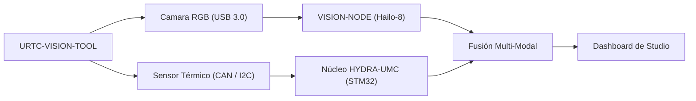

<p align="center">
  
</p>

# 👁️ URTC-VISION-TOOL

<p align="center"><a href="README.md">🇺🇸 English</a> | 🇪🇸 <b>Español</b> | <a href="README_fra.md">🇫🇷 Français</a> | <a href="README_ita.md">🇮🇹 Italiano</a> | <a href="README_deu.md">🇩🇪 Deutsch</a> | <a href="README_zho.md">🇨🇳 简体中文</a> | <a href="README_jpn.md">🇯🇵 日本語</a></p>

### 🔬 Cabezal Integrado que Combina Percepción Térmica y RGB

<p align="left">
  
  
  
  
</p>

---

## 1. 🛠️ VISIÓN TÉCNICA GENERAL

**URTC-VISION-TOOL** es un cabezal de robot especializado que fusiona percepción visual y térmica en un único efector compatible con URTC. Está diseñado para QA avanzado, inspección térmica de PCBs y alineación de Pick-and-Place de alta precisión.

Equipado con una cámara RGB de obturador global y un sensor térmico de la familia MLX9064x, proporciona al Vision AI Node datos duales, permitiéndole detectar no solo la presencia de un componente sino también su temperatura de funcionamiento o la disipación de calor de una soldadura.

Todavía no existe PCB/esquemático para esta placa (ver `hardware/`), así que nada de lo de abajo puede manejar sensores térmicos/RGB reales - pero el toolchain de firmware y el pipeline de visión del lado host (generación sintética de frames, renderizado en falso color, alineación de ROI RGB->térmico y extracción de estadísticas de temperatura, todo cubierto por pytest) son reales y funcionan hoy.

### Características Clave:
* 🔬 **Percepción Dual-Modal** — captura sincronizada de imagen Térmica y RGB. *(el pipeline de procesamiento que alimentan ambos frames es real - ver abajo; la captura sincronizada real necesita el PCB y los sensores.)*
* 🌡️ **Térmico de Alta Precisión** — soporte integrado para sensores MLX90640/41/42. *(el renderizado en falso color y la extracción de estadísticas por región son reales - ver abajo; leer un MLX9064x real por I2C necesita el PCB.)*
* 🎯 **Alineación Eye-in-Hand** — PnP y AOI (Inspección Óptica Automatizada) sub-milimétrica. *(el mapeo de coordenadas ROI RGB->térmico y la extracción de estadísticas de temperatura son reales y están testeados - ver `vision_companion/alignment.py` abajo; la precisión sub-milimétrica necesita una cámara calibrada real.)*
* 📡 **API CAN Unificada** — integrado sin fisuras en el catálogo de 25 herramientas de URTC. *(el protocolo de cable del propio sensor - framing, CRC, validación de rango - es real, ver abajo; todavía se necesita un transceptor CAN real para transportarlo.)*
* 🔒 **Seguridad del Protocolo de Sensor** — framing versionado real con checksum CRC8, validación de rango de medición real, limitación de tasa real, y contadores de diagnóstico dedicados de error/latencia/reset de bus. *(implementado)*
* ✅ **Toolchain de firmware Cortex-M4F** — una imagen bare-metal real que compila y enlaza de verdad con `arm-none-eabi-gcc`, el mismo toolchain que los repositorios hermanos URTC y URTC-SMART-RACK. *(implementado — ver COMPILACIÓN abajo)*
* ✅ **Pipeline de procesamiento `vision_companion`** — un paquete Python real y funcional: generación sintética de frames térmicos+RGB, renderizado térmico en falso color, alineación de ROI RGB->térmico + extracción de estadísticas de temperatura, informe de estadísticas, todo cubierto por 21 casos reales de pytest, funciona de principio a fin sin hardware conectado. *(implementado — ver COMPANION DE VISIÓN abajo)*

---

## 2. 🔄 FLUJO DE LA HERRAMIENTA DE VISIÓN



---

## 3. 🧱 ARQUITECTURA Y DECISIONES DE DISEÑO

* **Por qué este proyecto tiene 2 pistas de versión independientes.** `src/firmware_common.h` (el firmware del lado STM32) y `src/vision_companion/pyproject.toml` (un paquete Python independiente del lado host) se versionan por separado - corren en hardware distinto (MCU frente a host CM5/PC) y se publican en calendarios distintos.
* **Por qué no es un hijo del propio URTC.** Mismo motivo que el propio README de URTC-SMART-RACK - una Herramienta Complementaria que comparte el bus CAN/convenciones de firmware de URTC, sin formar parte de su jerarquía de integración.
* **Por qué un paquete complementario del lado host.** La captura dual térmica/RGB necesita procesamiento de imagen real (numpy/Pillow) que no tiene sitio corriendo en el propio STM32 - el paquete complementario es donde eso ocurre de verdad, hablando con la placa por CAN.
* **Por qué `alignment.py` asume un campo de visión compartido en vez de una homografía real.** Ambos sensores están en el mismo cabezal físico rígido, así que un reescalado lineal por eje entre coordenadas de píxel en espacio RGB y espacio térmico es una aproximación v0 razonable - una calibración real por píxel (tablero de ajedrez, distorsión de lente) necesita cámaras reales contra las que calibrar, que todavía no existen.
* **Cómo encaja en el resto del ecosistema.** Comparte el propio bus CAN/ecosistema de herramientas de URTC, y forma pareja natural con HYDRA-UMC-DETECTION-HEF para el mismo papel de reconocimiento visual que también cumple URTC-SMART-RACK.
* **Por qué el protocolo de trama del sensor lleva su propio campo de timestamp.** Un timestamp real en milisegundos generado por el propio sensor permite a quien llama saber *cuándo* se tomó realmente una lectura, independientemente de cuándo la MCU llegue a analizar la trama - un valor real para historial/diagnóstico que una simple suposición de "acaba de llegar" perdería.
* **Por qué los contadores de diagnóstico (`sensor_diagnostics.c`) nunca toman una decisión de aceptar/rechazar por sí mismos.** Solo `sensor_frame.c` (framing), `sensor_reading.c` (rango) y `rate_limiter.c` (limitación de tasa) deciden si se confía en una trama - diagnóstico solo registra lo que ellos decidieron. Mantener ese límite estricto significa que un bug en diagnóstico nunca pueda dejar pasar datos incorrectos por accidente, la propia "separar diagnóstico de salida de control" de la auditoría de promoción.

---

## 📂 ESTRUCTURA DE DIRECTORIOS

```text
URTC-VISION-TOOL/
├── src/
│   ├── firmware_common.h           # FIRMWARE_VERSION_MAJOR/MINOR/PATCH = 0.0.0
│   ├── sensor_frame.h / .c         # Real: formato de trama versionado + parseo/codificación CRC8
│   ├── sensor_reading.h / .c       # Real: decodificación de lectura térmica + validación de rango
│   ├── rate_limiter.h / .c         # Real: limitación de trama por intervalo mínimo
│   ├── sensor_diagnostics.h / .c   # Real: contadores de error/latencia/reset de bus, separado del control
│   ├── main.c                      # Punto de entrada mínimo (bucle de latido de vida)
│   ├── startup_stm32_minimal.c     # Tabla de vectores + Reset_Handler (sin HAL de ST todavía, ver cabecera del archivo)
│   ├── STM32_MINIMAL.ld            # Linker script placeholder (suelo de 128K FLASH / 32K RAM)
│   └── vision_companion/           # Pipeline de visión Python del lado host (CM5/máquina de desarrollo)
│       ├── pyproject.toml          # Empaquetado + console script `vision-companion`
│       ├── requirements.txt        # numpy + pillow
│       ├── main.py                 # CLI real y funcional (versión / selftest / analyze-roi)
│       ├── alignment.py            # Real: mapeo de ROI RGB<->térmico + extracción de estadísticas de temperatura
│       ├── tests/                  # 21 casos reales de pytest (main.py + alignment.py)
│       └── README.md               # Documentación específica del companion
├── tests/                          # Arnes real de pruebas de firmware nativo del host (sensor_frame, sensor_reading, rate_limiter, sensor_diagnostics, escenarios de sensor)
├── docs/                           # Documentación y referencia de calibración
├── hardware/                       # Archivos de diseño de hardware (PCB, carcasa) - vacío, sin esquemático todavía
├── firmware/                       # Salida de build versionada (.bin/.elf/.hex), commiteada igual que el repo hermano URTC
├── build/                          # Objetos intermedios de build (ignorado por git)
├── images/                         # Medios y diagramas
├── tools/
│   ├── build_test.py               # Comprobación de build/compilación sin subir versión
│   └── ci_validate.py              # Validación de manifest/CHANGELOG/docs usada por la CI
├── bump_version.py                 # Incremento de versión estilo cuentakilómetros (genérico, compartido con URTC / URTC-SMART-RACK)
├── bump_manifest_version.py        # Sincroniza la versión de hydra-umc.project.json con la nativa (--sync)
├── build_firmware.sh / .bat        # Build real: pruebas de host + incrementa versión + compila + enlaza + publica en firmware/
├── build-test.sh / .bat            # Comprobación de build/compilación sin subir versión
└── README.md
```

---

## 4. ⚙️ COMPILACIÓN (firmware)

Requiere el ARM GNU Toolchain (`arm-none-eabi-gcc`, `arm-none-eabi-objcopy`, `arm-none-eabi-size`) y Python 3.

```bash
# Linux/macOS
chmod +x build_firmware.sh   # una sola vez
./build_firmware.sh

# Windows
build_firmware.bat
```

El build incrementa la versión de `src/firmware_common.h` (regla cuentakilómetros), compila `main.c` y `startup_stm32_minimal.c` para Cortex-M4F, los enlaza contra el mapa de memoria placeholder `STM32_MINIMAL.ld`, y publica archivos `.elf`/`.bin`/`.hex` versionados en `firmware/`. Todavía no hay nada que flashear a hardware real - no existe PCB que confirme la pieza STM32 objetivo, el pinout, el cableado del MLX9064x, o la interfaz de la cámara RGB.

## 5. 🐍 COMPANION DE VISIÓN (Python del lado host)

Esta parte funciona hoy, completamente, sin ningún hardware conectado:

```bash
cd src/vision_companion
python3 -m venv .venv
# Linux/macOS:
.venv/bin/pip install -r requirements.txt
.venv/bin/python main.py selftest

# Windows:
.venv\Scripts\pip install -r requirements.txt
.venv\Scripts\python main.py selftest
```

`selftest` genera un frame térmico sintético con forma MLX9064x (32x24, con un punto caliente tipo punta de soldadura) y un patrón de prueba RGB de barras de color, renderiza/guarda ambos como archivos reales, e imprime sus estadísticas — prueba de que el pipeline de procesamiento numpy/Pillow funciona de verdad, independientemente del paso de captura del sensor real que llegará cuando exista hardware.

`analyze-roi X0 Y0 X1 Y1` mapea una caja delimitadora en espacio RGB a espacio térmico y reporta estadísticas reales de temperatura para esa región — la lógica de alineación detrás de la característica Eye-in-Hand Alignment del README, real hoy:

```bash
.venv/bin/python main.py analyze-roi 280 210 360 270
```

Salida de ejemplo real:

```text
RGB ROI (280,210)-(360,270) in a 640x480 frame
  -> thermal stats: min=75.67C max=78.97C mean=77.69C (16 thermal px)
```

21 casos reales de pytest cubren tanto `main.py` como `alignment.py`:

```bash
pip install -e ".[dev]"
pytest
```

Ver `src/vision_companion/README.md` para la documentación completa del companion, y [`docs/CLI_REFERENCE.md`](docs/CLI_REFERENCE.md) para cada comando, flag y código de salida con salida real capturada.

---

## 6. 📋 CHANGELOG

Consulta [`CHANGELOG.md`](CHANGELOG.md) para el historial completo de versiones — el firmware y `vision_companion` se versionan de forma independiente (ver COMPILACIÓN y COMPANION DE VISIÓN arriba), y cada cambio real tiene su propia entrada allí.

---

## 🔗 Proyectos Relacionados

Este proyecto es parte del ecosistema de robótica HYDRA-UMC del mismo autor (JuanenRac / Electro Hobby 3D). Vale la pena conocerlo, ya que una petición podría en realidad ser sobre alguno de estos en vez de sobre este repositorio.

**Directamente Relacionados**
- **[URTC](https://github.com/JuanenRac/URTC)** — firmware para la placa física del Universal Robot Tool Controller, más de 25 perfiles de herramienta por bus CAN — el mismo ecosistema de herramientas, sobre el mismo bus CAN.
- **[HYDRA-UMC-DETECTION-HEF](https://github.com/JuanenRac/HYDRA-UMC-DETECTION-HEF)** — registro real de modelos compilados con verificación de carga segura por arquitectura Hailo/checksum — un hermano en cuanto a rol de reconocimiento visual.
- **[URTC-TESTER](https://github.com/JuanenRac/URTC-TESTER)** — herramienta de escritorio de diagnóstico CAN-bus en vivo para placas URTC, un panel por perfil de herramienta — su propio diagnóstico CAN-bus en vivo complementa las comprobaciones visuales de control de calidad de esta herramienta sobre el mismo cabezal de herramienta.

**También Forma Parte del Ecosistema**

*Hardware y Plataforma Base*
- **[HYDRA-UMC](https://github.com/JuanenRac/HYDRA-UMC)** — la placa madre física del brazo robótico: host CM5 + coprocesador STM32H745 de doble núcleo, coordinando hasta 8 brazos herramienta por CAN-OTA/SPI-OTA.
- **[HYDRA-UMC-OS](https://github.com/JuanenRac/HYDRA-UMC-OS)** — capa de producto reproducible sobre Raspberry Pi OS para el CM5: agente de solo lectura, config/perfiles validados, aprovisionamiento WiFi de primer contacto.
- **[HYDRA-UMC-SDK](https://github.com/JuanenRac/HYDRA-UMC-SDK)** — el contrato JSON-Schema compartido y la barrera de seguridad contra la que cada bridge valida sus comandos.

*Backend Central y Clientes*
- **[HYDRA-UMC-SERVER](https://github.com/JuanenRac/HYDRA-UMC-SERVER)** — el backend headless real (REST/WebSocket) con el que habla de verdad cada cliente de control.
- **[HYDRA-UMC-STUDIO](https://github.com/JuanenRac/HYDRA-UMC-STUDIO)** — panel de control web con visualización 3D multi-robot en tiempo real.
- **[HYDRA-UMC-SUITE](https://github.com/JuanenRac/HYDRA-UMC-SUITE)** — centro de mando de enjambre de escritorio (PySide6) para varios servidores a la vez, empaquetado como ejecutable independiente.
- **[HYDRA-UMC-ANDROID-CONTROL](https://github.com/JuanenRac/HYDRA-UMC-ANDROID-CONTROL)** — app nativa de control para Android con inicio de sesión biométrico y un compañero Wear OS emparejado.
- **[HYDRA-UMC-IOS-CONTROL](https://github.com/JuanenRac/HYDRA-UMC-IOS-CONTROL)** — app de control para iOS/iPadOS (Flutter) con sincronización en tiempo real por WebSocket.
- **[HYDRA-UMC-DSI](https://github.com/JuanenRac/HYDRA-UMC-DSI)** — interfaz táctil nativa para la pantalla táctil DSI de 7" a bordo, embebida en el propio CM5.
- **[HYDRA-UMC-EDITOR-URDF](https://github.com/JuanenRac/HYDRA-UMC-EDITOR-URDF)** — creador/editor gráfico de URDF de escritorio que envía los modelos terminados al propio catálogo de STUDIO.
- **[HYDRA-UMC-BRIDGE-AMR](https://github.com/JuanenRac/HYDRA-UMC-BRIDGE-AMR)** — barrera de coordinación para flotas AGV/AMR mediante un publicador MQTT VDA 5050 real.
- **[HYDRA-UMC-BRIDGE-CNC](https://github.com/JuanenRac/HYDRA-UMC-BRIDGE-CNC)** — coordinador de alto nivel para celdas CNC con acceso real a estado/bytes de control GRBL.
- **[HYDRA-UMC-BRIDGE-DROIDS](https://github.com/JuanenRac/HYDRA-UMC-BRIDGE-DROIDS)** — barrera de coordinación para droides con patas/humanoides, con un emisor de comandos real para Boston Dynamics Spot.
- **[HYDRA-UMC-BRIDGE-LASER](https://github.com/JuanenRac/HYDRA-UMC-BRIDGE-LASER)** — coordinador de seguridad para celdas láser que lee 3 salvaguardas GPIO reales de llave/carcasa/enclavamiento.
- **[HYDRA-UMC-BRIDGE-OPENPNP](https://github.com/JuanenRac/HYDRA-UMC-BRIDGE-OPENPNP)** — coordinador de alto nivel seguro para el flujo de placas de pick-and-place OpenPnP.
- **[HYDRA-UMC-BRIDGE-PRINTER3D](https://github.com/JuanenRac/HYDRA-UMC-BRIDGE-PRINTER3D)** — barrera de coordinación segura para impresoras 3D Moonraker/Klipper, con comandos de trabajo reales y controlados.
- **[HYDRA-UMC-BRIDGE-ROS2](https://github.com/JuanenRac/HYDRA-UMC-BRIDGE-ROS2)** — coordinador de seguridad con un transporte ROS 2 rclpy real, importado de forma perezosa.
- **[HYDRA-UMC-BRIDGE-UAV](https://github.com/JuanenRac/HYDRA-UMC-BRIDGE-UAV)** — barrera de coordinación para UAV equipados con cámara, con un emisor de comandos MAVLink real.

*Plataforma de Herramientas URTC*
- **[URTC-FLASHER](https://github.com/JuanenRac/URTC-FLASHER)** — herramienta de escritorio con GUI para flashear placas URTC, CAN-OTA más SWD/JTAG de chip completo.
- **[URTC-WEB-STUDIO](https://github.com/JuanenRac/URTC-WEB-STUDIO)** — alternativa basada en navegador a URTC-TESTER mediante la Web Serial API, sin instalación local.

*Nodo IA de Visión (Hailo-8)*
- **[HYDRA-UMC-VISION-NODE](https://github.com/JuanenRac/HYDRA-UMC-VISION-NODE)** — nodo de integración para el pipeline de visión Hailo-8, con una comprobación real de disponibilidad de hardware por etapa.
- **[HYDRA-UMC-VISION-STREAMER](https://github.com/JuanenRac/HYDRA-UMC-VISION-STREAMER)** — generador real de pipeline GStreamer + config MediaMTX, con una frontera de integración HailoRT real.
- **[HYDRA-UMC-VISUAL-SERVOING-API](https://github.com/JuanenRac/HYDRA-UMC-VISUAL-SERVOING-API)** — ley de corrección real de Position-Based Visual Servoing, con puerta de seguridad según el estado de zona previo.
- **[HYDRA-UMC-SAFETY-ZONES](https://github.com/JuanenRac/HYDRA-UMC-SAFETY-ZONES)** — comprobación real de invasión de zona y solicitud de E-STOP, con exigencia de vigencia de calibración.

*Nodo IA Cognitivo (Hailo-10)*
- **[HYDRA-UMC-COGNITIVE-NODE](https://github.com/JuanenRac/HYDRA-UMC-COGNITIVE-NODE)** — nodo de integración para el pipeline cognitivo Hailo-10 (orquestación de LLM/VLA/voz).
- **[HYDRA-UMC-VLA-ENGINE](https://github.com/JuanenRac/HYDRA-UMC-VLA-ENGINE)** — codificación/decodificación real de tokens de acción y generación de trayectoria para un modelo Vision-Language-Action.
- **[HYDRA-UMC-VOICE-UI](https://github.com/JuanenRac/HYDRA-UMC-VOICE-UI)** — front-end de voz real (VAD + analizador de intención) con un relé a Watch acotado y con confirmación.
- **[HYDRA-UMC-SEMANTIC-PLANNER](https://github.com/JuanenRac/HYDRA-UMC-SEMANTIC-PLANNER)** — descomposición real de tareas basada en reglas y recuperación semántica de errores sobre códigos de error del MCU.
- **[HYDRA-UMC-DOCS-QA](https://github.com/JuanenRac/HYDRA-UMC-DOCS-QA)** — búsqueda real de documentos TF-IDF (solo librería estándar) sobre los propios documentos Markdown de este ecosistema.

*Orquestación y Enjambre*
- **[HYDRA-UMC-ORCHESTRATOR](https://github.com/JuanenRac/HYDRA-UMC-ORCHESTRATOR)** — nodo de integración con un contrato real de informe de salud gRPC/Protobuf y una máquina de estados de misión.
- **[HYDRA-UMC-JOB-DISPATCHER](https://github.com/JuanenRac/HYDRA-UMC-JOB-DISPATCHER)** — cola de trabajos real basada en prioridad con deduplicación, sobre una API HTTP real.
- **[HYDRA-UMC-NODE-HEALING](https://github.com/JuanenRac/HYDRA-UMC-NODE-HEALING)** — watchdog de salud de flota real basado en gRPC, con reintento/backoff y detección de discrepancia de identidad.
- **[HYDRA-UMC-PATH-PLANNER-3D](https://github.com/JuanenRac/HYDRA-UMC-PATH-PLANNER-3D)** — planificador de rutas 3D real basado en RRT, con validación real de colisión de obstáculos/espacio de trabajo.
- **[HYDRA-UMC-SWARM-SYNC](https://github.com/JuanenRac/HYDRA-UMC-SWARM-SYNC)** — sincronización de estado real mediante CRDT LWW-Element-Map, con pruebas de propiedades para convergencia multi-celda.

*Gemelo Digital y Simulación*
- **[HYDRA-UMC-TWIN](https://github.com/JuanenRac/HYDRA-UMC-TWIN)** — nodo de integración para el motor de gemelo digital, con un contrato real de sincronización por compatibilidad de versión.
- **[HYDRA-UMC-HIL-BRIDGE](https://github.com/JuanenRac/HYDRA-UMC-HIL-BRIDGE)** — enclavamiento de seguridad real hardware-in-the-loop que enruta comandos entre simulación y hardware real.
- **[HYDRA-UMC-PHYSICS-REPLICA](https://github.com/JuanenRac/HYDRA-UMC-PHYSICS-REPLICA)** — cinemática directa real y validación de límites articulares sobre un subconjunto real de URDF.
- **[HYDRA-UMC-SYNTHETIC-DATA-GEN](https://github.com/JuanenRac/HYDRA-UMC-SYNTHETIC-DATA-GEN)** — generador real de escenas 2D procedurales con exportación de anotaciones YOLO/COCO.

*Datos y Analítica*
- **[HYDRA-UMC-DATALAKE](https://github.com/JuanenRac/HYDRA-UMC-DATALAKE)** — almacén de series temporales real respaldado por sqlite3, con una API HTTP real de ingesta/consulta.
- **[HYDRA-UMC-ANOMALY-DETECTOR](https://github.com/JuanenRac/HYDRA-UMC-ANOMALY-DETECTOR)** — detector de anomalías real basado en FFT + línea base estadística, con monitorización de deriva.
- **[HYDRA-UMC-PRODUCTION-REPORTS](https://github.com/JuanenRac/HYDRA-UMC-PRODUCTION-REPORTS)** — cálculo real de OEE/disponibilidad sobre el histórico de DATALAKE, con exportación CSV reproducible.
- **[HYDRA-UMC-TELEMETRY-COLLECTOR](https://github.com/JuanenRac/HYDRA-UMC-TELEMETRY-COLLECTOR)** — pipeline real de ingesta CAN/WebSocket hacia DATALAKE, con deduplicación por secuencia.

*Pasarela Industrial*
- **[HYDRA-UMC-GATEWAY-INDUSTRIAL](https://github.com/JuanenRac/HYDRA-UMC-GATEWAY-INDUSTRIAL)** — nodo de integración que retransmite a protocolos industriales, con una capa real de lista blanca de comandos/contrapresión.
- **[HYDRA-UMC-OPCUA-SERVER](https://github.com/JuanenRac/HYDRA-UMC-OPCUA-SERVER)** — espacio de direcciones OPC-UA real, verificado con una sesión de cliente real del protocolo binario.
- **[HYDRA-UMC-MQTT-BROKER](https://github.com/JuanenRac/HYDRA-UMC-MQTT-BROKER)** — broker MQTT real con autenticación por cliente opcional y ACL de tópicos.
- **[HYDRA-UMC-MTCONNECT-ADAPTER](https://github.com/JuanenRac/HYDRA-UMC-MTCONNECT-ADAPTER)** — endpoints XML reales `/probe` y `/current` de MTConnect, con salida en modo degradado.

*Herramientas Complementarias y Operaciones del Ecosistema*
- **[HYDRA-UMC-DASHBOARD-AI](https://github.com/JuanenRac/HYDRA-UMC-DASHBOARD-AI)** — paneles de Resúmenes Inteligentes y Resaltado de Anomalías sobre DATALAKE/ANOMALY-DETECTOR, con un respaldo estadístico honesto.
- **[HYDRA-UMC-TOOL-CLI](https://github.com/JuanenRac/HYDRA-UMC-TOOL-CLI)** — CLI de flota con un contrato real y estable de códigos de salida, cliente real y en vivo de la propia API de HYDRA-UMC-SERVER.
- **[HYDRA-UMC-WATCH](https://github.com/JuanenRac/HYDRA-UMC-WATCH)** — app compañera de WearOS con alertas hápticas reales y un relé de voz al teléfono emparejado.
- **[URTC-SMART-RACK](https://github.com/JuanenRac/URTC-SMART-RACK)** — firmware para un rack de montaje de placas con decodificación real de ID de herramienta y lógica de precalentamiento Smart Idle.
- **[HYDRA-UMC-UPDATER](https://github.com/JuanenRac/HYDRA-UMC-UPDATER)** — herramienta administrativa de escritorio que descubre, clona y actualiza cada repositorio de este ecosistema.
- **[HYDRA-UMC-OS-REBUILDER](https://github.com/JuanenRac/HYDRA-UMC-OS-REBUILDER)** — herramienta de escritorio Windows/Linux que construye una imagen de la CM5 lista para grabar, precargada con las versiones más actuales del ecosistema, con configuración de primer arranque de Wi-Fi/usuario/SSH al estilo de Raspberry Pi Imager.


---

## 📚 Documentación y Comunidad

- **[CONTRIBUTING.md](CONTRIBUTING.md)** — stack tecnológico y pautas de codificación para un pull request.
- **[CODE_OF_CONDUCT.md](CODE_OF_CONDUCT.md)** — los estándares de comportamiento esperados en esta comunidad.
- **[SECURITY.md](SECURITY.md)** — cómo reportar una vulnerabilidad, y las áreas reales de enfoque en seguridad de este proyecto.
- **[SUPPORT.md](SUPPORT.md)** — dónde hacer preguntas y reportar errores.
- **[LICENSE.md](LICENSE.md)** — la licencia propia de este proyecto.

## 👤 AUTOR
**JuanenRac** (Electro Hobby 3D)
📧 electrohobby3d@gmail.com
📺 [youtube.com/@electrohobby3d](https://youtube.com/@electrohobby3d)

## 📜 LICENCIA
GPL-3.0 - Ver LICENSE para más detalles.
