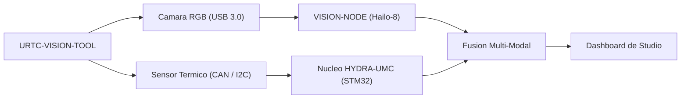

<p align="center">
  
</p>

# 👁️ URTC-VISION-TOOL

<p align="center"><a href="README.md">🇺🇸 English</a> | 🇪🇸 <b>Español</b> | <a href="README_fra.md">🇫🇷 Français</a> | <a href="README_ita.md">🇮🇹 Italiano</a> | <a href="README_deu.md">🇩🇪 Deutsch</a> | <a href="README_zho.md">🇨🇳 简体中文</a> | <a href="README_jpn.md">🇯🇵 日本語</a></p>

### 🔬 Cabezal Integrado que Combina Percepcion Termica y RGB

<p align="left">
  
  
  
  
</p>

---

## 1. 🛠️ VISIÓN TÉCNICA GENERAL

**URTC-VISION-TOOL** es un cabezal de robot especializado que fusiona percepcion visual y termica en un unico efector compatible con URTC. Esta disenado para QA avanzado, inspeccion termica de PCBs y alineacion de Pick-and-Place de alta precision.

Equipado con una camara RGB de obturador global y un sensor termico de la familia MLX9064x, proporciona al Vision AI Node datos duales, permitiendole detectar no solo la presencia de un componente sino tambien su temperatura de funcionamiento o la disipacion de calor de una soldadura.

Todavia no existe PCB/esquematico para esta placa (ver `hardware/`) - las caracteristicas de abajo describen el diseno objetivo; el toolchain de firmware y el pipeline de vision del lado host son lo que es real hoy.

### Caracteristicas Clave:
* 🔬 **Percepcion Dual-Modal** — captura sincronizada de imagen Termica y RGB. *(planeado — necesita el PCB y los sensores reales)*
* 🌡️ **Termico de Alta Precision** — soporte integrado para sensores MLX90640/41/42. *(planeado)*
* 🎯 **Alineacion Eye-in-Hand** — PnP y AOI (Inspeccion Optica Automatizada) sub-milimetrica. *(planeado)*
* 📡 **API CAN Unificada** — integrado sin fisuras en el catalogo de 25 herramientas de URTC. *(planeado)*
* ✅ **Toolchain de firmware Cortex-M4F** — una imagen bare-metal real que compila y enlaza de verdad con `arm-none-eabi-gcc`, el mismo toolchain que los repositorios hermanos URTC y URTC-SMART-RACK. *(implementado — ver COMPILACIÓN abajo)*
* ✅ **Pipeline de procesamiento `vision_companion`** — un paquete Python real y funcional: generacion sintetica de frames termicos+RGB, renderizado termico en falso color, informe de estadisticas, funciona de principio a fin sin hardware conectado. *(implementado — ver COMPANION DE VISIÓN abajo)*

---

## 2. 🔄 FLUJO DE LA HERRAMIENTA DE VISION



---

## 3. 🧱 ARQUITECTURA Y DECISIONES DE DISEÑO

* **Por qué este proyecto tiene 2 pistas de versión independientes.** `src/firmware_common.h` (el firmware del lado STM32) y `src/vision_companion/pyproject.toml` (un paquete Python independiente del lado host) se versionan por separado - corren en hardware distinto (MCU frente a host CM5/PC) y se publican en calendarios distintos.
* **Por qué no es un hijo del propio URTC.** Mismo motivo que el propio README de URTC-SMART-RACK - una Herramienta Complementaria que comparte el bus CAN/convenciones de firmware de URTC, sin formar parte de su jerarquía de integración.
* **Por qué un paquete complementario del lado host.** La captura dual térmica/RGB necesita procesamiento de imagen real (numpy/Pillow) que no tiene sitio corriendo en el propio STM32 - el paquete complementario es donde eso ocurre de verdad, hablando con la placa por CAN.
* **Cómo encaja en el resto del ecosistema.** Comparte el propio bus CAN/ecosistema de herramientas de URTC, y forma pareja natural con HYDRA-UMC-DETECTION-HEF para el mismo papel de reconocimiento visual que también cumple URTC-SMART-RACK.

---

## 📂 ESTRUCTURA DE DIRECTORIOS

```text
URTC-VISION-TOOL/
├── src/
│   ├── firmware_common.h           # FIRMWARE_VERSION_MAJOR/MINOR/PATCH = 0.0.0
│   ├── main.c                      # Punto de entrada minimo (bucle de latido de vida)
│   ├── startup_stm32_minimal.c     # Tabla de vectores + Reset_Handler (sin HAL de ST todavia, ver cabecera del archivo)
│   ├── STM32_MINIMAL.ld            # Linker script placeholder (suelo de 128K FLASH / 32K RAM)
│   └── vision_companion/           # Pipeline de vision Python del lado host (CM5/maquina de desarrollo)
│       ├── pyproject.toml          # Empaquetado + console script `vision-companion`
│       ├── requirements.txt        # numpy + pillow
│       ├── main.py                 # CLI real y funcional (version / selftest)
│       └── README.md               # Documentacion especifica del companion
├── docs/                           # Documentacion y referencia de calibracion
├── hardware/                       # Archivos de diseno de hardware (PCB, carcasa) - vacio, sin esquematico todavia
├── firmware/                       # Salida de build versionada (.bin/.elf/.hex), commiteada igual que el repo hermano URTC
├── build/                          # Objetos intermedios de build (ignorado por git)
├── images/                         # Medios y diagramas
├── scripts/                        # Scripts de utilidad
├── bump_version.py                 # Incremento de version estilo cuentakilometros (generico, compartido con URTC / URTC-SMART-RACK)
├── build_firmware.sh / .bat        # Build real: incrementa version + compila + enlaza + publica en firmware/
└── README.md
```

---

## 4. ⚙️ COMPILACIÓN (firmware)

Requiere el ARM GNU Toolchain (`arm-none-eabi-gcc`, `arm-none-eabi-objcopy`, `arm-none-eabi-size`) y Python 3.

```bash
# Linux/macOS
chmod +x build_firmware.sh   # una sola vez
./build_firmware.sh

# Windows
build_firmware.bat
```

El build incrementa la version de `src/firmware_common.h` (regla cuentakilometros), compila `main.c` y `startup_stm32_minimal.c` para Cortex-M4F, los enlaza contra el mapa de memoria placeholder `STM32_MINIMAL.ld`, y publica archivos `.elf`/`.bin`/`.hex` versionados en `firmware/`. Todavia no hay nada que flashear a hardware real - no existe PCB que confirme la pieza STM32 objetivo, el pinout, el cableado del MLX9064x, o la interfaz de la camara RGB.

## 5. 🐍 COMPANION DE VISIÓN (Python del lado host)

Esta parte funciona hoy, completamente, sin ningun hardware conectado:

```bash
cd src/vision_companion
python3 -m venv .venv
# Linux/macOS:
.venv/bin/pip install -r requirements.txt
.venv/bin/python main.py selftest

# Windows:
.venv\Scripts\pip install -r requirements.txt
.venv\Scripts\python main.py selftest
```

`selftest` genera un frame termico sintetico con forma MLX9064x (32x24, con un punto caliente tipo punta de soldadura) y un patron de prueba RGB de barras de color, renderiza/guarda ambos como archivos reales, e imprime sus estadisticas — prueba de que el pipeline de procesamiento numpy/Pillow funciona de verdad, independientemente del paso de captura del sensor real que llegara cuando exista hardware. Ver `src/vision_companion/README.md` para la documentacion completa del companion.

---

## 🔗 Proyectos Relacionados

Este proyecto forma parte de un ecosistema de robótica más amplio del mismo autor (JuanenRac / Electro Hobby 3D), que abarca firmware, software de control, nodos de IA y herramientas de flota. Vale la pena conocerlo, ya que una petición podría en realidad ser sobre uno de estos proyectos en vez de sobre este repositorio.

### Relación Directa

- **[URTC](https://github.com/JuanenRac/URTC)** — mismo ecosistema de herramientas / bus CAN.
- **[HYDRA-UMC-DETECTION-HEF](https://github.com/JuanenRac/HYDRA-UMC-DETECTION-HEF)** — hermano de reconocimiento visual.

### Resto del Ecosistema

**Plataforma HYDRA-UMC** — la célula de micro-fábrica multi-robot
- **[HYDRA-UMC](https://github.com/JuanenRac/HYDRA-UMC)** — la placa base CM5 + STM32H745 que orquesta hasta 8 brazos robóticos.
- **[HYDRA-UMC-SERVER](https://github.com/JuanenRac/HYDRA-UMC-SERVER)** — el backend Express/WebSocket con el que habla cada cliente de control.
- **[HYDRA-UMC-STUDIO](https://github.com/JuanenRac/HYDRA-UMC-STUDIO)** — panel de control web, visualización 3D multi-robot.
- **[HYDRA-UMC-ANDROID-CONTROL](https://github.com/JuanenRac/HYDRA-UMC-ANDROID-CONTROL)** — app de control Android por Wi-Fi/Bluetooth.
- **[HYDRA-UMC-IOS-CONTROL](https://github.com/JuanenRac/HYDRA-UMC-IOS-CONTROL)** — app de control iOS/iPadOS construida en Flutter.
- **[HYDRA-UMC-SUITE](https://github.com/JuanenRac/HYDRA-UMC-SUITE)** — centro de mando de enjambre de escritorio (Python/PySide6).
- **[HYDRA-UMC-EDITOR-URDF](https://github.com/JuanenRac/HYDRA-UMC-EDITOR-URDF)** — editor de modelos URDF de escritorio para el catálogo de robots.
- **[HYDRA-UMC-DSI](https://github.com/JuanenRac/HYDRA-UMC-DSI)** — interfaz táctil nativa para la pantalla DSI integrada.

**Plataforma URTC** — el controlador de cabezal de herramienta que lleva cada brazo HYDRA-UMC
- **[URTC](https://github.com/JuanenRac/URTC)** — controlador de cabezal de herramienta CAN, 25 perfiles de herramienta.
- **[URTC-FLASHER](https://github.com/JuanenRac/URTC-FLASHER)** — herramienta de escritorio de flasheo CAN-OTA + SWD/JTAG.
- **[URTC-TESTER](https://github.com/JuanenRac/URTC-TESTER)** — herramienta de escritorio de diagnóstico CAN en vivo.
- **[URTC-WEB-STUDIO](https://github.com/JuanenRac/URTC-WEB-STUDIO)** — alternativa basada en navegador vía Web Serial API.

**🎥 Vision AI Node (Hailo-8)**
- [HYDRA-UMC-VISION-NODE](https://github.com/JuanenRac/HYDRA-UMC-VISION-NODE)
- [HYDRA-UMC-VISION-STREAMER](https://github.com/JuanenRac/HYDRA-UMC-VISION-STREAMER)
- [HYDRA-UMC-DETECTION-HEF](https://github.com/JuanenRac/HYDRA-UMC-DETECTION-HEF)
- [HYDRA-UMC-SAFETY-ZONES](https://github.com/JuanenRac/HYDRA-UMC-SAFETY-ZONES)
- [HYDRA-UMC-VISUAL-SERVOING-API](https://github.com/JuanenRac/HYDRA-UMC-VISUAL-SERVOING-API)

**🧠 Cognitive AI Node (Hailo-10)**
- [HYDRA-UMC-COGNITIVE-NODE](https://github.com/JuanenRac/HYDRA-UMC-COGNITIVE-NODE)
- [HYDRA-UMC-VLA-ENGINE](https://github.com/JuanenRac/HYDRA-UMC-VLA-ENGINE)
- [HYDRA-UMC-VOICE-UI](https://github.com/JuanenRac/HYDRA-UMC-VOICE-UI)
- [HYDRA-UMC-SEMANTIC-PLANNER](https://github.com/JuanenRac/HYDRA-UMC-SEMANTIC-PLANNER)
- [HYDRA-UMC-DOCS-QA](https://github.com/JuanenRac/HYDRA-UMC-DOCS-QA)

**🐝 Orchestration & Swarm**
- [HYDRA-UMC-ORCHESTRATOR](https://github.com/JuanenRac/HYDRA-UMC-ORCHESTRATOR)
- [HYDRA-UMC-SWARM-SYNC](https://github.com/JuanenRac/HYDRA-UMC-SWARM-SYNC)
- [HYDRA-UMC-PATH-PLANNER-3D](https://github.com/JuanenRac/HYDRA-UMC-PATH-PLANNER-3D)
- [HYDRA-UMC-JOB-DISPATCHER](https://github.com/JuanenRac/HYDRA-UMC-JOB-DISPATCHER)
- [HYDRA-UMC-NODE-HEALING](https://github.com/JuanenRac/HYDRA-UMC-NODE-HEALING)

**🎮 Digital Twin & Simulation**
- [HYDRA-UMC-TWIN](https://github.com/JuanenRac/HYDRA-UMC-TWIN)
- [HYDRA-UMC-PHYSICS-REPLICA](https://github.com/JuanenRac/HYDRA-UMC-PHYSICS-REPLICA)
- [HYDRA-UMC-HIL-BRIDGE](https://github.com/JuanenRac/HYDRA-UMC-HIL-BRIDGE)
- [HYDRA-UMC-SYNTHETIC-DATA-GEN](https://github.com/JuanenRac/HYDRA-UMC-SYNTHETIC-DATA-GEN)

**📊 Data & Analytics**
- [HYDRA-UMC-DATALAKE](https://github.com/JuanenRac/HYDRA-UMC-DATALAKE)
- [HYDRA-UMC-TELEMETRY-COLLECTOR](https://github.com/JuanenRac/HYDRA-UMC-TELEMETRY-COLLECTOR)
- [HYDRA-UMC-ANOMALY-DETECTOR](https://github.com/JuanenRac/HYDRA-UMC-ANOMALY-DETECTOR)
- [HYDRA-UMC-PRODUCTION-REPORTS](https://github.com/JuanenRac/HYDRA-UMC-PRODUCTION-REPORTS)

**🏭 Industrial Gateway**
- [HYDRA-UMC-GATEWAY-INDUSTRIAL](https://github.com/JuanenRac/HYDRA-UMC-GATEWAY-INDUSTRIAL)
- [HYDRA-UMC-OPCUA-SERVER](https://github.com/JuanenRac/HYDRA-UMC-OPCUA-SERVER)
- [HYDRA-UMC-MQTT-BROKER](https://github.com/JuanenRac/HYDRA-UMC-MQTT-BROKER)
- [HYDRA-UMC-MTCONNECT-ADAPTER](https://github.com/JuanenRac/HYDRA-UMC-MTCONNECT-ADAPTER)

**🛠️ Complementary Tools**
- [URTC-SMART-RACK](https://github.com/JuanenRac/URTC-SMART-RACK)
- [HYDRA-UMC-WATCH](https://github.com/JuanenRac/HYDRA-UMC-WATCH)
- [HYDRA-UMC-TOOL-CLI](https://github.com/JuanenRac/HYDRA-UMC-TOOL-CLI)
- [HYDRA-UMC-DASHBOARD-AI](https://github.com/JuanenRac/HYDRA-UMC-DASHBOARD-AI)


## 👤 AUTOR
**JuanenRac** (Electro Hobby 3D)
📧 electrohobby3d@gmail.com

## 📜 LICENCIA
GPL-3.0 - Ver LICENSE para más detalles.

## 🛠️ BUILD & RUN

Usa la comprobación de compilación sin versionado antes de una compilación de publicación:

| Acción | Windows | Linux / macOS |
|---|---|---|
| Comprobación de compilación (sin cambiar versión ni CHANGELOG) | `build-test.bat` | `./build-test.sh` |
| Ejecución / desarrollo (cuando exista) | `run*.bat` o `dev*.bat` | `./run*.sh` o `./dev*.sh` |

`build-test.bat` y `build-test.sh` compilan o validan el stack del proyecto sin incrementar `hydra-umc.project.json` ni modificar `CHANGELOG.md`. Solo pueden crear salidas normales del compilador. Los scripts existentes `build*.bat`, `build*.sh`, `run*` y `dev*` conservan su comportamiento específico de versión o ejecución; úsalos cuando necesites ese comportamiento.