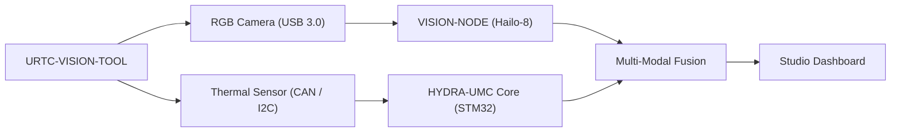

<p align="center">
  
</p>

# 👁️ URTC-VISION-TOOL

<p align="center"><a href="README.md">🇺🇸 English</a> | <a href="README_spa.md">🇪🇸 Español</a> | <a href="README_fra.md">🇫🇷 Français</a> | <a href="README_ita.md">🇮🇹 Italiano</a> | <a href="README_deu.md">🇩🇪 Deutsch</a> | 🇨🇳 <b>简体中文</b> | <a href="README_jpn.md">🇯🇵 日本語</a></p>

### 🔬 融合热成像与 RGB 感知的集成末端执行器

<p align="left">
  
  
  
  
</p>

---

## 1. 🛠️ 技术概述

**URTC-VISION-TOOL** 是一款专用的机器人工具头，将视觉与热成像感知融合到
单一的 URTC 兼容执行器中。它专为高级质检、PCB 热成像检测和高精度抓取
放置对位而设计。

它配备了一个 RGB 全局快门摄像头和一个 MLX9064x 系列热传感器，为视觉 AI
节点提供双模态数据，使其不仅能检测组件是否存在，还能检测其工作温度或
焊点散热情况。

该板卡目前尚不存在 PCB/原理图（见 `hardware/`），因此下面的功能都无法驱动
真实的热成像/RGB 传感器——但固件工具链以及主机端的视觉处理流水线（合成帧
生成、伪彩色渲染、RGB->热成像 ROI 对位与温度统计提取，全部有 pytest 覆盖）
今天就是真实且可用的。

### 关键特性：
* 🔬 **双模态感知** —— 同步的热成像与 RGB 图像捕获。*（两路帧所馈送的处理流水线是真实的——见下文；真正的同步捕获需要 PCB 和传感器。）*
* 🌡️ **高精度热成像** —— 集成 MLX90640/41/42 传感器支持。*（伪彩色渲染和按区域统计提取是真实的——见下文；通过 I2C 读取真实的 MLX9064x 需要 PCB。）*
* 🎯 **Eye-in-Hand 对位** —— 亚毫米级 PnP 与 AOI（自动光学检测）。*（RGB->热成像 ROI 坐标映射与温度统计提取是真实的并已测试——见下文的 `vision_companion/alignment.py`；亚毫米级精度需要真实的已标定摄像头。）*
* 📡 **统一 CAN API** —— 无缝集成到 URTC 25 种工具目录中。*（传感器侧的线缆协议本身——帧格式、CRC、范围校验——是真实的，见下文；仍需要真实的 CAN 收发器来实际承载它。）*
* 🔒 **传感器协议安全性** —— 真实的版本化帧格式，带 CRC8 校验和，真实的测量范围校验，真实的速率限制，以及独立于控制决策的专用错误/延迟/总线复位诊断计数器。*（已实现）*
* ✅ **Cortex-M4F 固件工具链** —— 一个真实的裸机镜像，使用与兄弟仓库 URTC 和 URTC-SMART-RACK 相同的工具链，通过 `arm-none-eabi-gcc` 交叉编译并链接。*（已实现——见下方"构建"）*
* ✅ **`vision_companion` 处理流水线** —— 一个真实可用的 Python 包：合成热成像+RGB 帧生成、伪彩色热成像渲染、RGB->热成像 ROI 对位 + 温度统计提取、统计报告，全部由 21 个真实 pytest 用例覆盖，无需连接任何硬件即可端到端运行。*（已实现——见下方"VISION COMPANION"）*

---

## 2. 🔄 视觉工具流程



---

## 3. 🧱 架构与设计决策

* **为什么本项目拥有 2 条独立的版本跟踪线。** `src/firmware_common.h`（STM32 端固件）和 `src/vision_companion/pyproject.toml`（独立的主机端 Python 包）分别独立进行版本管理——它们运行在不同的硬件上（MCU 与主机 CM5/PC），并按不同的发布节奏交付。
* **为什么它不是 URTC 自身的子项目。** 与 URTC-SMART-RACK 自身 README 中的理由相同——它是一个共享 URTC 的 CAN 总线/固件惯例的配套工具，而非其集成层级结构的一部分。
* **为什么需要一个主机端配套软件包。** 热成像/RGB 双模态捕获需要真正的图像处理（numpy/Pillow），而这不适合直接运行在 STM32 上——该配套软件包正是执行这些处理的地方，通过 CAN 与板卡通信。
* **为什么 `alignment.py` 假设两个传感器共享同一视场，而非使用真实单应变换。** 两个传感器安装在同一个刚性工具头上，因此在 RGB 空间与热成像空间之间对像素坐标做逐轴线性缩放是合理的 v0 近似——真正的逐像素标定（棋盘格、镜头畸变）需要真实摄像头才能进行，而这些目前还不存在。
* **这如何融入生态系统的其余部分。** 共享 URTC 自身的 CAN 总线/工具生态系统，并与 HYDRA-UMC-DETECTION-HEF 自然搭配，承担与 URTC-SMART-RACK 相同的视觉识别角色。
* **为什么传感器帧协议携带自己的时间戳字段。** 真实的传感器端毫秒级时间戳让调用方知道一次读数*实际上是何时*采集的，而与 MCU 何时才能解析该帧无关——这是历史记录/诊断方面真实的价值，若只是简单地假设“刚刚到达”则会丢失这一价值。
* **为什么诊断计数器（`sensor_diagnostics.c`）自身从不做出接受/拒绝的决策。** 只有 `sensor_frame.c`（帧格式）、`sensor_reading.c`（范围）和 `rate_limiter.c`（速率限制）决定一帧数据是否可信——诊断模块只记录它们的决策结果。严格保持这一边界意味着诊断模块中的 bug 永远不可能意外放行错误数据，这正是晋级审计自身所说的"separar diagnostico de salida de control"。

---

## 📂 目录结构

```text
URTC-VISION-TOOL/
├── src/
│   ├── firmware_common.h           # FIRMWARE_VERSION_MAJOR/MINOR/PATCH = 0.0.0
│   ├── sensor_frame.h / .c         # 真实：版本化帧格式 + CRC8 解析/编码
│   ├── sensor_reading.h / .c       # 真实：热成像读数解码 + 范围校验
│   ├── rate_limiter.h / .c         # 真实：最小间隔帧限速
│   ├── sensor_diagnostics.h / .c   # 真实：错误/延迟/总线复位计数器，与控制分离
│   ├── main.c                      # 最小入口点（存活证明心跳循环）
│   ├── startup_stm32_minimal.c     # 向量表 + Reset_Handler（暂无 ST HAL，见文件头说明）
│   ├── STM32_MINIMAL.ld            # 占位链接脚本（128K FLASH / 32K RAM 下限）
│   └── vision_companion/           # 主机端（CM5/开发机）Python 视觉流水线
│       ├── pyproject.toml          # 打包配置 + `vision-companion` 控制台脚本
│       ├── requirements.txt        # numpy + pillow
│       ├── main.py                 # 真实可用的 CLI（版本/自检/analyze-roi）
│       ├── alignment.py            # 真实：RGB<->热成像 ROI 映射 + 温度统计提取
│       ├── tests/                  # 21 个真实 pytest 用例（main.py + alignment.py）
│       └── README.md               # 配套软件专属使用文档
├── tests/                          # 真实的主机原生固件测试套件（sensor_frame、sensor_reading、rate_limiter、sensor_diagnostics、传感器场景）
├── docs/                           # 文档与标定参考
├── hardware/                       # 硬件设计文件（PCB、外壳）—— 目前为空，尚无原理图
├── firmware/                       # 版本化构建输出（.bin/.elf/.hex），与兄弟仓库 URTC 一样被提交
├── build/                          # 中间构建对象（已被 gitignore）
├── images/                         # 媒体与图表
├── tools/
│   ├── build_test.py               # 不递增版本号的构建/编译检查
│   └── ci_validate.py              # CI 使用的 manifest/CHANGELOG/docs 校验
├── bump_version.py                 # 里程表式版本递增（通用脚本，与 URTC / URTC-SMART-RACK 共享）
├── bump_manifest_version.py        # 将 hydra-umc.project.json 的版本与原生版本同步（--sync）
├── build_firmware.sh / .bat        # 真实构建：主机测试 + 版本递增 + 编译 + 链接 + 发布到 firmware/
├── build-test.sh / .bat            # 不递增版本号的构建/编译检查
└── README.md
```

---

## 4. ⚙️ 构建（固件）

需要 ARM GNU 工具链（`arm-none-eabi-gcc`、`arm-none-eabi-objcopy`、
`arm-none-eabi-size`）以及 Python 3。

```bash
# Linux/macOS
chmod +x build_firmware.sh   # 仅需一次
./build_firmware.sh

# Windows
build_firmware.bat
```

该构建会递增 `src/firmware_common.h` 中的版本号（里程表规则），针对
Cortex-M4F 编译 `main.c` 和 `startup_stm32_minimal.c`，将其与占位性质
的 `STM32_MINIMAL.ld` 内存映射进行链接，并将版本化的
`.elf`/`.bin`/`.hex` 文件发布到 `firmware/`。目前尚无内容可刷写到真实
硬件——因为没有 PCB 可以确认目标 STM32 型号、引脚布局、MLX9064x 接线，
或 RGB 摄像头接口。

## 5. 🐍 视觉配套软件（主机端 Python）

这部分今天就能完整运行，无需连接任何硬件：

```bash
cd src/vision_companion
python3 -m venv .venv
# Linux/macOS：
.venv/bin/pip install -r requirements.txt
.venv/bin/python main.py selftest

# Windows：
.venv\Scripts\pip install -r requirements.txt
.venv\Scripts\python main.py selftest
```

`selftest` 会生成一个合成的、符合 MLX9064x 格式的热成像帧（32x24，带有
类似烙铁头的热点），以及一个合成的 RGB 彩条测试图案，将两者渲染/保存为
真实文件，并打印其统计信息——证明 numpy/Pillow 处理流水线确实可以正常
工作，独立于将在硬件问世后才实现的真实传感器捕获步骤。

`analyze-roi X0 Y0 X1 Y1` 将 RGB 空间中的一个边界框映射到热成像空间，并
报告该区域的真实温度统计——这正是 README 中"Eye-in-Hand Alignment"功能
背后的对位逻辑，今天就是真实的：

```bash
.venv/bin/python main.py analyze-roi 280 210 360 270
```

真实示例输出：

```text
RGB ROI (280,210)-(360,270) in a 640x480 frame
  -> thermal stats: min=75.67C max=78.97C mean=77.69C (16 thermal px)
```

21 个真实 pytest 用例覆盖了 `main.py` 和 `alignment.py`：

```bash
pip install -e ".[dev]"
pytest
```

完整的配套软件文档请见 `src/vision_companion/README.md`,每个命令、参数和
退出码及其真实捕获输出请见 [`docs/CLI_REFERENCE.md`](docs/CLI_REFERENCE.md)。

---

## 6. 📋 更新日志

完整版本历史见 [`CHANGELOG.md`](CHANGELOG.md) —— 固件与 `vision_companion` 各自独立
进行版本管理(见上方"构建"与"视觉配套软件"一节),每次真实变更在其中都有独立条目。

---

## 🔗 相关项目

本项目是同一作者(JuanenRac / Electro Hobby 3D)打造的 HYDRA-UMC 机器人生态系统的一部分。值得了解,因为某个请求实际上可能是关于这些项目之一,而非本仓库本身。

**直接相关**
- **[URTC](https://github.com/JuanenRac/URTC)** — 面向实体 Universal Robot Tool Controller 板卡的固件，通过 CAN 总线支持 25 种以上工具配置 —— 同一 CAN 总线上的同一工具生态系统。
- **[HYDRA-UMC-DETECTION-HEF](https://github.com/JuanenRac/HYDRA-UMC-DETECTION-HEF)** — 具备 Hailo 架构/校验和安全加载验证的真实编译模型注册表 —— 视觉识别角色上的兄弟项目。
- **[URTC-TESTER](https://github.com/JuanenRac/URTC-TESTER)** — 面向 URTC 板卡的桌面实时 CAN 总线诊断工具，每种工具配置对应一个面板 —— 其自身的实时 CAN 总线诊断,补充了本工具在同一工具头上的视觉质量保证检查。

**生态系统中的其他项目**

*核心硬件与平台*
- **[HYDRA-UMC](https://github.com/JuanenRac/HYDRA-UMC)** — 机器人手臂的真实主板——CM5 主机 + 双核 STM32H745，通过 CAN-OTA/SPI-OTA 协调最多 8 条工具臂。
- **[HYDRA-UMC-OS](https://github.com/JuanenRac/HYDRA-UMC-OS)** — 面向 CM5 的可复现 Raspberry Pi OS 产品层——只读代理、经过验证的配置/配置文件、WiFi 首次配网。
- **[HYDRA-UMC-SDK](https://github.com/JuanenRac/HYDRA-UMC-SDK)** — 每个桥接都据此校验自身指令的共享 JSON-Schema 契约与安全门限边界。

*核心后端与客户端*
- **[HYDRA-UMC-SERVER](https://github.com/JuanenRac/HYDRA-UMC-SERVER)** — 每个控制客户端真正通信的真实无头后端(REST/WebSocket)。
- **[HYDRA-UMC-STUDIO](https://github.com/JuanenRac/HYDRA-UMC-STUDIO)** — 具有实时多机器人 3D 可视化的网页控制面板。
- **[HYDRA-UMC-SUITE](https://github.com/JuanenRac/HYDRA-UMC-SUITE)** — 面向多台服务器的桌面(PySide6)集群指挥中心，打包为独立可执行文件。
- **[HYDRA-UMC-ANDROID-CONTROL](https://github.com/JuanenRac/HYDRA-UMC-ANDROID-CONTROL)** — 具有生物识别登录和配对 Wear OS 伴侣应用的原生 Android 控制应用。
- **[HYDRA-UMC-IOS-CONTROL](https://github.com/JuanenRac/HYDRA-UMC-IOS-CONTROL)** — 具有实时 WebSocket 同步的 iOS/iPadOS 控制应用(Flutter)。
- **[HYDRA-UMC-DSI](https://github.com/JuanenRac/HYDRA-UMC-DSI)** — 面向机载 7 英寸 DSI 触摸屏的原生触控界面，直接嵌入 CM5 本体。
- **[HYDRA-UMC-EDITOR-URDF](https://github.com/JuanenRac/HYDRA-UMC-EDITOR-URDF)** — 将完成的模型推送到 STUDIO 自身目录的桌面版图形化 URDF 创建/编辑工具。
- **[HYDRA-UMC-BRIDGE-AMR](https://github.com/JuanenRac/HYDRA-UMC-BRIDGE-AMR)** — 通过真实的 VDA 5050 MQTT 发布者为 AGV/AMR 车队提供的协调边界。
- **[HYDRA-UMC-BRIDGE-CNC](https://github.com/JuanenRac/HYDRA-UMC-BRIDGE-CNC)** — 具备真实 GRBL 状态/控制字节访问能力的高层 CNC 单元协调器。
- **[HYDRA-UMC-BRIDGE-DROIDS](https://github.com/JuanenRac/HYDRA-UMC-BRIDGE-DROIDS)** — 面向足式/人形机器人的协调边界，具备真实的 Boston Dynamics Spot 指令发送器。
- **[HYDRA-UMC-BRIDGE-LASER](https://github.com/JuanenRac/HYDRA-UMC-BRIDGE-LASER)** — 读取 3 项真实钥匙/外壳/联锁 GPIO 安全信号的激光单元安全协调器。
- **[HYDRA-UMC-BRIDGE-OPENPNP](https://github.com/JuanenRac/HYDRA-UMC-BRIDGE-OPENPNP)** — 面向 OpenPnP 贴片机板级流程的安全高层协调器。
- **[HYDRA-UMC-BRIDGE-PRINTER3D](https://github.com/JuanenRac/HYDRA-UMC-BRIDGE-PRINTER3D)** — 面向 Moonraker/Klipper 3D 打印机的安全协调边界，具备真实的受控作业指令。
- **[HYDRA-UMC-BRIDGE-ROS2](https://github.com/JuanenRac/HYDRA-UMC-BRIDGE-ROS2)** — 具备真实的惰性导入 rclpy ROS 2 传输层的安全协调器。
- **[HYDRA-UMC-BRIDGE-UAV](https://github.com/JuanenRac/HYDRA-UMC-BRIDGE-UAV)** — 面向搭载摄像头的无人机的协调边界，具备真实的 MAVLink 指令发送器。

*URTC 工具平台*
- **[URTC-FLASHER](https://github.com/JuanenRac/URTC-FLASHER)** — 面向 URTC 板卡的桌面图形烧录工具，支持 CAN-OTA 以及全芯片 SWD/JTAG。
- **[URTC-WEB-STUDIO](https://github.com/JuanenRac/URTC-WEB-STUDIO)** — 通过 Web Serial API 实现的浏览器版 URTC-TESTER 替代方案，无需本地安装。

*视觉 AI 节点(Hailo-8)*
- **[HYDRA-UMC-VISION-NODE](https://github.com/JuanenRac/HYDRA-UMC-VISION-NODE)** — 面向 Hailo-8 视觉流水线的集成中枢，具备逐阶段的真实硬件就绪检测。
- **[HYDRA-UMC-VISION-STREAMER](https://github.com/JuanenRac/HYDRA-UMC-VISION-STREAMER)** — 具备真实 HailoRT 集成边界的真实 GStreamer 流水线 + MediaMTX 配置生成器。
- **[HYDRA-UMC-VISUAL-SERVOING-API](https://github.com/JuanenRac/HYDRA-UMC-VISUAL-SERVOING-API)** — 具备真实 Position-Based Visual Servoing 修正律，并依据上游区域状态进行安全门控。
- **[HYDRA-UMC-SAFETY-ZONES](https://github.com/JuanenRac/HYDRA-UMC-SAFETY-ZONES)** — 具备校准新鲜度强制检查的真实区域入侵检测与 E-STOP 请求。

*认知 AI 节点(Hailo-10)*
- **[HYDRA-UMC-COGNITIVE-NODE](https://github.com/JuanenRac/HYDRA-UMC-COGNITIVE-NODE)** — 面向 Hailo-10 认知流水线(LLM/VLA/语音编排)的集成中枢。
- **[HYDRA-UMC-VLA-ENGINE](https://github.com/JuanenRac/HYDRA-UMC-VLA-ENGINE)** — 面向 Vision-Language-Action 模型的真实动作 token 编解码与轨迹生成。
- **[HYDRA-UMC-VOICE-UI](https://github.com/JuanenRac/HYDRA-UMC-VOICE-UI)** — 具备受限、需确认的 Watch 中继的真实语音前端(VAD + 意图解析)。
- **[HYDRA-UMC-SEMANTIC-PLANNER](https://github.com/JuanenRac/HYDRA-UMC-SEMANTIC-PLANNER)** — 基于真实规则的任务分解，以及针对 MCU 错误码的语义化错误恢复。
- **[HYDRA-UMC-DOCS-QA](https://github.com/JuanenRac/HYDRA-UMC-DOCS-QA)** — 面向本生态系统自身 Markdown 文档的真实纯标准库 TF-IDF 文档检索。

*编排与集群*
- **[HYDRA-UMC-ORCHESTRATOR](https://github.com/JuanenRac/HYDRA-UMC-ORCHESTRATOR)** — 具备真实 gRPC/Protobuf 健康报告契约与任务状态机的集成中枢。
- **[HYDRA-UMC-JOB-DISPATCHER](https://github.com/JuanenRac/HYDRA-UMC-JOB-DISPATCHER)** — 基于真实 HTTP API 的真实优先级任务队列，支持去重。
- **[HYDRA-UMC-NODE-HEALING](https://github.com/JuanenRac/HYDRA-UMC-NODE-HEALING)** — 具备重试/退避与身份不匹配检测的真实基于 gRPC 的车队健康看门狗。
- **[HYDRA-UMC-PATH-PLANNER-3D](https://github.com/JuanenRac/HYDRA-UMC-PATH-PLANNER-3D)** — 具备真实障碍物/工作空间碰撞校验的真实基于 RRT 的三维路径规划器。
- **[HYDRA-UMC-SWARM-SYNC](https://github.com/JuanenRac/HYDRA-UMC-SWARM-SYNC)** — 经过多单元收敛属性测试的真实 CRDT LWW-Element-Map 状态同步。

*数字孪生与仿真*
- **[HYDRA-UMC-TWIN](https://github.com/JuanenRac/HYDRA-UMC-TWIN)** — 面向数字孪生引擎的集成中枢，具备真实的版本兼容性同步契约。
- **[HYDRA-UMC-HIL-BRIDGE](https://github.com/JuanenRac/HYDRA-UMC-HIL-BRIDGE)** — 在仿真与真实硬件之间路由指令的真实硬件在环安全联锁。
- **[HYDRA-UMC-PHYSICS-REPLICA](https://github.com/JuanenRac/HYDRA-UMC-PHYSICS-REPLICA)** — 面向真实 URDF 子集的真实正向运动学与关节限位校验。
- **[HYDRA-UMC-SYNTHETIC-DATA-GEN](https://github.com/JuanenRac/HYDRA-UMC-SYNTHETIC-DATA-GEN)** — 具备 YOLO/COCO 标注导出功能的真实程序化 2D 场景生成器。

*数据与分析*
- **[HYDRA-UMC-DATALAKE](https://github.com/JuanenRac/HYDRA-UMC-DATALAKE)** — 具备真实数据摄入/查询 HTTP API 的真实 sqlite3 时序数据存储。
- **[HYDRA-UMC-ANOMALY-DETECTOR](https://github.com/JuanenRac/HYDRA-UMC-ANOMALY-DETECTOR)** — 具备漂移监测能力的真实 FFT + 统计基线异常检测器。
- **[HYDRA-UMC-PRODUCTION-REPORTS](https://github.com/JuanenRac/HYDRA-UMC-PRODUCTION-REPORTS)** — 基于 DATALAKE 历史数据的真实 OEE/可用率计算，支持可复现的 CSV 导出。
- **[HYDRA-UMC-TELEMETRY-COLLECTOR](https://github.com/JuanenRac/HYDRA-UMC-TELEMETRY-COLLECTOR)** — 面向 DATALAKE 的真实 CAN/WebSocket 数据摄入管道，支持序列去重。

*工业网关*
- **[HYDRA-UMC-GATEWAY-INDUSTRIAL](https://github.com/JuanenRac/HYDRA-UMC-GATEWAY-INDUSTRIAL)** — 中继至工业协议的集成中枢，具备真实的指令白名单/背压控制层。
- **[HYDRA-UMC-OPCUA-SERVER](https://github.com/JuanenRac/HYDRA-UMC-OPCUA-SERVER)** — 经真实二进制协议客户端会话验证的真实 OPC-UA 地址空间。
- **[HYDRA-UMC-MQTT-BROKER](https://github.com/JuanenRac/HYDRA-UMC-MQTT-BROKER)** — 具备可选按客户端认证与主题 ACL 的真实 MQTT 代理。
- **[HYDRA-UMC-MTCONNECT-ADAPTER](https://github.com/JuanenRac/HYDRA-UMC-MTCONNECT-ADAPTER)** — 具备降级模式输出的真实 MTConnect `/probe` 与 `/current` XML 端点。

*辅助工具与生态系统运维*
- **[HYDRA-UMC-DASHBOARD-AI](https://github.com/JuanenRac/HYDRA-UMC-DASHBOARD-AI)** — 基于 DATALAKE/ANOMALY-DETECTOR 的智能摘要与异常高亮面板，具备诚实的统计回退机制。
- **[HYDRA-UMC-TOOL-CLI](https://github.com/JuanenRac/HYDRA-UMC-TOOL-CLI)** — 具备真实、稳定退出码契约的车队 CLI，是 HYDRA-UMC-SERVER 自身 API 的真实在线客户端。
- **[HYDRA-UMC-WATCH](https://github.com/JuanenRac/HYDRA-UMC-WATCH)** — 具备真实触觉提醒与配对手机语音中继功能的 WearOS 伴侣应用。
- **[URTC-SMART-RACK](https://github.com/JuanenRac/URTC-SMART-RACK)** — 面向板卡安装机架的固件，具备真实的工具 ID 解码与 Smart Idle 预热逻辑。
- **[HYDRA-UMC-UPDATER](https://github.com/JuanenRac/HYDRA-UMC-UPDATER)** — 发现、克隆并更新本生态系统中每个仓库的管理类桌面工具。


---

## 📚 文档与社区

- **[CONTRIBUTING.md](CONTRIBUTING.md)** —— 提交 Pull Request 所需的技术栈和编码规范。
- **[CODE_OF_CONDUCT.md](CODE_OF_CONDUCT.md)** —— 本社区所期望的行为准则。
- **[SECURITY.md](SECURITY.md)** —— 如何报告漏洞，以及本项目真实的安全关注重点。
- **[SUPPORT.md](SUPPORT.md)** —— 在哪里提问和报告缺陷。
- **[LICENSE.md](LICENSE.md)** —— 本项目自身的许可证。

## 👤 作者
**JuanenRac** (Electro Hobby 3D)
📧 electrohobby3d@gmail.com
📺 [youtube.com/@electrohobby3d](https://youtube.com/@electrohobby3d)

## 📜 许可证
GPL-3.0 —— 详见 LICENSE。
