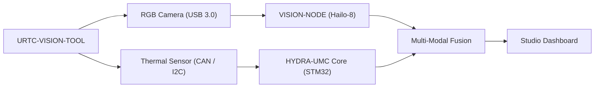

<p align="center">
  
</p>

# 👁️ URTC-VISION-TOOL

<p align="center"><a href="README.md">🇺🇸 English</a> | <a href="README_spa.md">🇪🇸 Español</a> | <a href="README_fra.md">🇫🇷 Français</a> | <a href="README_ita.md">🇮🇹 Italiano</a> | <a href="README_deu.md">🇩🇪 Deutsch</a> | 🇨🇳 <b>简体中文</b> | <a href="README_jpn.md">🇯🇵 日本語</a></p>

### 🔬 融合热成像与 RGB 感知的集成末端执行器

<p align="left">
  
  
  
  
</p>

---

## 1. 🛠️ 技术概述

**URTC-VISION-TOOL** 是一款专用的机器人工具头，将视觉与热成像感知融合到
单一的 URTC 兼容执行器中。它专为高级质检、PCB 热成像检测和高精度抓取
放置对位而设计。

它配备了一个 RGB 全局快门摄像头和一个 MLX9064x 系列热传感器，为视觉 AI
节点提供双模态数据，使其不仅能检测组件是否存在，还能检测其工作温度或
焊点散热情况。

该板卡目前尚不存在 PCB/原理图（见 `hardware/`），因此下面的功能都无法驱动
真实的热成像/RGB 传感器——但固件工具链以及主机端的视觉处理流水线（合成帧
生成、伪彩色渲染、RGB->热成像 ROI 对位与温度统计提取，全部有 pytest 覆盖）
今天就是真实且可用的。

### 关键特性：
* 🔬 **双模态感知** —— 同步的热成像与 RGB 图像捕获。*（两路帧所馈送的处理流水线是真实的——见下文；真正的同步捕获需要 PCB 和传感器。）*
* 🌡️ **高精度热成像** —— 集成 MLX90640/41/42 传感器支持。*（伪彩色渲染和按区域统计提取是真实的——见下文；通过 I2C 读取真实的 MLX9064x 需要 PCB。）*
* 🎯 **Eye-in-Hand 对位** —— 亚毫米级 PnP 与 AOI（自动光学检测）。*（RGB->热成像 ROI 坐标映射与温度统计提取是真实的并已测试——见下文的 `vision_companion/alignment.py`；亚毫米级精度需要真实的已标定摄像头。）*
* 📡 **统一 CAN API** —— 无缝集成到 URTC 25 种工具目录中。*（传感器侧的线缆协议本身——帧格式、CRC、范围校验——是真实的，见下文；仍需要真实的 CAN 收发器来实际承载它。）*
* 🔒 **传感器协议安全性** —— 真实的版本化帧格式，带 CRC8 校验和，真实的测量范围校验，真实的速率限制，以及独立于控制决策的专用错误/延迟/总线复位诊断计数器。*（已实现）*
* ✅ **Cortex-M4F 固件工具链** —— 一个真实的裸机镜像，使用与兄弟仓库 URTC 和 URTC-SMART-RACK 相同的工具链，通过 `arm-none-eabi-gcc` 交叉编译并链接。*（已实现——见下方"构建"）*
* ✅ **`vision_companion` 处理流水线** —— 一个真实可用的 Python 包：合成热成像+RGB 帧生成、伪彩色热成像渲染、RGB->热成像 ROI 对位 + 温度统计提取、统计报告，全部由 21 个真实 pytest 用例覆盖，无需连接任何硬件即可端到端运行。*（已实现——见下方"VISION COMPANION"）*

---

## 2. 🔄 视觉工具流程



---

## 3. 🧱 架构与设计决策

* **为什么本项目拥有 2 条独立的版本跟踪线。** `src/firmware_common.h`（STM32 端固件）和 `src/vision_companion/pyproject.toml`（独立的主机端 Python 包）分别独立进行版本管理——它们运行在不同的硬件上（MCU 与主机 CM5/PC），并按不同的发布节奏交付。
* **为什么它不是 URTC 自身的子项目。** 与 URTC-SMART-RACK 自身 README 中的理由相同——它是一个共享 URTC 的 CAN 总线/固件惯例的配套工具，而非其集成层级结构的一部分。
* **为什么需要一个主机端配套软件包。** 热成像/RGB 双模态捕获需要真正的图像处理（numpy/Pillow），而这不适合直接运行在 STM32 上——该配套软件包正是执行这些处理的地方，通过 CAN 与板卡通信。
* **为什么 `alignment.py` 假设两个传感器共享同一视场，而非使用真实单应变换。** 两个传感器安装在同一个刚性工具头上，因此在 RGB 空间与热成像空间之间对像素坐标做逐轴线性缩放是合理的 v0 近似——真正的逐像素标定（棋盘格、镜头畸变）需要真实摄像头才能进行，而这些目前还不存在。
* **这如何融入生态系统的其余部分。** 共享 URTC 自身的 CAN 总线/工具生态系统，并与 HYDRA-UMC-DETECTION-HEF 自然搭配，承担与 URTC-SMART-RACK 相同的视觉识别角色。
* **为什么传感器帧协议携带自己的时间戳字段。** 真实的传感器端毫秒级时间戳让调用方知道一次读数*实际上是何时*采集的，而与 MCU 何时才能解析该帧无关——这是历史记录/诊断方面真实的价值，若只是简单地假设“刚刚到达”则会丢失这一价值。
* **为什么诊断计数器（`sensor_diagnostics.c`）自身从不做出接受/拒绝的决策。** 只有 `sensor_frame.c`（帧格式）、`sensor_reading.c`（范围）和 `rate_limiter.c`（速率限制）决定一帧数据是否可信——诊断模块只记录它们的决策结果。严格保持这一边界意味着诊断模块中的 bug 永远不可能意外放行错误数据，这正是晋级审计自身所说的"separar diagnostico de salida de control"。

---

## 📂 目录结构

```text
URTC-VISION-TOOL/
├── src/
│   ├── firmware_common.h           # FIRMWARE_VERSION_MAJOR/MINOR/PATCH = 0.0.0
│   ├── sensor_frame.h / .c         # 真实：版本化帧格式 + CRC8 解析/编码
│   ├── sensor_reading.h / .c       # 真实：热成像读数解码 + 范围校验
│   ├── rate_limiter.h / .c         # 真实：最小间隔帧限速
│   ├── sensor_diagnostics.h / .c   # 真实：错误/延迟/总线复位计数器，与控制分离
│   ├── main.c                      # 最小入口点（存活证明心跳循环）
│   ├── startup_stm32_minimal.c     # 向量表 + Reset_Handler（暂无 ST HAL，见文件头说明）
│   ├── STM32_MINIMAL.ld            # 占位链接脚本（128K FLASH / 32K RAM 下限）
│   └── vision_companion/           # 主机端（CM5/开发机）Python 视觉流水线
│       ├── pyproject.toml          # 打包配置 + `vision-companion` 控制台脚本
│       ├── requirements.txt        # numpy + pillow
│       ├── main.py                 # 真实可用的 CLI（版本/自检/analyze-roi）
│       ├── alignment.py            # 真实：RGB<->热成像 ROI 映射 + 温度统计提取
│       ├── tests/                  # 21 个真实 pytest 用例（main.py + alignment.py）
│       └── README.md               # 配套软件专属使用文档
├── tests/                          # 真实的主机原生固件测试套件（sensor_frame、sensor_reading、rate_limiter、sensor_diagnostics、传感器场景）
├── docs/                           # 文档与标定参考
├── hardware/                       # 硬件设计文件（PCB、外壳）—— 目前为空，尚无原理图
├── firmware/                       # 版本化构建输出（.bin/.elf/.hex），与兄弟仓库 URTC 一样被提交
├── build/                          # 中间构建对象（已被 gitignore）
├── images/                         # 媒体与图表
├── scripts/                        # 实用脚本
├── bump_version.py                 # 里程表式版本递增（通用脚本，与 URTC / URTC-SMART-RACK 共享）
├── build_firmware.sh / .bat        # 真实构建：主机测试 + 版本递增 + 编译 + 链接 + 发布到 firmware/
└── README.md
```

---

## 4. ⚙️ 构建（固件）

需要 ARM GNU 工具链（`arm-none-eabi-gcc`、`arm-none-eabi-objcopy`、
`arm-none-eabi-size`）以及 Python 3。

```bash
# Linux/macOS
chmod +x build_firmware.sh   # 仅需一次
./build_firmware.sh

# Windows
build_firmware.bat
```

该构建会递增 `src/firmware_common.h` 中的版本号（里程表规则），针对
Cortex-M4F 编译 `main.c` 和 `startup_stm32_minimal.c`，将其与占位性质
的 `STM32_MINIMAL.ld` 内存映射进行链接，并将版本化的
`.elf`/`.bin`/`.hex` 文件发布到 `firmware/`。目前尚无内容可刷写到真实
硬件——因为没有 PCB 可以确认目标 STM32 型号、引脚布局、MLX9064x 接线，
或 RGB 摄像头接口。

## 5. 🐍 视觉配套软件（主机端 Python）

这部分今天就能完整运行，无需连接任何硬件：

```bash
cd src/vision_companion
python3 -m venv .venv
# Linux/macOS：
.venv/bin/pip install -r requirements.txt
.venv/bin/python main.py selftest

# Windows：
.venv\Scripts\pip install -r requirements.txt
.venv\Scripts\python main.py selftest
```

`selftest` 会生成一个合成的、符合 MLX9064x 格式的热成像帧（32x24，带有
类似烙铁头的热点），以及一个合成的 RGB 彩条测试图案，将两者渲染/保存为
真实文件，并打印其统计信息——证明 numpy/Pillow 处理流水线确实可以正常
工作，独立于将在硬件问世后才实现的真实传感器捕获步骤。

`analyze-roi X0 Y0 X1 Y1` 将 RGB 空间中的一个边界框映射到热成像空间，并
报告该区域的真实温度统计——这正是 README 中"Eye-in-Hand Alignment"功能
背后的对位逻辑，今天就是真实的：

```bash
.venv/bin/python main.py analyze-roi 280 210 360 270
```

真实示例输出：

```text
RGB ROI (280,210)-(360,270) in a 640x480 frame
  -> thermal stats: min=75.67C max=78.97C mean=77.69C (16 thermal px)
```

21 个真实 pytest 用例覆盖了 `main.py` 和 `alignment.py`：

```bash
pip install -e ".[dev]"
pytest
```

完整的配套软件文档请见 `src/vision_companion/README.md`。

---

## 🔗 相关项目

本项目是同一作者（JuanenRac / Electro Hobby 3D）打造的更大规模机器人生态
系统的一部分，涵盖固件、控制软件、AI 节点和车队工具。值得了解，因为某个
需求实际上可能是关于这些项目之一，而非本仓库。

### 直接相关

- **[URTC](https://github.com/JuanenRac/URTC)** —— 同一工具生态系统/CAN 总线。
- **[HYDRA-UMC-DETECTION-HEF](https://github.com/JuanenRac/HYDRA-UMC-DETECTION-HEF)** —— 视觉识别的同族项目。
- **[URTC-TESTER](https://github.com/JuanenRac/URTC-TESTER)** —— 其自身的实时 CAN 总线诊断与本工具对同一工具头的视觉 QA 检查相辅相成。

### 生态系统的其余部分

**HYDRA-UMC 平台** —— 多机器人微工厂单元
- **[HYDRA-UMC](https://github.com/JuanenRac/HYDRA-UMC)** —— 协调最多 8 条机械臂的 CM5 + STM32H745 主板。
- **[HYDRA-UMC-SERVER](https://github.com/JuanenRac/HYDRA-UMC-SERVER)** —— 每个控制客户端所对接的 Express/WebSocket 后端。
- **[HYDRA-UMC-STUDIO](https://github.com/JuanenRac/HYDRA-UMC-STUDIO)** —— 基于 Web 的控制仪表盘，多机器人 3D 可视化。
- **[HYDRA-UMC-ANDROID-CONTROL](https://github.com/JuanenRac/HYDRA-UMC-ANDROID-CONTROL)** —— 通过 Wi-Fi/蓝牙的 Android 控制应用。
- **[HYDRA-UMC-IOS-CONTROL](https://github.com/JuanenRac/HYDRA-UMC-IOS-CONTROL)** —— 基于 Flutter 构建的 iOS/iPadOS 控制应用。
- **[HYDRA-UMC-SUITE](https://github.com/JuanenRac/HYDRA-UMC-SUITE)** —— 桌面端集群指挥中心（Python/PySide6）。
- **[HYDRA-UMC-EDITOR-URDF](https://github.com/JuanenRac/HYDRA-UMC-EDITOR-URDF)** —— 用于机器人目录的桌面端 URDF 模型编辑器。
- **[HYDRA-UMC-DSI](https://github.com/JuanenRac/HYDRA-UMC-DSI)** —— 机载 DSI 触摸屏的原生触控 UI。

**URTC 平台** —— 每台 HYDRA-UMC 机械臂搭载的工具头控制器
- **[URTC](https://github.com/JuanenRac/URTC)** —— CAN 总线工具头控制器，25 种工具配置。
- **[URTC-FLASHER](https://github.com/JuanenRac/URTC-FLASHER)** —— 桌面端 CAN-OTA + SWD/JTAG 刷写工具。
- **[URTC-TESTER](https://github.com/JuanenRac/URTC-TESTER)** —— 桌面端实时 CAN 总线诊断工具。
- **[URTC-WEB-STUDIO](https://github.com/JuanenRac/URTC-WEB-STUDIO)** —— 通过 Web Serial API 的浏览器端替代方案。

**🎥 视觉 AI 节点（Hailo-8）**
- [HYDRA-UMC-VISION-NODE](https://github.com/JuanenRac/HYDRA-UMC-VISION-NODE)
- [HYDRA-UMC-VISION-STREAMER](https://github.com/JuanenRac/HYDRA-UMC-VISION-STREAMER)
- [HYDRA-UMC-DETECTION-HEF](https://github.com/JuanenRac/HYDRA-UMC-DETECTION-HEF)
- [HYDRA-UMC-SAFETY-ZONES](https://github.com/JuanenRac/HYDRA-UMC-SAFETY-ZONES)
- [HYDRA-UMC-VISUAL-SERVOING-API](https://github.com/JuanenRac/HYDRA-UMC-VISUAL-SERVOING-API)

**🧠 认知 AI 节点（Hailo-10）**
- [HYDRA-UMC-COGNITIVE-NODE](https://github.com/JuanenRac/HYDRA-UMC-COGNITIVE-NODE)
- [HYDRA-UMC-VLA-ENGINE](https://github.com/JuanenRac/HYDRA-UMC-VLA-ENGINE)
- [HYDRA-UMC-VOICE-UI](https://github.com/JuanenRac/HYDRA-UMC-VOICE-UI)
- [HYDRA-UMC-SEMANTIC-PLANNER](https://github.com/JuanenRac/HYDRA-UMC-SEMANTIC-PLANNER)
- [HYDRA-UMC-DOCS-QA](https://github.com/JuanenRac/HYDRA-UMC-DOCS-QA)

**🐝 编排与集群**
- [HYDRA-UMC-ORCHESTRATOR](https://github.com/JuanenRac/HYDRA-UMC-ORCHESTRATOR)
- [HYDRA-UMC-SWARM-SYNC](https://github.com/JuanenRac/HYDRA-UMC-SWARM-SYNC)
- [HYDRA-UMC-PATH-PLANNER-3D](https://github.com/JuanenRac/HYDRA-UMC-PATH-PLANNER-3D)
- [HYDRA-UMC-JOB-DISPATCHER](https://github.com/JuanenRac/HYDRA-UMC-JOB-DISPATCHER)
- [HYDRA-UMC-NODE-HEALING](https://github.com/JuanenRac/HYDRA-UMC-NODE-HEALING)

**🎮 数字孪生与仿真**
- [HYDRA-UMC-TWIN](https://github.com/JuanenRac/HYDRA-UMC-TWIN)
- [HYDRA-UMC-PHYSICS-REPLICA](https://github.com/JuanenRac/HYDRA-UMC-PHYSICS-REPLICA)
- [HYDRA-UMC-HIL-BRIDGE](https://github.com/JuanenRac/HYDRA-UMC-HIL-BRIDGE)
- [HYDRA-UMC-SYNTHETIC-DATA-GEN](https://github.com/JuanenRac/HYDRA-UMC-SYNTHETIC-DATA-GEN)

**📊 数据与分析**
- [HYDRA-UMC-DATALAKE](https://github.com/JuanenRac/HYDRA-UMC-DATALAKE)
- [HYDRA-UMC-TELEMETRY-COLLECTOR](https://github.com/JuanenRac/HYDRA-UMC-TELEMETRY-COLLECTOR)
- [HYDRA-UMC-ANOMALY-DETECTOR](https://github.com/JuanenRac/HYDRA-UMC-ANOMALY-DETECTOR)
- [HYDRA-UMC-PRODUCTION-REPORTS](https://github.com/JuanenRac/HYDRA-UMC-PRODUCTION-REPORTS)

**🏭 工业网关**
- [HYDRA-UMC-GATEWAY-INDUSTRIAL](https://github.com/JuanenRac/HYDRA-UMC-GATEWAY-INDUSTRIAL)
- [HYDRA-UMC-OPCUA-SERVER](https://github.com/JuanenRac/HYDRA-UMC-OPCUA-SERVER)
- [HYDRA-UMC-MQTT-BROKER](https://github.com/JuanenRac/HYDRA-UMC-MQTT-BROKER)
- [HYDRA-UMC-MTCONNECT-ADAPTER](https://github.com/JuanenRac/HYDRA-UMC-MTCONNECT-ADAPTER)

**🛠️ 配套工具**
- [URTC-SMART-RACK](https://github.com/JuanenRac/URTC-SMART-RACK)
- [HYDRA-UMC-WATCH](https://github.com/JuanenRac/HYDRA-UMC-WATCH)
- [HYDRA-UMC-TOOL-CLI](https://github.com/JuanenRac/HYDRA-UMC-TOOL-CLI)
- [HYDRA-UMC-DASHBOARD-AI](https://github.com/JuanenRac/HYDRA-UMC-DASHBOARD-AI)


## 👤 作者
**JuanenRac** (Electro Hobby 3D)
📧 electrohobby3d@gmail.com
📺 [youtube.com/@electrohobby3d](https://youtube.com/@electrohobby3d)

## 📜 许可证
GPL-3.0 —— 详见 LICENSE。
